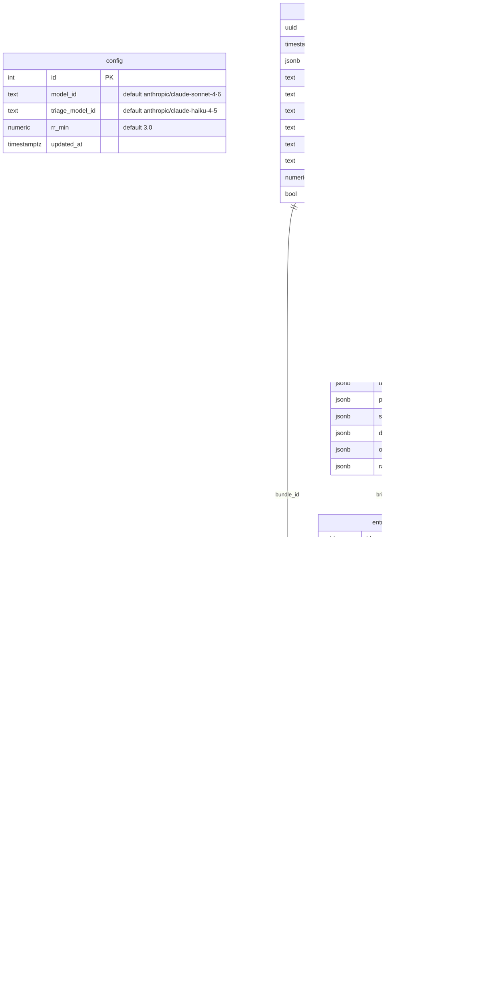
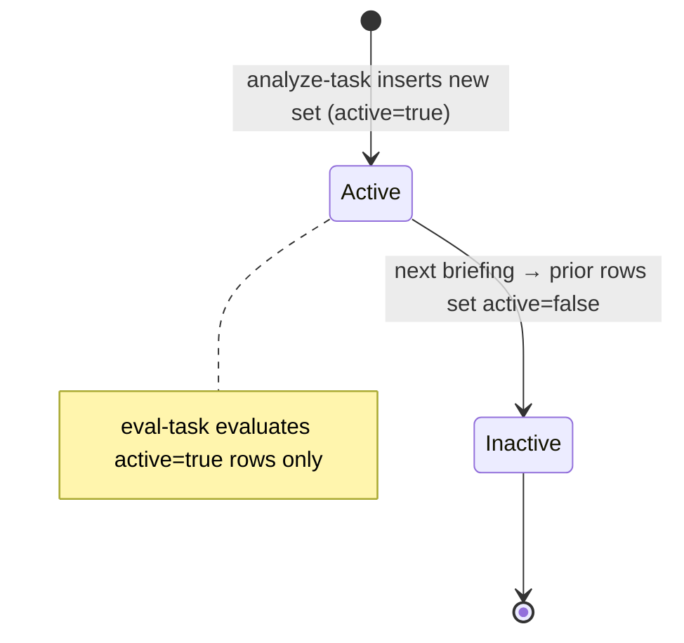

# Database Schema (Supabase / Postgres)

Source: `docs/agent-architecture-plan.md` → *Persistence* (lines 221–238), cross-checked
against the live migrations in `supabase/migrations/` (feat-005, **done**, applied to project
`qvhkqilizwozikpomxob`).

Five tables plus a singleton `config` row. Files (PNGs, CSVs) live in Supabase Storage; rows
hold string refs. Small JSON (MGI) is stored inline as `jsonb`. Current price is read from
the latest `raw_bundles` row — there is no separate hot-price store. RLS is enabled on all
tables with no policies (service-role-only access).

> Mermaid ER attribute types can't contain brackets, so Postgres `numeric[]` arrays
> (`entry_levels.targets`, `eval_results.targets`) are shown as `numeric_arr`.

## `entry_levels` lifecycle

Each new briefing deactivates the prior set and inserts a fresh one; `eval-task` only ever
evaluates `active=true` rows (lines 230–236).

