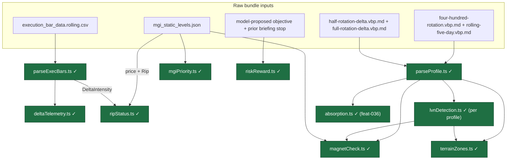
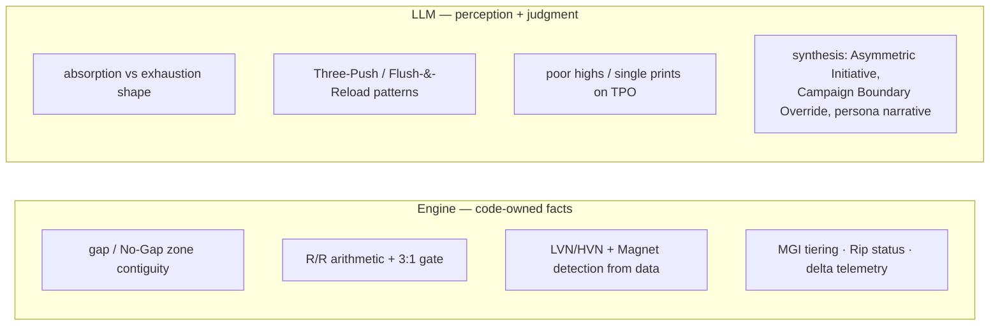
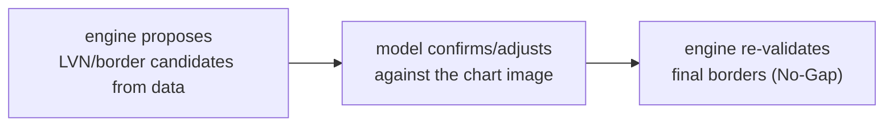

# Deterministic Engine

Source: `docs/agent-architecture-plan.md` → *Deterministic Engine vs LLM* (lines 94–147).
Computable doctrine lives in TypeScript under `lib/engine/` (pure, no I/O), so the prompt
stays small and an error class (gap math, R/R arithmetic) is removed.

## Module data lineage

Arrows show **data lineage**, not import coupling — every module is a pure function whose
inputs the caller passes in. `✓` = built, `✗` = planned (feature id in parens).

What each module computes:

- **parseProfile.ts** — parse each VbP / Delta Markdown export standalone (`{price, volume}[]` /
  `{price, delta}[]`); no cross-profile join (the grids differ).
- **parseExecBars.ts** — parse the ~250-row exec CSV → typed `ExecBar[]`.
- **deltaTelemetry.ts** — reduce `ExecBar[]` to a compact summary (delta trend, sign, ±3/±4 extremes, Leg-VWAP position).
- **mgiPriority.ts** — MGI Tier 1/2/3 hierarchy + daily priority; nearest Tier-1 border above/below price.
- **ripStatus.ts** — Vanguard Protocol Green/Yellow/Red from price-vs-Rip + DeltaIntensity.
- **riskReward.ts** — direction-aware 3:1 R/R gate; enforces "stops never widen" vs the prior briefing.
- **lvnDetection.ts** — LVN valleys + HVN peaks, run on each VbP volume series (rotation + five-day).
- **magnetCheck.ts** — Trench/Wall/Magnet = POC/VAH/VAL + HVN peaks (rotation profile), cross-referenced to MGI.
- **terrainZones.ts** — contiguous Stratosphere→Abyss zone stack (rotation profile, volume structure) with the No-Gap invariant.
- **absorption.ts** — one-sided bin stacks on the half/full-rotation delta profiles → absorption **candidates** (model confirms price stalled).

## Deterministic engine vs LLM (the key split)

The engine computes facts; the model supplies perception and judgment it can't get from data
alone (lines 114–121).

## Hybrid LVN flow

LVN/border detection is a round trip: the engine proposes from data, the model confirms
against the chart image, the engine re-validates (lines 120–121).

