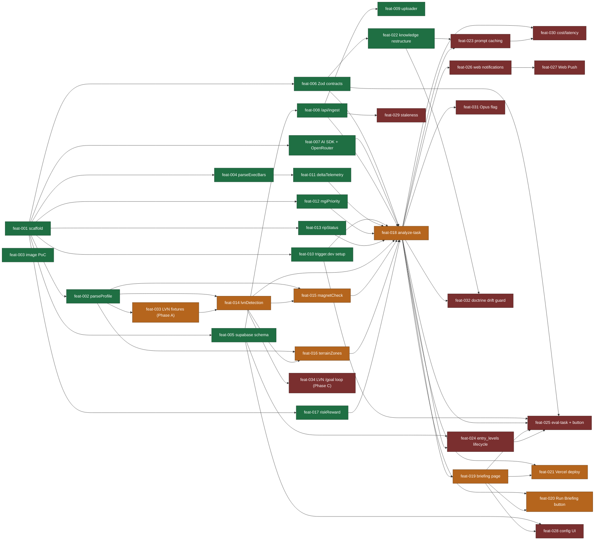
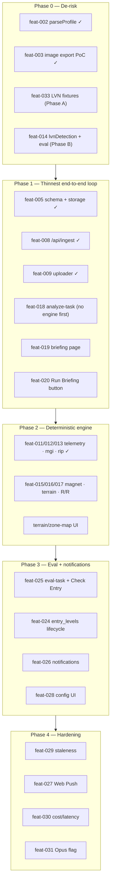

# Feature Roadmap

Source: `feature_list.json` (34 features) and `docs/agent-architecture-plan.md` →
*Phased Build Order* (lines 265–290). **11 done, 23 not-started.**

## Dependency graph

Edges point from a dependency to the feature it unblocks. Green = done, red = not-started,
orange = the **critical path** (`feat-033 → 014 → 015/016 → 018 → 019/020/021`) that
currently gates the entire UI pipeline.

## Phase 0–4 build order

The architecture plan groups the work into five phases. The LVN sub-effort (`feat-033` Phase
A → `feat-014` Phase B → `feat-034` Phase C) is the Phase-0 de-risk thread — it is the
system's main edge over the existing Gem and gates `analyze-task`.

> Cross-cutting features not pinned to a single phase: `feat-007` (AI SDK), `feat-010`
> (trigger.dev setup), and `feat-022` (knowledge restructure) underpin Phases 1–2;
> `feat-023` (prompt caching) and `feat-032` (doctrine drift guard) ride alongside the
> engine work.
