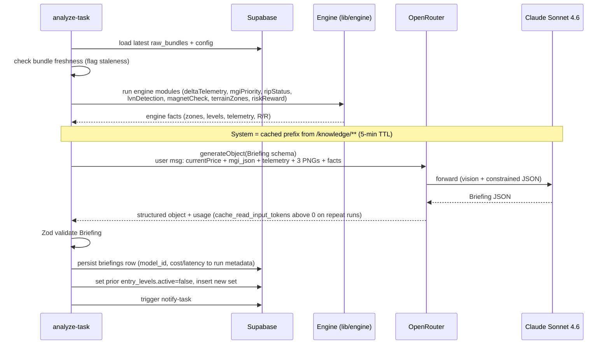
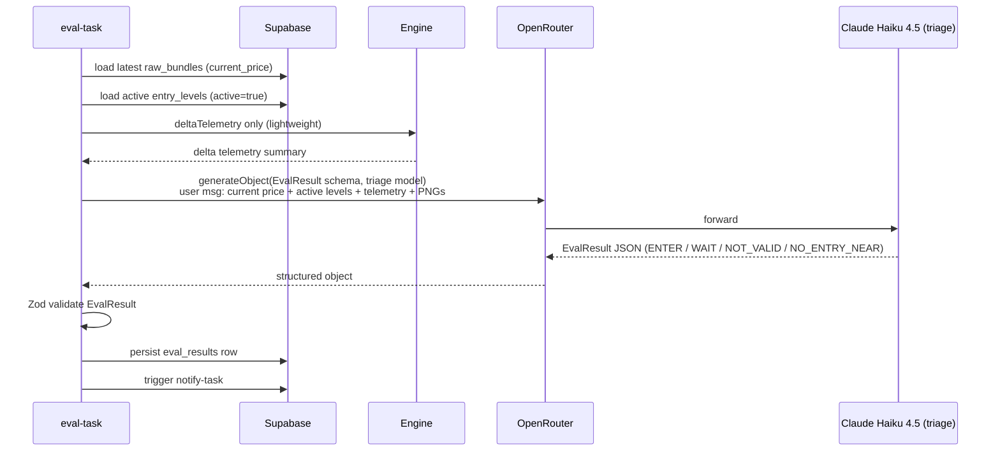
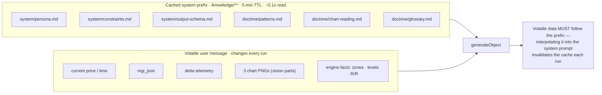

# LLM Call Construction & Flow

Source: `docs/agent-architecture-plan.md` → *Deterministic Engine vs LLM* (lines 94–122),
*Knowledge Restructure* (lines 151–189), *trigger.dev Tasks* (lines 242–256).

Both tasks call the LLM the same way: a **cached system prefix** (static doctrine) followed
by a **volatile user message** (per-run data + images), through the Vercel AI SDK
`generateObject` over OpenRouter, validated against a Zod schema. Model IDs come from the
`config` row, never hardcoded.

## `analyze-task` — full briefing (default Sonnet 4.6)

## `eval-task` — entry triage (default Haiku 4.5)

Lighter: only `deltaTelemetry` runs, against active entry levels, with the cheaper triage
model and the `EvalResult` schema.

## Prompt assembly: cached prefix vs volatile message

Static doctrine is assembled into the **cached prefix** (Anthropic `cache_control` /
`providerOptions` through OpenRouter — ~0.1× read cost + lower latency). Volatile per-run
data goes in the user message **after** the prefix; interpolating it into the system prompt
would invalidate the cache every run. This is the main cost/latency lever (lines 176–185).

