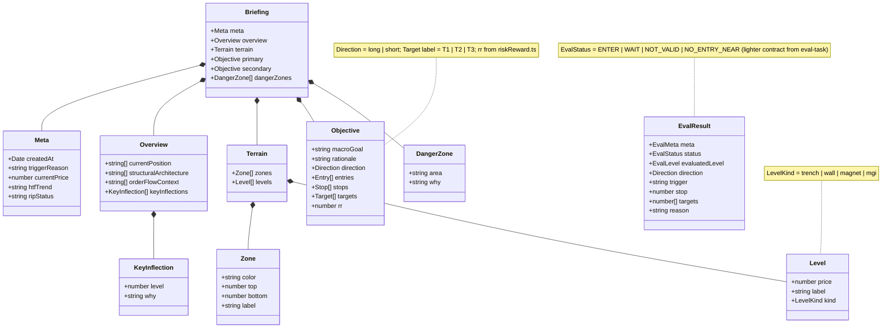

# Output Contract (Zod)

Source: `docs/agent-architecture-plan.md` → *Output contract* (lines 190–217) and
`knowledge/schema/briefing.schema.ts` (feat-006, **done**). The Zod schema is the single
source of truth for both task outputs; the Next.js UI renders tables and the terrain map
straight from these objects.

