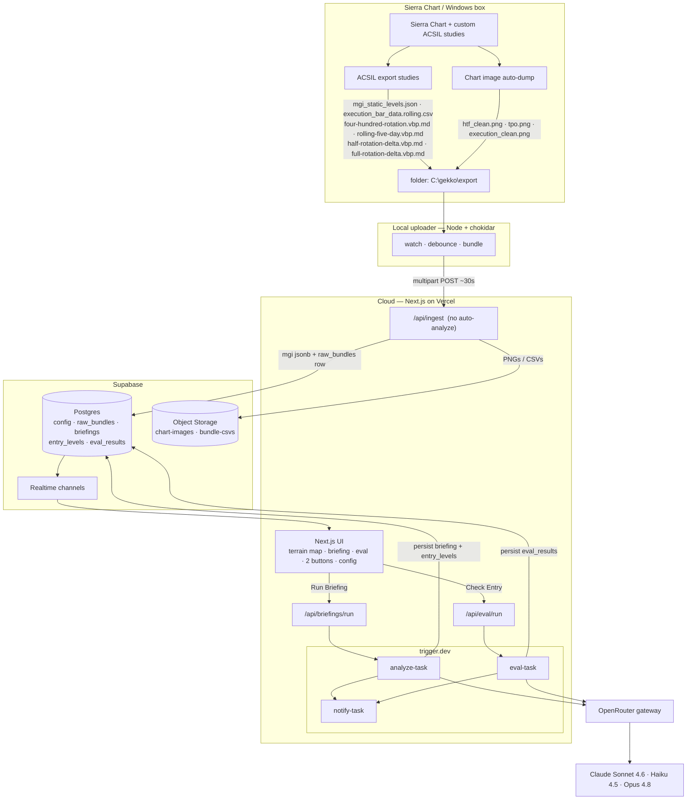
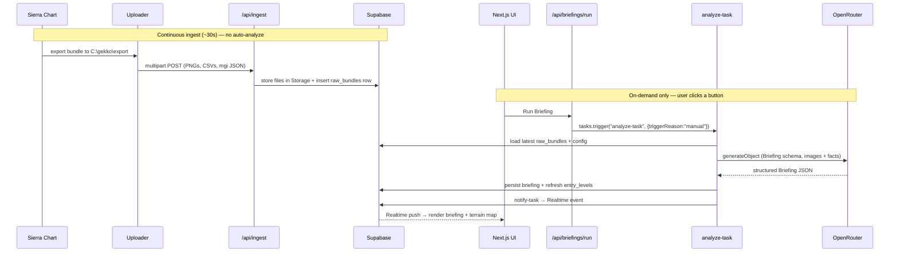

# System Architecture & Data Flow

Source: `docs/agent-architecture-plan.md` → *Stack* (lines 43–46) and *Architecture & Data
Flow* (lines 50–91).

## Components & data flow

Three tiers: the trader's Windows box (Sierra Chart), a thin local uploader, and the cloud
(Next.js on Vercel + trigger.dev + Supabase + OpenRouter). Ingest is continuous (~30s);
analysis is **on-demand only** — there is no scheduler, live price feed, or proximity
automation.

**Why a local uploader (not direct ACSIL HTTP):** ACSIL can POST JSON but can't easily
screenshot+upload a PNG, and auth/retry in C++ is brittle. A ~100-line chokidar watcher
isolates all fragile local concerns (file-write timing, screen capture, retries, bearer
auth) in one debuggable JS process.

## End-to-end "Run Briefing" sequence

Continuous ingest keeps the latest `raw_bundles` row fresh; the user then triggers analysis
by clicking a button. Current price is read from the latest bundle (no separate price store).

