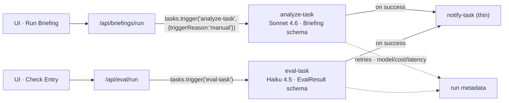
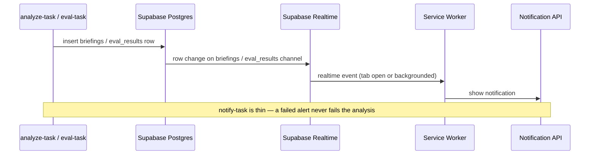

# trigger.dev Task Orchestration & Notifications

Source: `docs/agent-architecture-plan.md` → *trigger.dev Tasks* (lines 242–256) and
*Web Notifications* (lines 257–261).

## Task orchestration

Two UI buttons hit two API routes, each triggering one task; both tasks fan out to a thin
`notify-task` on success and log model/cost/latency to run metadata. Tasks use retries.

## Notification flow

`notify-task` is thin so a failed alert never fails the analysis. Delivery starts simple —
Supabase Realtime on the `briefings` / `eval_results` channel drives the Notification API via
a Service Worker while the tab is open or backgrounded. Web Push (VAPID + `web-push`) is
added later only for tab-fully-closed alerting (feat-027).

