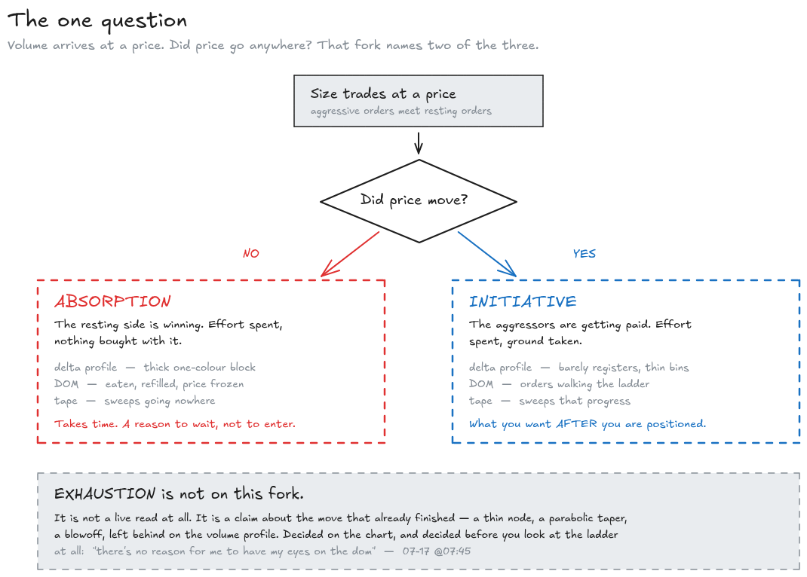
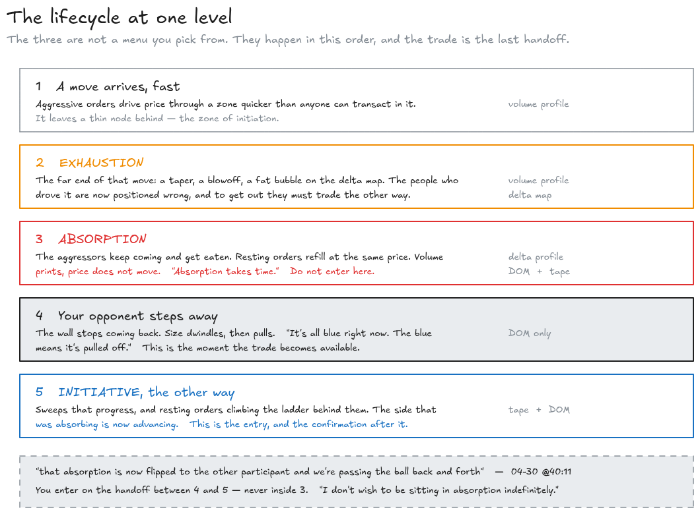
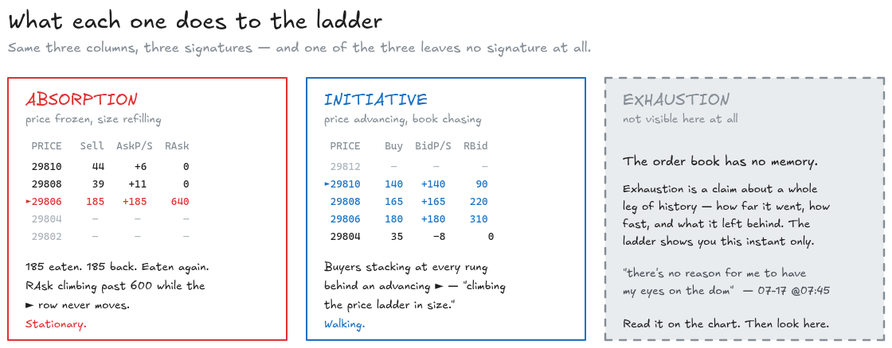
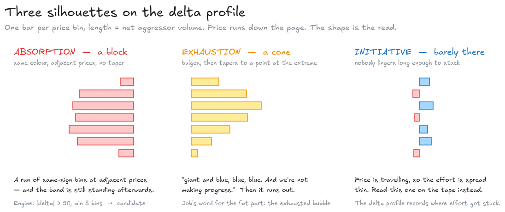
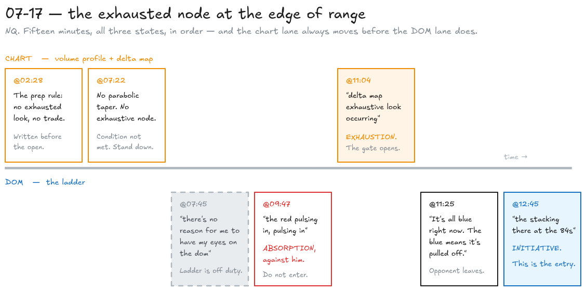

# Absorption, exhaustion and initiative, in plain English — with the receipts

Written 2026-08-29 from the nine market-replay transcripts in
[`docs/jba-research/replays/`](./replays/), the OFL course material in
[`docs/jba-research/reference/`](./reference/), and the 25 morning-prep transcripts in
[`docs/jba-research/transcripts/`](./transcripts/). Every timestamp below is a real link into a real
video — click it and watch the thing happen.

This is the companion to [`refreshing-explained.md`](./refreshing-explained.md). That document covers
one mechanic — orders getting eaten and coming back. This one covers the three words Job uses to say
*what that mechanic means*, and where each one is actually visible on screen.

**Terminology note 1 — buy/sell.** As in the refreshing doc, my own prose uses **buy** and **sell**.
Job's quotes are left verbatim.

| Job says | Means |
| --- | --- |
| **bid** | resting **buy** orders sitting below the market |
| **offer** / **ask** | resting **sell** orders sitting above the market |
| **passive** | a limit order — sitting there, waiting to be traded against |
| **aggressive** | a market order — crossing the spread to take what's resting |

**Terminology note 2 — "initiation" is not "initiative".** These are two different things that share
a root, and Job uses both constantly, sometimes in the same sentence. Getting them confused makes
half the corpus unreadable, so the decoder ring goes here rather than buried in a footnote:

| Word | Part of speech | What it is | Where it lives |
| --- | --- | --- | --- |
| **zone of initiation** / area of initiation | a **place** | the LVN where a move started — *"where we just absolutely slammed through"* | on the volume profile, drawn in advance |
| **initiative activity** | a **behaviour** | somebody crossing the spread and moving price | on the tape and the DOM, right now |

*"Areas of initiation on the volume profile are low volume nodes. There's not a lot of volume there."*
— [Pivots deep dive @22:29](https://youtu.be/CoKoCpLYnC8?t=1349)

**Terminology note 3 — the auto-captions.** Every replay quote comes from YouTube auto-captions, which
carry no reliable punctuation and mis-hear some words. Words are verbatim, including the stutters and
filler; sentence punctuation and capitalisation are mine. Two recurring mis-transcriptions worth
knowing: **"cell"** for *sell*, and **"bi-delta"** / **"by side delta"** for *buy delta*. Where a
quote is garbled beyond reading, I say so rather than tidying it.

---

## 1. One question separates all three

### The setup: two kinds of order

There are exactly two ways to participate. You can **rest** an order at a price and wait — a limit
order, which Job calls *passive*. Or you can **cross the spread** and take whatever is resting there
right now — a market order, which he calls *aggressive*.

> *"Passive being a limit order, aggressive being a market order."*
> — [04-24 @15:01](https://youtu.be/JMWo4IpN8yA?t=901)

Every trade is one of each. Somebody was resting, somebody crossed. Price only moves when the
aggressor runs out of resting orders at the current price and has to reach for the next one.

That gives you the only question that matters when volume shows up at a level:

**Did price go anywhere?**

Everything in this document falls out of that one question.



*Every diagram in this document has its editable source alongside it in [`diagrams/`](./diagrams/) as a
`.excalidraw` file — drop one into [excalidraw.com](https://excalidraw.com) to change it.*

### Absorption — volume arrives, price does not move

**Absorption is aggressive orders being eaten by passive orders without price making progress.**

Somebody is hitting the market with size and getting nowhere, because on the other side somebody is
resting enough orders to swallow all of it — and refilling them as they get filled.

The course material's definition:

> *"This signifies a scenario where large limit orders (or refreshing limit orders) soak up opposing
> market orders, restraining further price movement. This can display a potential reversal in the
> price activity."* — [`reference/dom.txt`](./reference/dom.txt)

Job's own, said out loud in answer to a member question — this is the clearest statement of it in the
whole corpus:

> *"If if price is moving up even just a little bit, okay, if the offer is kind of shying away,
> allowing the bid to step up the ladder and then hits more market orders, but it's not going
> anywhere. Instead, it's going against the the um intended action of a sell order is is essentially
> going to give you negative delta and price showing that the sell side's not making progress. And
> that's absorption."* — [04-24 @15:23](https://youtu.be/JMWo4IpN8yA?t=923)

Note what he does **not** say. He doesn't say "a big order appeared". Absorption is not a size
observation, it's a *futility* observation: effort spent, nothing bought with it.

The tape-only version, from the OFL 101 lesson:

> *"if we come down into a zone that is replenishing and refilling and we're seeing a bunch of sweeps
> like [sell] sweeps… but price is not moving at all and we're seeing replenishing of the bid then
> we're looking at that as potential absorption"*
> — [OFL 101 @02:49](https://youtu.be/3sNu2TIfae8?t=169)

And the version he says while trading, which is the same sentence with the jargon removed:

> *"Getting a lot of sell sweeps and they're not going anywhere."*
> — [06-30 @06:39](https://youtu.be/FrSP2kDoJvs?t=399)

**Absorption is slow.** This is the property people get wrong, so he says it flatly:

> *"the offer is still heavy and filling and filling and filling. This is going to take time.
> Absorption takes time."* — [05-04 @09:12](https://youtu.be/9iNMcMoI9nk?t=552)

### Initiative — volume arrives, and price moves

**Initiative is aggressive orders that get paid: the market orders come in and price goes with
them.**

Identical footprint on the volume — big prints, one colour — and the opposite meaning, because of the
one thing that differs:

> *"buy it [at] Market buy it Market buy it Market that's initiative activity because it's also
> making progress"* — [OFL 101 @05:19](https://youtu.be/3sNu2TIfae8?t=319)

The sweep is its most aggressive form. A sweep is one market order big enough to eat every resting
order at the current price and keep filling at the next ones:

> *"Sweeping is a circumstance where a sizable market order depletes all available orders at the
> recent market price and starts filling at subsequent prices."* — [`reference/dom.txt`](./reference/dom.txt)

> *"what I want [you to] see is this large block of red come through — that's a sweep. In order to
> create a sweep we have to step down below all of these orders, and when it occurs like this at the
> edge of range that's very aggressive, that's initiative."*
> — [OFL 101 @05:30](https://youtu.be/3sNu2TIfae8?t=330)

There is a second face of initiative, and it lives in the book rather than the tape. The passive side
stops standing still and starts *chasing*:

> *"This is a display of orders replenishing and also stepping up/down the order book to pursue their
> desired price. Evident as limit orders begin climbing or descending the price ladder in size as the
> book thins out."* — [`reference/dom.txt`](./reference/dom.txt)

Job watches for exactly that, and treats it as the thing that kills a counter-trade:

> *"And instead of just stepping in and absorbing, we begin to see some stepping down."*
> — [05-28 @09:50](https://youtu.be/bFU1dXf5uw8?t=590)

So: **absorption is the passive side winning where it stands; initiative is either side advancing.**

### Exhaustion — the shape a finished move leaves behind

The first two are readings of *right now*. Exhaustion is not. **Exhaustion is a claim about a move
that has already happened: it went too far, too fast, and the participants who drove it are done.**

Its signature is a location, not an event — a thin node at the end of a leg, left because price
travelled through that price so fast nobody had time to transact there:

> *"How do we know if it's exhaustive? It moves away and aggressively. And so this here would be
> exhaustive."* — [Pivots deep dive @19:13](https://youtu.be/CoKoCpLYnC8?t=1153)

Job's working vocabulary for it is a small cluster of near-synonyms — **exhausted node**,
**exhaustive look**, **parabolic taper**, **blowoff**:

> *"we still have unfinished business at the bottom of that volume profile. We don't have either a
> parabolic taper. We don't have an exhaustive node."*
> — [07-17 @07:22](https://youtu.be/glG8-dCLba0?t=442)

> *"I'm waiting to be able to see if we can get some sort of scary exhaustive look. Give me a
> blowoff."* — [07-17 @08:03](https://youtu.be/glG8-dCLba0?t=483)

And it has a mechanism, not just a shape. The people who drove the move have to unwind:

> *"that creates some sort of exhaustion because if they are sitting short and they want to exit that
> position, they have to become a buyer."*
> — [06-26 @10:55](https://youtu.be/l4xvVNTE_H8?t=655)

That is why exhaustion is a *reversal* read while absorption is only a *stop* read. Absorption says
the move is being resisted. Exhaustion says the move's own participants are about to trade the other
way.

### They are a sequence, not a menu

The three are not three options you pick between. In Job's actual sequence they follow each other
around a level, in order, and the handoff between them is the trade.

The lesson states the handoff explicitly:

> *"initiative activity is going to be when we begin to step out of that zone of absorption where
> we'd like to see the counter type of look"*
> — [OFL 101 @04:45](https://youtu.be/3sNu2TIfae8?t=285)

Absorption is the setup; initiative in the *other* direction is the confirmation. He describes the
whole loop as one participant handing off to the next:

> *"we're looking at absorption. We move away. Okay, that absorption is now flipped to the other
> participant and we're passing the ball back and forth."*
> — [04-30 @40:11](https://youtu.be/5124WmFuurg?t=2411)



**The practical consequence: you do not enter during absorption.** You enter when it ends.

> *"I don't wish to be sitting in absorption indefinitely."*
> — [05-19 @16:18](https://youtu.be/RaJRUnHR_Rg?t=978)

> *"I definitely don't want to be entering when my opponent is active."*
> — [05-04 @40:16](https://youtu.be/9iNMcMoI9nk?t=2416)

Which is the same rule the refreshing doc arrives at from the other direction — *"When do you step
in? When they step away."*

### The hard part: absorption and exhaustion are the same print seen from opposite ends

This is where the corpus looks like it contradicts itself, and it is worth sitting with, because the
resolution is the most useful idea in this document.

Job describes an **exhaustion** signature like this:

> *"with the leg-to-leg delta profile, you're going to get a ton of [buy] delta up here. This is going
> to be giant and blue, blue, blue. And we're not making progress."*
> — [Pivots deep dive @19:44](https://youtu.be/CoKoCpLYnC8?t=1184)

Big one-sided delta, no progress. But that is word-for-word the **absorption** definition from
[04-24 @15:23](https://youtu.be/JMWo4IpN8yA?t=923) above.

They are the same print. The difference is which participant you are pointing at:

| | You are pointing at | The claim |
| --- | --- | --- |
| **Absorption** | the **passive** side — the wall | somebody is home and holding |
| **Exhaustion** | the **aggressive** side — the crowd hitting the wall | they're spent, and they're now trapped |

One observation, two subjects. And they resolve to the same trade, which is why Job rarely bothers
separating them in live commentary — he just needs one of them, at a border he already cares about,
before he'll act. The tie-break is what happens *next*: if the aggressors were merely resisted, price
grinds; if they were exhausted, they have to cover, and you get the flip.

> *"you get a pull stack flip. The offer starts stepping down. You start getting aggressive orders
> pushing against and underneath that [buy] delta… And now you begin to accelerate. And that is
> another way to view exhaustion."*
> — [Pivots deep dive @20:00](https://youtu.be/CoKoCpLYnC8?t=1200)

There is a second, sharper way the same footprint flips meaning — this time between absorption and
initiative. Job catches himself doing it live on 04-08, at a level where he'd normally call
absorption on sight:

> *"Normally, at the upper portion of range, I'd be looking at this saying absorption. However, with
> this here, that was aggressive buying. Why is it aggressive buying?"* … *"we had limit orders of
> very large were hitting the offer."* … *"Exactly. They're hitting the offer. Crossing the crossing
> spread."* — [04-08 @07:55](https://youtu.be/u-S6Rvj7hIY?t=475)

(The member's line is garbled in the captions; what he means is that very large orders were **hitting
the offer** — buying at market, not resting.) The discriminator is *who crossed the spread*, and it
is invisible on a volume chart. You need the tape or the DOM to get it right.

And on 04-30, the same call in one breath, resolved by position:

> *"yes, absorption, right? We're above it and we're creating more. And so that's initiative."*
> — [04-30 @03:20](https://youtu.be/5124WmFuurg?t=200)

Above the level and still building = initiative. Same delta, different location, different word.

---

## 2. Reading them on your own DOM

The column layout, colours and Sierra settings are worked out in full in
[`refreshing-explained.md` §2](./refreshing-explained.md#2-reading-it-on-your-own-dom) — a Trade DOM
on NQ with four-tick compression, separate Bid/Ask Pulling-Stacking columns, and `RBid`/`RAsk`
adjacent as a footprint block. That is the setup assumed below; this section is only what the three
states *do* to that ladder.

```
Buy │ BidP/S │ PRICE │ AskP/S │ Sell │ RBid │ RAsk
```

**A flag on this section.** Job never sits down and enumerates "here is absorption on the DOM, here
is initiative on the DOM". The table below is my mapping of what he says while trading onto the
specific column layout in the refreshing doc. The behaviours are sourced; the column-by-column
rendering is synthesis, and I've marked the two rows that are the weakest inference.

### The three-state read

| | `Buy` / `Sell` size | Pull/Stack column | `RBid` / `RAsk` | `PRICE` |
| --- | --- | --- | --- | --- |
| **Absorption** | eaten and back at the **same price**, repeatedly | flat or positive on the defending side — they are *adding*, not moving | climbing hard on one side, Same-Price-and-Side condition firing | **frozen** |
| **Initiative** | thinning out ahead of price on the side being taken | **stepping down / up the ladder** in front of price | both sides ticking over as price travels | **advancing** |
| **Exhaustion** | *(nothing specific — see below)* | *(nothing specific)* | *(nothing specific)* | already moved |

**Absorption.** This is the refreshing doc's whole subject, and its tape fingerprint is the give-away:
volume through one price, price unchanged. On the configured ladder that is the `Recent Bid/Ask Same
Price and Side` background lighting up — *"the background color at the price of the last Bid update
when the previous update was also a Bid at the same price"* — while the price row does not move. The
`Buy`/`Sell` number at that row drops to nothing and refills.

**Initiative.** The tell is not size, it's *direction of travel in the book*. dom.txt: limit orders
*"climbing or descending the price ladder in size as the book thins out."* Job, watching it happen
against him:

> *"the offer continues to respect that zone. Step in, step in… then the offer gets underneath,
> begins to protect, and then we get our little sweep."*
> — [04-24 @06:31](https://youtu.be/JMWo4IpN8yA?t=391)

That is the pull/stack column producing a *moving* signature rather than a stationary one, and it is
the single most important thing to be able to distinguish from absorption, because they are adjacent
in time and opposite in meaning. Job draws the line himself at
[05-28 @09:50](https://youtu.be/bFU1dXf5uw8?t=590): *"instead of just stepping in and absorbing, we
begin to see some stepping down."*

**Exhaustion. You cannot see it on the DOM.** This is not a gap in my sourcing — it is the finding.
Exhaustion is a claim about a whole leg's worth of history, and the order book has no memory. Job
says so directly, in the middle of a session where an exhausted node is the entire thesis:

> *"So at this point there's no reason for me to have my eyes on the dom."*
> — [07-17 @07:45](https://youtu.be/glG8-dCLba0?t=465)

> *"Still, at this point, I have no concern looking at the DOM with the exception of the 87s."*
> — [07-17 @09:29](https://youtu.be/glG8-dCLba0?t=569)

The DOM's role in an exhaustion trade is to time the *entry* once the profile has already made the
call — which is exactly the division of labour the refreshing doc describes. Exhaustion is decided on
the chart; the ladder only tells you when your opponent has left.



### What it looks like when it fires

The cleanest DOM-side sequence in the corpus is 07-17 around the 87s, because Job narrates the colour
changes as they happen:

- *"the red pulsing in, pulsing in. Are we — are we actually able to take the bid up and above that?
  Nope, pulsing in"* — [07-17 @09:47](https://youtu.be/glG8-dCLba0?t=587). Sellers refreshing;
  absorption against the buyers.
- *"Watch your 87s. It's all blue right now. The blue means it's pulled off."*
  — [07-17 @11:25](https://youtu.be/glG8-dCLba0?t=685). The Ask Pulling/Stacking column has gone
  negative and is rendering blue — the colour rule in the refreshing doc's table. **Sellers pulling.**
- *"We have orders stepping in at the 84s. The offer is off the 87s. You see the stacking there at
  the 84s. So at the 84s at that point, this is showing me strength from the bid side and weakness
  from the offer."* — [07-17 @12:41](https://youtu.be/glG8-dCLba0?t=761). Buyers now stacking *up*
  the ladder: initiative, in his favour.

Absorption → pull → initiative, in about three minutes, all three visible in the pull/stack columns.

### Two known defects

**1. Job actively discourages going deeper here.** Asked point blank whether to study DOM activity in
more depth:

> *"when it comes to reading DOM activity, uh and I've been asked this a lot, 'Can we go more
> in-depth?'… 'Can we go more in-depth with DOM activity?' Yes, you can. Absolutely. And will that
> serve you? No."*
> — [05-19 @31:36](https://youtu.be/RaJRUnHR_Rg?t=1896)

> *"keep it simple, especially when it comes to DOM stuff… just trade structure first."*
> — [05-19 @33:05](https://youtu.be/RaJRUnHR_Rg?t=1985)

So a finer-grained DOM taxonomy than the three rows above is against the grain of the method, not an
extension of it. The refreshing doc lands in the same place: *"place your weight on structure."*

**2. Gekko cannot see any of this.** The briefing engine has no order-book feed at all. This is
enforced in the prompt doctrine:

> *"Judge every pattern from the delta telemetry and the execution chart — no order-book (DOM) data
> is available in this system; never cite the DOM as evidence."*
> — [`knowledge/doctrine/patterns.md`](../../knowledge/doctrine/patterns.md)

Everything in this section is for the operator's own eyes at the moment of execution. Section 3 is
the half the system can actually reason about.

---

## 3. Reading them on the delta profile

### What delta actually is

Delta at a price is **buy-aggressor volume minus sell-aggressor volume** at that price. It counts who
crossed the spread, not who was resting. Which is why it is the right instrument for these three
concepts — it measures exactly the thing that separates them.

Job walks a member through it from first principles, in the single best teaching passage in the
corpus:

> *"In order to have negative delta, we have to have an aggressive sell order fill a passive buy
> order. When that happens, you have negative delta."*
> — [04-24 @15:01](https://youtu.be/JMWo4IpN8yA?t=901)

The question that prompted it is the one everybody asks, and the answer is the whole point:

> *"As we can see, ES is negative uh delta is rising but for NQ it's going down. How come ES can move
> up with negative delta buildup?"* … *"So you can have negative delta and price can be going up.
> essentially uh what that's telling negative delta is um displaying passive buying."*
> — [04-24 @13:45](https://youtu.be/JMWo4IpN8yA?t=825)

**Negative delta with price rising is not a contradiction. It is the definition of absorption.**
Sellers are hitting the market; buyers are resting under them, eating all of it, and stepping up the
ladder anyway.

So the sign convention that matters:

| Delta at a price | Who crossed the spread | Who was resting |
| --- | --- | --- |
| **negative** (red) | aggressive **sellers** | passive **buyers** |
| **positive** (blue) | aggressive **buyers** | passive **sellers** |

The corollary is a rule the briefing doctrine states as a hard constraint: **absorption prints in the
aggressor's colour.** Price falling into support absorbs *red*. Price rising into resistance absorbs
*blue*. There is no such thing as blue absorption at support — the entry-side colour shows up
*afterwards*, as the response ([`knowledge/doctrine/chart-reading.md`](../../knowledge/doctrine/chart-reading.md)).

### The exports

In this repo the delta profile is two files per bundle, both anchored to the execution chart:
`half-rotation-delta.vbp.md` (~35-pt anchor) and `full-rotation-delta.vbp.md` (~75-pt). Each is a
price-descending list of bins:

```csv
Price,Delta
29949.75,7
29947.50,34
29945.25,30
29943.00,-70
```

Job's own name for the same object is the **leg-to-leg delta profile**, or the **delta map**.

### Absorption on the profile — the clustered stack

**Absorption looks like a run of same-coloured bins at adjacent prices.** Thick, blocky, all one
sign, spanning a band rather than a single price.

The engine encodes exactly that, and the thresholds are operator doctrine rather than a guess
([`lib/engine/absorption.ts`](../../lib/engine/absorption.ts)): a bin qualifies at **|delta| > 50**, a
stack needs **at least 3** qualifying bins, and it tolerates the odd weak bin in the interior but is
broken by a strong opposite-sign bin.

A real one, from `chart-data/comparison-examples/example2/data/full-rotation-delta.vbp.md` — 15 bins
from 29693.25 down to 29661.75:

```
-51  -62  -63   -2  -24  -50  -68 -120   -7  -16  -49   11  -24  -73  -63
```

Eleven of those fifteen bins are sell-aggressor prints, one after another, over about eight points of
price. Aggressive sellers spent that whole band and the band still exists — which is what "no
progress" looks like when you write it down as numbers.

The doctrine summary is three lines:

> **Absorption (clustered delta)** — *Appearance:* thick cluster at one price. *Timeframe:* 2–5 bars.
> *Meaning:* one side defending successfully.
> — [`knowledge/doctrine/patterns.md`](../../knowledge/doctrine/patterns.md)

### Exhaustion on the profile — the taper, the cone, the bubble

**Exhaustion looks like a bulge that thins to a point.** Not a block — a shape with an end to it.

> **Exhaustion (tapered delta)** — *Appearance:* tall cone shape. *Timeframe:* 1–2 bars.
> *Meaning:* final push failing. — [`knowledge/doctrine/patterns.md`](../../knowledge/doctrine/patterns.md)

Job's word for the same silhouette is a **bubble**, and he uses its *absence* as the confirmation
that a move is real rather than terminal:

> *"if it's going to progress, it's not going to show that bubble, that exhausted bubble on delta map
> when it moves up and out."* — [06-26 @09:39](https://youtu.be/l4xvVNTE_H8?t=579)

That is a genuinely useful inversion: **a healthy move leaves a thin, even delta trail; a dying one
leaves a fat blob at its far end.** He reads the fat-blob version as a waterfall:

> *"When we have an extreme look on the delta map like this… I look at that as more of a waterfall
> type of exhausted move."* — [06-26 @09:14](https://youtu.be/l4xvVNTE_H8?t=554)

The corresponding volume-profile signature — the one he plans off in the mornings — is the thin node
at the end of the leg, the *parabolic taper*.

### Initiative on the profile — delta and price moving together

**Initiative barely shows up on a delta profile at all, and that is the signal.** If price is
travelling, the aggressors do not linger at any one price long enough to build a stack. You get
thin, spread-out bins across a wide band — the exact opposite of the absorption block.

Which is why the tape and the DOM are the instruments for initiative, and the profile is the
instrument for the other two. The delta profile is a record of *where effort got stuck*.



### The rule that keeps you honest

A stack on its own means nothing. The engine emits **candidates**; the model has to confirm that
price actually stalled there:

> *"A stack of bins on its own means nothing: real absorption requires price to be STALLED at the
> stack. The engine cannot see that; the model confirms each candidate against price behavior on the
> execution chart before calling absorption in a briefing."*
> — [`lib/engine/absorption.ts`](../../lib/engine/absorption.ts)

That is the progress test from section 1, implemented. The delta profile can show you the effort. It
cannot show you whether the effort was rewarded. You always need the price axis next to it — which is
precisely what Job means when he pairs the two every single time:

> *"we're getting buy side delta down here. Attempt to absorb, or not finding progress from the offer
> side."* — [05-28 @14:22](https://youtu.be/bFU1dXf5uw8?t=862)

---

## 4. A worked example — 07-17, the exhausted node at the edge of range

The best single walkthrough is the 07-17 replay, which is titled for this exact subject and runs all
three states in order in about fifteen minutes on NQ. Watch it end to end once.

1. **[@02:28](https://youtu.be/glG8-dCLba0?t=148)** — the requirement, stated in advance from the
   morning prep: *"I want to see an exhausted look in order to get on board to be able to step in and
   um see my opponent shy away."* Note the order — the chart condition first, the DOM condition second.
2. **[@07:22](https://youtu.be/glG8-dCLba0?t=442)** — the condition is **not** met yet: *"We don't
   have either a parabolic taper. We don't have an exhaustive node."* No trade.
3. **[@07:45](https://youtu.be/glG8-dCLba0?t=465)** — and therefore: *"there's no reason for me to
   have my eyes on the dom."* The DOM is off duty until the profile says otherwise.
4. **[@08:03](https://youtu.be/glG8-dCLba0?t=483)** — what he's waiting for: *"some sort of scary
   exhaustive look. Give me a blowoff."*
5. **[@09:47](https://youtu.be/glG8-dCLba0?t=587)** — price gets there and the DOM comes on: *"the red
   pulsing in, pulsing in. Are we — are we actually able to take the bid up and above that? Nope."*
   **Absorption**, against him.
6. **[@11:04](https://youtu.be/glG8-dCLba0?t=664)** — the chart condition fires: *"We have delta map
   exhaustive look occurring at the lowest."* **Exhaustion**, confirmed on the delta map.
7. **[@11:25](https://youtu.be/glG8-dCLba0?t=685)** — the opponent leaves: *"Watch your 87s. It's all
   blue right now. The blue means it's pulled off."*
8. **[@12:41](https://youtu.be/glG8-dCLba0?t=761)** — the handoff completes: *"The offer is off the
   87s. You see the stacking there at the 84s… this is showing me strength from the bid side and
   weakness from the offer."* **Initiative**, in his favour. This is the entry.
9. **[@16:59](https://youtu.be/glG8-dCLba0?t=1019)** — after the fact: *"I've confirmed an exhausted
   look at this time. How long does that have to exist? It doesn't have to exist for any specific
   period of time. It's just about rotating this zone."*



Step 9 is worth a second look. Exhaustion has **no duration requirement** — it is a shape, not a
timer. Compare that with *"absorption takes time"*
([05-04 @09:12](https://youtu.be/9iNMcMoI9nk?t=552)), which is a process you sit through. Two of these
three words describe things that take time to happen; the third describes a thing that has already
happened.

---

## 5. Where to see it — timestamped index

98 timestamped mentions of *absorb\**, *exhaust\** or *initiat\** across nine replays and the OFL 101
lesson, plus the untimestamped course PDFs and the Pivots deep dive. Everything below is real.

### Source index

| Date | Video | Length | Link |
| --- | --- | --- | --- |
| 2026-04-08 | Market Replay — JBA low bid for con't | 36:28 | [u-S6Rvj7hIY](https://youtu.be/u-S6Rvj7hIY) |
| 2026-04-24 | Market Replay — Rebid and DOM discussion | 19:21 | [JMWo4IpN8yA](https://youtu.be/JMWo4IpN8yA) |
| 2026-04-30 | Market Replay — Reoffer to ONL then Rebid from VAL and HVE | 45:18 | [5124WmFuurg](https://youtu.be/5124WmFuurg) |
| 2026-05-04 | Market Replay — JBA high reoffer & ONL Rebid | 44:42 | [9iNMcMoI9nk](https://youtu.be/9iNMcMoI9nk) |
| 2026-05-19 | Market Replay — ES PW_LO fail, RP change of auction for longs | 39:24 | [RaJRUnHR_Rg](https://youtu.be/RaJRUnHR_Rg) |
| 2026-05-28 | Market Replay — RP, Pivot, LVN Bid/Rebid ES | 25:16 | [bFU1dXf5uw8](https://youtu.be/bFU1dXf5uw8) |
| 2026-06-26 | Market Replay — rebid scenarios and interaction on ES | 50:43 | [l4xvVNTE_H8](https://youtu.be/l4xvVNTE_H8) |
| 2026-06-30 | Market Replay — discussion | 30:43 | [FrSP2kDoJvs](https://youtu.be/FrSP2kDoJvs) |
| 2026-07-17 | Market Replay — **Exhaustive Node at Edge of Range** | 27:22 | [glG8-dCLba0](https://youtu.be/glG8-dCLba0) |
| reference | OFL 101 — Time and Sales | 8:10 | [3sNu2TIfae8](https://youtu.be/3sNu2TIfae8) |
| reference | Job Pivots — Deep Dive | 38:44 | [CoKoCpLYnC8](https://youtu.be/CoKoCpLYnC8) |

### Start here — the seven clearest clips

| # | Clip | Why this one |
| --- | --- | --- |
| 1 | [04-24 @13:45](https://youtu.be/JMWo4IpN8yA?t=825) → @15:59 | **The definition clip.** Two full minutes answering "how can price rise on negative delta". Passive vs aggressive, the sign of delta, and absorption — from first principles, out loud. Play this first. |
| 2 | [OFL 101 @04:41](https://youtu.be/3sNu2TIfae8?t=281) → @06:00 | Absorption and initiative demonstrated **back to back on the same tape**, with the discriminator named: *"because it's also making progress."* |
| 3 | [04-08 @07:55](https://youtu.be/u-S6Rvj7hIY?t=475) | The trap, live: a footprint he'd *normally* call absorption, that was actually aggressive buying. 30 seconds, and it will change how you read every level. |
| 4 | [Pivots @19:13](https://youtu.be/CoKoCpLYnC8?t=1153) → @20:26 | Exhaustion defined on the profile (*"it moves away and aggressively"*), then the same thing on the leg-to-leg delta, then the pull-stack flip that ends it. |
| 5 | [06-26 @09:14](https://youtu.be/l4xvVNTE_H8?t=554) → @09:50 | The **exhausted bubble** on the delta map, and the inversion: a real move *doesn't* show one. |
| 6 | [07-17 @07:22](https://youtu.be/glG8-dCLba0?t=442) → @12:50 | The full sequence in five minutes: no node → no DOM → absorption against → exhaustion confirmed → offer pulls → initiative. Section 4 is this clip. |
| 7 | [05-04 @09:12](https://youtu.be/9iNMcMoI9nk?t=552) | Eight words that stop most bad entries: *"This is going to take time. Absorption takes time."* |

### Full index, by video

#### 2026-04-08 — NQ, JBA low bid for continuation (2 mentions)

| Time | Job's words | Gloss |
| --- | --- | --- |
| [08:00](https://youtu.be/u-S6Rvj7hIY?t=480) | *"Normally, at the upper portion of range, I'd be looking at this saying absorption. However, with this here, that was aggressive buying."* | **The discriminator.** Same footprint, opposite word, decided by who crossed the spread. |
| [27:49](https://youtu.be/u-S6Rvj7hIY?t=1669) | *"If we see that on the high at JBI's, I see that as absorption, but potential for liquidation."* | Absorption at a high has a second reading — trapped longs about to be forced out. |

#### 2026-04-24 — NQ, rebid and DOM discussion (7 mentions)

| Time | Job's words | Gloss |
| --- | --- | --- |
| [00:57](https://youtu.be/JMWo4IpN8yA?t=57) | *"we jam to the downside and we get a nice exhaustive look um down through here"* | Exhaustion as the day's opening context, read off the chart. |
| [02:56](https://youtu.be/JMWo4IpN8yA?t=176) | *"Now we've seen where we initiate from. We initiated from through here."* | **"Initiation" as a place.** The zone, not the behaviour. |
| [11:57](https://youtu.be/JMWo4IpN8yA?t=717) | *"get a little bit of absorption there um initially, but we're close to RP"* | Expecting absorption at a magnet level before it happens. |
| [12:04](https://youtu.be/JMWo4IpN8yA?t=724) | *"if we build out a little bit more absorption, it begins to protect"* | Absorption accumulating into structure you can lean on. |
| **[13:45](https://youtu.be/JMWo4IpN8yA?t=825)** | *"How come ES can move up with negative delta buildup?"* | **The question that starts the definition clip.** |
| **[15:01](https://youtu.be/JMWo4IpN8yA?t=901)** | *"Passive being a limit order, aggressive being a market order. In order to have negative delta, we have to have an aggressive sell order fill a passive buy order."* | **First principles.** The cleanest statement of the sign convention anywhere. |
| **[15:38](https://youtu.be/JMWo4IpN8yA?t=938)** | *"…essentially going to give you negative delta and price showing that the sell side's not making progress. And that's absorption."* | **The definition.** Progress, or the lack of it, is the whole test. |
| [18:17](https://youtu.be/JMWo4IpN8yA?t=1097) | *"which side of the IB is more logical if we've already seen exhaustion on one"* | Exhaustion used as a directional filter for the rest of the session. |

#### 2026-04-30 — NQ, reoffer to ONL then rebid (8 mentions)

| Time | Job's words | Gloss |
| --- | --- | --- |
| [03:20](https://youtu.be/5124WmFuurg?t=200) | *"yes, absorption, right? We're above it and we're creating more. And so that's initiative."* | **Both words in one breath**, resolved by where price sits relative to the level. |
| [06:08](https://youtu.be/5124WmFuurg?t=368) | *"That's initiative continuation up here."* | Initiative as continuation confirmation after a leg. |
| [07:49](https://youtu.be/5124WmFuurg?t=469) | *"I haven't replayed this up into this absorption."* | |
| [13:20](https://youtu.be/5124WmFuurg?t=800) | *"it's off above this zone where we absorbed up here and begin to press down and in"* | **Absorption as memory.** Where it happened becomes the level that invalidates the thesis. |
| [39:48](https://youtu.be/5124WmFuurg?t=2388) | *"I view it essentially as absorption."* | Answering a member on what a liquidity zone actually is. |
| [40:11](https://youtu.be/5124WmFuurg?t=2411) | *"that absorption is now flipped to the other participant and we're passing the ball back and forth"* | **The lifecycle in one sentence.** Absorption isn't a state, it's a relay. |

Not a mention of the three words, but the clip §2 leans on, carried over from the refreshing doc:
[24:40](https://youtu.be/5124WmFuurg?t=1480) — *"when they pull off, I have it turn blue to show me that"* — the DOM
colour rule that makes a pull visible at a glance.

#### 2026-05-04 — ES, JBA high reoffer & ONL rebid (27 mentions — the densest video)

| Time | Job's words | Gloss |
| --- | --- | --- |
| [02:26](https://youtu.be/9iNMcMoI9nk?t=146) | *"looking for absorption and looking for allergic activity from the bid side"* | The pairing he always wants: absorption **and** the opponent going allergic. |
| [04:35](https://youtu.be/9iNMcMoI9nk?t=275) | *"Watching the bid, we start to get this absorption right here around the low 70s."* | |
| [04:52](https://youtu.be/9iNMcMoI9nk?t=292) | *"I want to see some absorption like this. Yeah, eat it up from the offer side."* | *Eat it up* — the plain-language version. |
| [05:06](https://youtu.be/9iNMcMoI9nk?t=306) | *"that starts to show us that potential absorption through that mix. And you see when that step away from the bid happens, um, that's where I would position"* | **Absorption is the setup; the step-away is the entry.** |
| [05:19](https://youtu.be/9iNMcMoI9nk?t=319) | *"Now at this point we have absorption just above us."* | Absorption above a short = defined risk above. |
| [05:48](https://youtu.be/9iNMcMoI9nk?t=348) | *"when you're seeing that type of absorption coming in like this at those highs… that's a reasonable location to be able to step in on"* | Absorption at an extreme is a location filter, not a signal by itself. |
| [07:40](https://youtu.be/9iNMcMoI9nk?t=460) | *"We're absorbing at the top of that uh leg-to-le[g] delta profile."* | **Absorption named on the delta profile** — the exact instrument this doc's §3 covers. |
| [07:56](https://youtu.be/9iNMcMoI9nk?t=476) | *"especially with the absorption and having [clears throat] further absorption"* | Repeat absorption compounding the case. |
| [08:26](https://youtu.be/9iNMcMoI9nk?t=506) | *"even a little bit more absorption through that mix, this is a two-way trade"* | Absorption without a winner = two-way trade, no edge. |
| **[09:16](https://youtu.be/9iNMcMoI9nk?t=556)** | *"This is going to take time. Absorption takes time."* | **The patience rule.** |
| [10:12](https://youtu.be/9iNMcMoI9nk?t=612) | *"And now we begin to see aggression. This is what you want to see as far as initiative activity once you're positioned."* | **Initiative as post-entry confirmation**, not as the trigger. |
| [10:36](https://youtu.be/9iNMcMoI9nk?t=636) | *"that's a zone of initiation after leaving the prior distribution"* | Initiation-as-place again. |
| [11:20](https://youtu.be/9iNMcMoI9nk?t=680) | *"We remember that 70s had absorption. Therefore, if the 70s give up, then no bueno."* | Absorption location as the invalidation line. |
| [11:54](https://youtu.be/9iNMcMoI9nk?t=714) | *"Primary LVN zone of initiation. Natural place for response."* | |
| [13:16](https://youtu.be/9iNMcMoI9nk?t=796) | *"then we begin to absorb a little bit more here into the leg delta profile"* | |
| [14:08](https://youtu.be/9iNMcMoI9nk?t=848) | *"getting absorption into the leg to leg uh profile"* | |
| [16:02](https://youtu.be/9iNMcMoI9nk?t=962) | *"We have that absorption up in the 6263 area. I don't want to see any type of activity up into there."* | |
| [18:32](https://youtu.be/9iNMcMoI9nk?t=1112) | *"I'm not too concerned about letting it sit through any further absorption. Take it off."* | Absorption against a position = reduce. |
| [27:12](https://youtu.be/9iNMcMoI9nk?t=1632) | *"do you not look at that absorption as kind of protection to your position?"* … *"I do, but I'm not going to sit through absorption"* | **The member question and the answer.** Protection, yes; a reason to hold, no. |
| [28:13](https://youtu.be/9iNMcMoI9nk?t=1693) | *"downward shaping balance waterfall type of activity looks exhaustive"* | **Waterfall** = his shape-word for exhaustion. |
| [34:09](https://youtu.be/9iNMcMoI9nk?t=2049) | *"we're dwindling on the cell [sell] side tape reader… I'm looking at this as as exhaustive"* | Exhaustion corroborated by the tape going quiet. |
| **[40:16](https://youtu.be/9iNMcMoI9nk?t=2416)** | *"I definitely don't want to be entering when my opponent is active."* | **The rule that follows from all of it.** |
| [40:59](https://youtu.be/9iNMcMoI9nk?t=2459) | *"24 25 area. this area of absorption. Want to take things off this area"* | Prior absorption used as a **target**, not an entry. |
| [44:09](https://youtu.be/9iNMcMoI9nk?t=2649) | *"24 25 zone where we had previous absorption, it's looking at that going, okay, are they going to step back in?"* | Revisiting an absorption zone is a live test of whether the participant is still there. |

#### 2026-05-19 — ES, PW low fail (4 mentions, plus the DOM-philosophy passage)

| Time | Job's words | Gloss |
| --- | --- | --- |
| [00:52](https://youtu.be/RaJRUnHR_Rg?t=52) | *"we were not finding any more sell-side activation or any type of initiation down through previous week's low"* | No initiative below the level → the breakdown is failing. |
| [09:49](https://youtu.be/RaJRUnHR_Rg?t=589) | *"The offer dwindles a little bit. We get some assimilation of absorption here into this leg to leg delta. You can see it on the execution chart."* | **Absorption located on the delta profile and cross-checked on the chart** — both instruments, one call. |
| [16:18](https://youtu.be/RaJRUnHR_Rg?t=978) | *"I don't wish to be sitting in absorption indefinitely."* | Absorption is a place to wait, not a place to hold. |
| [18:18](https://youtu.be/RaJRUnHR_Rg?t=1098) | *"what does it What does it look like to have uh the setup that is ready to expand in your favor versus working into that absorption?"* | The question this whole document answers. |
| [31:36](https://youtu.be/RaJRUnHR_Rg?t=1896) | *"'Can we go more in-depth with DOM activity?' Yes, you can. Absolutely. And will that serve you? No."* | **The ceiling on DOM study**, stated by Job. |
| [33:05](https://youtu.be/RaJRUnHR_Rg?t=1985) | *"keep it simple, especially when it comes to DOM stuff… just trade structure first"* | |

#### 2026-05-28 — ES, RP / Pivot / LVN rebid (5 mentions)

| Time | Job's words | Gloss |
| --- | --- | --- |
| [01:45](https://youtu.be/bFU1dXf5uw8?t=105) | *"If we're going to see an initiative seller, then you'll know and they're going to step in onto the plate."* | Initiative announces itself — you don't have to infer it. |
| [09:47](https://youtu.be/bFU1dXf5uw8?t=587) | *"Into that LVN, that zone of initiation."* | Place. |
| **[09:52](https://youtu.be/bFU1dXf5uw8?t=592)** | *"instead of just stepping in and absorbing, we begin to see some stepping down"* | **The line between absorption and initiative, drawn on the DOM.** Stationary vs. walking. |
| [14:22](https://youtu.be/bFU1dXf5uw8?t=862) | *"Attempt to absorb, or not finding progress from the offer side."* | The two halves of the test stated as one phrase. |
| [15:11](https://youtu.be/bFU1dXf5uw8?t=911) | *"Yes, we're stalling, we're absorbing on a pullback, though. The offer is stepping away."* | Absorbing **in his favour**, opponent leaving — the green light. |

#### 2026-06-26 — ES, rebid scenarios (10 mentions)

| Time | Job's words | Gloss |
| --- | --- | --- |
| [00:46](https://youtu.be/l4xvVNTE_H8?t=46) | *"I didn't think the numbers were big enough to be able to stay in this um and treat it as absorption. But the offer stepped away"* | Size doubt overruled by behaviour. |
| [01:07](https://youtu.be/l4xvVNTE_H8?t=67) | *"we had absorption on that created a liquidity zone"* | **Absorption creates structure** you can trade against later. |
| [01:20](https://youtu.be/l4xvVNTE_H8?t=80) | *"there was a lot of sellside activity. They were getting absorbed creating um negative delta and we push outside of that area."* | The full causal chain: aggressive sellers → absorbed → negative delta → price goes the other way. |
| **[09:26](https://youtu.be/l4xvVNTE_H8?t=566)** | *"I look at that as more of a waterfall type of exhausted move."* | |
| **[09:46](https://youtu.be/l4xvVNTE_H8?t=586)** | *"if it's going to progress, it's not going to show that bubble, that exhausted bubble on delta map when it moves up and out"* | **The inversion.** A healthy move has no bubble. |
| [10:57](https://youtu.be/l4xvVNTE_H8?t=657) | *"that creates some sort of exhaustion because if they are sitting short and they want to exit that position, they have to become a buyer"* | **The mechanism** behind exhaustion — trapped participants must trade the other way. |
| [11:26](https://youtu.be/l4xvVNTE_H8?t=686) | *"we have delta map exhaustion which leads us into some sort of purgatory or balance"* | Exhaustion resolves to balance first, not straight to reversal. |
| [18:50](https://youtu.be/l4xvVNTE_H8?t=1130) | *"you want to be taking it from the zone of initiation"* | Place. |
| [34:31](https://youtu.be/l4xvVNTE_H8?t=2071) | *"that's zone of initiation. I want to be able to have my risk as close to that as possible."* | Place, used as the stop reference. |
| [38:37](https://youtu.be/l4xvVNTE_H8?t=2317) | *"So that um the transparent circle um that happened earlier is for absorption, right?"* — *"Yeah. Yes."* | Confirms the on-chart marker that flags absorption. |

#### 2026-06-30 — ES, discussion (7 mentions)

| Time | Job's words | Gloss |
| --- | --- | --- |
| [05:10](https://youtu.be/FrSP2kDoJvs?t=310) | *"this is zone of interest. This is an area of of initiation."* | Place. |
| [06:16](https://youtu.be/FrSP2kDoJvs?t=376) | *"We have a zone of initiation. We saw aggression through here."* | Place **because of** past initiative — the link between the two senses. |
| **[06:39](https://youtu.be/FrSP2kDoJvs?t=399)** | *"Getting a lot of sell sweeps and they're not going anywhere."* | **Absorption in eight plain words.** No jargon at all. |
| [07:03](https://youtu.be/FrSP2kDoJvs?t=423) | *"Zone of initiation is right here around the 14 to 10 zone."* | |
| [08:58](https://youtu.be/FrSP2kDoJvs?t=538) | *"we might get a pullback into that zone of initiation"* | |
| [20:01](https://youtu.be/FrSP2kDoJvs?t=1201) | *"If we begin to give up prior distribution, then we begin to look at an exhausted node."* | **When exhaustion gets declared:** after the prior distribution fails, not during the move. |
| [28:06](https://youtu.be/FrSP2kDoJvs?t=1686) | *"it's a lot of absorption there, right? Are we making any type of movement away from that?"* | The progress question, asked out loud. |

#### 2026-07-17 — NQ, exhaustive node at edge of range (18 mentions — the subject video for exhaustion)

| Time | Job's words | Gloss |
| --- | --- | --- |
| [00:59](https://youtu.be/glG8-dCLba0?t=59) | *"where do we create our exhausted node and we have to come back into a prior distribution"* | The setup shape, stated at the top of the video. |
| **[02:28](https://youtu.be/glG8-dCLba0?t=148)** | *"I want to see an exhausted look in order to get on board to be able to step in and um see my opponent shy away"* | **The two-condition entry:** chart shape first, DOM second. |
| [03:59](https://youtu.be/glG8-dCLba0?t=239) | *"we're at the edge of a range and we get an exhaustive look"* | Exhaustion only counts at an edge. |
| [06:11](https://youtu.be/glG8-dCLba0?t=371) | *"If we have an exhaustive look, we flip and we have accommodation from the opponent"* | Exhaustion + opponent accommodating = the trade. |
| **[07:22](https://youtu.be/glG8-dCLba0?t=442)** | *"We don't have either a parabolic taper. We don't have an exhaustive node."* | **The stand-down.** No shape, no trade. |
| **[07:45](https://youtu.be/glG8-dCLba0?t=465)** | *"there's no reason for me to have my eyes on the dom"* | **Exhaustion is not a DOM read.** The receipt for §2's finding. |
| [08:05](https://youtu.be/glG8-dCLba0?t=485) | *"some sort of scary exhaustive look. Give me a blowoff."* | |
| [09:29](https://youtu.be/glG8-dCLba0?t=569) | *"I have no concern looking at the DOM with the exception of the 87s"* | The DOM narrows to one level once structure has spoken. |
| [11:04](https://youtu.be/glG8-dCLba0?t=664) | *"We have delta map exhaustive look occurring at the lowest."* | **Exhaustion confirmed on the delta map**, the moment it fires. |
| [11:25](https://youtu.be/glG8-dCLba0?t=685) | *"Watch your 87s. It's all blue right now. The blue means it's pulled off."* | The pull, read off the colour. |
| [12:45](https://youtu.be/glG8-dCLba0?t=765) | *"The offer is off the 87s. You see the stacking there at the 84s… strength from the bid side and weakness from the offer."* | **Initiative**, and the entry. |
| [14:10](https://youtu.be/glG8-dCLba0?t=850) | *"this is the uh anatomy of an exhausted node"* | The teaching segment starts here. |
| [15:34](https://youtu.be/glG8-dCLba0?t=934) | *"the assimilation of a potential… exhaustive node… let's talk about the anatomy of how this is forming"* | Exhaustion **forming** rather than complete. |
| **[16:59](https://youtu.be/glG8-dCLba0?t=1019)** | *"I've confirmed an exhausted look at this time. How long does that have to exist? It doesn't have to exist for any specific period of time."* | **No duration requirement** — the contrast with "absorption takes time". |
| [20:30](https://youtu.be/glG8-dCLba0?t=1230) | *"We exhaust, we come back up and out above those 87s, and then boom, off we are again."* | The same setup, second occurrence, same session. |
| [20:47](https://youtu.be/glG8-dCLba0?t=1247) | *"this is what I'm looking for as far as pock flip. Give me some sort of exhaustive look on this to be able to get in and extract with minimal risk."* | Exhaustion paired with the VPOC flip gate — see [`vpoc-entry-gate-explained.md`](./vpoc-entry-gate-explained.md). |
| [21:51](https://youtu.be/glG8-dCLba0?t=1311) | *"This is the anatomy of seeing an exhaustive look for a push back into a primary [LVN]"* | |
| **[23:50](https://youtu.be/glG8-dCLba0?t=1430)** | *"in order to get long, I want to see an exhaustive node or a parabolic taper or something like that"* | **The requirement, stated as a rule.** |
| [24:21](https://youtu.be/glG8-dCLba0?t=1461) | *"Can you see the difference between the lower build versus what it looks like when it's exhaustive? with a taper or an exhausted node."* | Asks the group to make the visual discrimination directly. |
| [25:12](https://youtu.be/glG8-dCLba0?t=1512) | *"I don't trade moves that are like right here to break out and create that exhausted node."* | **He doesn't trade the move that makes the node** — only the response to it. |

#### Reference — OFL 101, Time and Sales (10 mentions)

| Time | Job's words | Gloss |
| --- | --- | --- |
| [02:30](https://youtu.be/3sNu2TIfae8?t=150) | *"when we talk about pull stack flips and… replacing of orders, viewing absorption and so forth"* | Absorption placed in the DOM-sequence family. |
| **[02:49](https://youtu.be/3sNu2TIfae8?t=169)** | *"a bunch of sweeps like [sell] sweeps… but price is not moving at all and we're seeing replenishing of the bid then we're looking at that as potential absorption"* | **The tape-only definition.** Volume, no movement, refills. |
| [03:14](https://youtu.be/3sNu2TIfae8?t=194) | *"top and bottom range activity for reversion, absorption, initiative activity and breakout activity"* | The four things the tape is for. |
| **[04:45](https://youtu.be/3sNu2TIfae8?t=285)** | *"initiative activity is going to be when we begin to step out of that zone of absorption where we'd like to see the counter type of look"* | **The handoff.** Initiative is defined *relative to* the absorption that preceded it. |
| **[05:22](https://youtu.be/3sNu2TIfae8?t=322)** | *"buy it Market buy it Market that's initiative activity because it's also making progress"* | **The discriminator, named.** |
| [05:49](https://youtu.be/3sNu2TIfae8?t=349) | *"when it occurs like this at the edge of range that's very aggressive, that's initiative"* | Sweeps at an edge = initiative, not absorption. |
| [05:58](https://youtu.be/3sNu2TIfae8?t=358) | *"a precursor would be these buy orders coming in not making any progress and then boom match with the [sell] side order"* | **Absorption precedes the reversal**, on the tape, in seconds. |
| [06:14](https://youtu.be/3sNu2TIfae8?t=374) | *"boom [sell] absorption watch these replenished orders"* | |
| [06:36](https://youtu.be/3sNu2TIfae8?t=396) | *"what's actually getting filled and how much progress is it making — putting these two things together is going to be Paramount"* | **The method in one sentence:** fills × progress. |

#### Reference — Job Pivots deep dive

| Time | Job's words | Gloss |
| --- | --- | --- |
| [12:10](https://youtu.be/CoKoCpLYnC8?t=730) | *"some responsibility to view an exhausted look on your profile or on the absorption from delta"* | **Both instruments named side by side** — profile for exhaustion, delta for absorption. |
| [13:29](https://youtu.be/CoKoCpLYnC8?t=809) | *"if you're initiating a position, allow the response to show. Gauge the absorption at pivot"* | |
| [18:36](https://youtu.be/CoKoCpLYnC8?t=1116) | *"So exhaustive looks on the profile. So if you have something like this, and you get a spike up, and you get a volume build from that, traverse back across."* | The exhaustion shape described geometrically. |
| **[19:13](https://youtu.be/CoKoCpLYnC8?t=1153)** | *"How do we know if it's exhaustive? It moves away and aggressively."* | **The definition of exhaustion.** |
| **[19:44](https://youtu.be/CoKoCpLYnC8?t=1184)** | *"with the leg-to-leg delta profile, you're going to get a ton of [buy] delta up here. This is going to be giant and blue, blue, blue. And we're not making progress."* | **Exhaustion on the delta profile** — and the sentence that collides with the absorption definition. |
| **[20:00](https://youtu.be/CoKoCpLYnC8?t=1200)** | *"you get a pull stack flip. The offer starts stepping down. You start getting aggressive orders pushing against and underneath that [buy] delta."* | **The resolution:** what happens next is what tells you it was exhaustion. |
| [20:16](https://youtu.be/CoKoCpLYnC8?t=1216) | *"And now you begin to accelerate. And that is another way to view exhaustion with respect to balance itself."* | |
| [21:56](https://youtu.be/CoKoCpLYnC8?t=1316) | *"Exhaustive looks on the profile. Absorption edges on leg to leg delta."* | **The instrument split, stated as a checklist item.** |
| [22:29](https://youtu.be/CoKoCpLYnC8?t=1349) | *"Areas of initiation on the volume profile are low volume nodes."* | **Initiation = place**, defined. |
| [22:56](https://youtu.be/CoKoCpLYnC8?t=1376) | *"It stops when the areas of initiation are breached back through."* | Where a move ends: back through where it began. |
| [27:17](https://youtu.be/CoKoCpLYnC8?t=1637) | *"Area of initiation. We're thinking LVN or we're thinking where we just absolutely slammed through, where we expanded very quickly and left a wide kennel."* | The clearest plain-language version of initiation-as-place. |

#### Reference — course PDFs (no timestamps)

| Source | What it defines |
| --- | --- |
| [`reference/dom.txt`](./reference/dom.txt) | **Absorption**, **Initiative Activity**, **Reloading**, **Sweeping**, Layering, Large Orders — the canonical four-line definitions quoted throughout §1. |
| [`reference/time-and-sales.txt`](./reference/time-and-sales.txt) | *"this information sheds light on potential market absorption or initiative activities, based on actual order fills and observed price progression."* The progress test, in the course's own words. |

---

## 6. Supporting detail

### The morning preps use exactly one of these three words

A count worth recording, because it says something structural. Across all **25** morning-prep
transcripts in [`transcripts/`](./transcripts/):

| Word | Mentions in the preps |
| --- | --- |
| absorption / absorb\* | **0** |
| initiative | **0** (one hit for *"where we initiated from"* — the place sense, 2026-03-18) |
| exhaust\* | **6** |

Every single exhaust mention is a plan statement about a chart location — *"potentially a little
exhausted node out of that"* (03-02), *"I want to watch this as an exhaust of note on top of the volume profile"* (06-02 — the captions
garble "exhaustive node"), *"we would need to absolutely show a fail and exhausted look"* (07-23).

**Exhaustion is the only one of the three you can plan the night before.** It is a property of a
completed move, visible on a static chart, so it can be a precondition written into a morning plan.
Absorption and initiative are live reads that only exist while you are watching the tape — which is
why they appear 98 times in the replays and never once in the preps.

That also explains the shape of Job's entry sequence: the prep names an exhausted node as the
requirement; the DOM is only consulted once price arrives there.

### Where each concept is decided

| | Instrument that decides it | Instruments that corroborate |
| --- | --- | --- |
| **Absorption** | delta profile (a stack) + price stalling | DOM refreshing; `RBid`/`RAsk` accumulating; tape sweeps going nowhere |
| **Exhaustion** | volume profile (thin node / taper at the end of a leg) | delta-map "bubble"; dwindling tape |
| **Initiative** | time & sales (sweeps that progress) | pull/stack column walking the ladder; delta and price agreeing |

### What Gekko can and cannot do with this

- **Can:** detect absorption *candidates* — one-sided delta stacks — in
  [`lib/engine/absorption.ts`](../../lib/engine/absorption.ts), and hand them to the model to confirm
  against price stalling on the execution chart.
- **Can:** carry the absorption/exhaustion distinction as a perception instruction to the model
  ([`knowledge/doctrine/patterns.md`](../../knowledge/doctrine/patterns.md),
  [`chart-reading.md`](../../knowledge/doctrine/chart-reading.md)) and require an Absorption check on
  every level verdict.
- **Cannot:** see the DOM. No order-book feed exists in the system, and the doctrine forbids citing
  one. Everything in §2 is operator-side only.

---

## 7. The one-paragraph summary

Every trade has a passive side resting a limit order and an aggressive side crossing the spread to
take it, and the only question that matters when size shows up at a price is whether price then went
anywhere. If aggressive orders keep arriving and price does not move, the resting side is winning:
that is **absorption**, it prints as a thick block of one-coloured bins on the delta profile and as
size being eaten and instantly refilled at a frozen price on the DOM, and it takes time — it is a
reason to wait, never a reason to enter. If the aggressive orders do move price — sweeps that
progress, and passive orders climbing or descending the ladder to chase — that is **initiative**, and
it is what you want to see *after* you are positioned, not before. **Exhaustion** is the odd one out:
it is not a live read at all but a claim about a move that already finished, visible as a thin node,
taper or blowoff at the end of a leg on the volume profile and as a fat "bubble" on the delta map,
and it is the only one of the three Job plans in advance — it is what he requires before he will look
at the DOM at all. The three run in sequence around a level: a move arrives and exhausts, its
aggressors get absorbed by the wall they ran into, the wall holds, the opponent steps away, and
initiative fires in the other direction — and the entry is that last handoff, not any one of the
states on its own.
