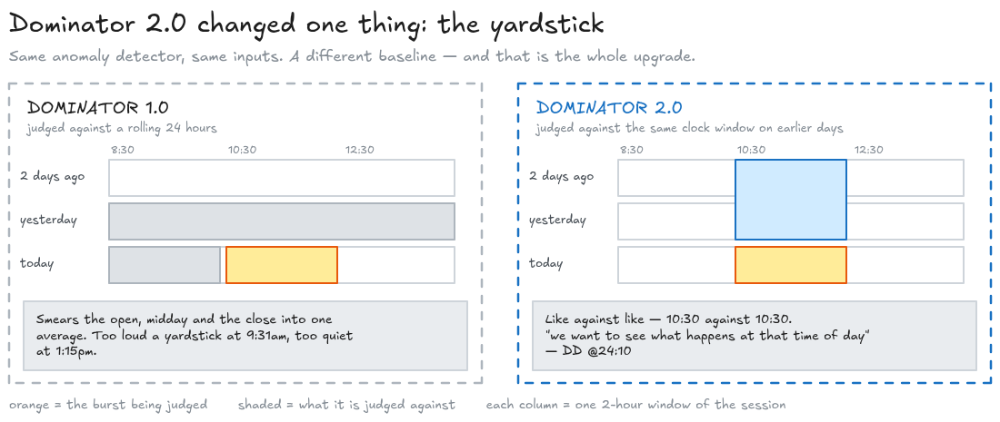
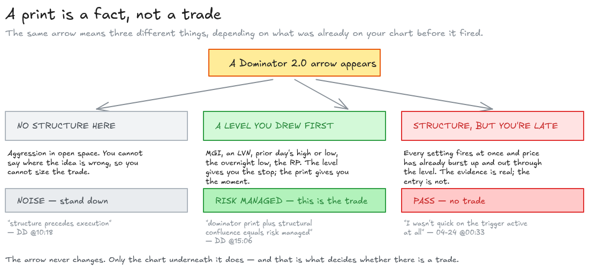
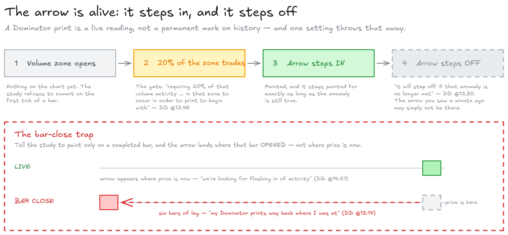
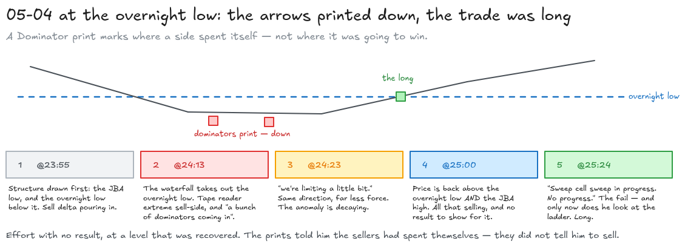

# Dominator 2.0, in plain English — with the receipts

Written 2026-08-29 from the OFL course text
[`reference/dominator-2.0.txt`](./reference/dominator-2.0.txt), the 26-minute deep-dive call
[`reference/dominator-2-0-deep-dive.txt`](./reference/dominator-2-0-deep-dive.txt), and the four
market replays in [`replays/`](./replays/) where Job says the word out loud. Every timestamp below
is a real link into a real video — click it and watch the thing happen.

**Terminology note.** Job talks in OFL shorthand. Nothing below assumes you know any of it; the
decoder ring is here, up front, and my own prose uses the plain-English column. Job's quotes stay
verbatim, disfluencies and all, because that is what you will actually hear.

| Job says | Means |
| --- | --- |
| **print** | the arrow the study paints on your chart |
| **step in / step off** | the arrow appears / the arrow disappears again |
| **DND chart** | a second, hidden chart at a different bar size that feeds the study. "Do Not Display" — it exists to be calculated on, not looked at |
| **RTH** | Regular Trading Hours — the day session (NQ: 8:30am Chicago / 9:30am New York) |
| **Globex** | the overnight electronic session, everything outside RTH |
| **IB** | Initial Balance — the range of the first hour of RTH |
| **"arval"** (aRVOL) | relative volume — today's volume measured against what is normal for this window |
| **pace of tape** | how fast trades are printing in time & sales, i.e. how hard people are hitting the market |
| **DOM** | the order book / depth of market ladder |
| **pinch, whalinator, LZ, ED, autoplot, RP, JBA** | other OFL studies and levels. They matter here only as things Job stacks *alongside* a Dominator print |

**A note on the auto-captions.** The deep-dive transcript is machine-generated and it mangles OFL
vocabulary badly. `"modified pot pace of tape"` is *plot*; `"dumb time sales"` is *DOM, time &
sales*; `"arval"` is *aRVOL*; `"dominate 2.0"`, `"dominated 2.0"` and `"whinator"` are Dominator 2.0
and Whalinator. I quote them as captioned and gloss them in brackets, so you can always check me
against the video.

---

## 1. What Dominator 2.0 actually is

### The setup

Every so often the market gets violent for a moment. A wave of buying or selling comes through
faster, bigger and harder than the trades around it. Somebody with size decided *now*, and pushed.

You want to know about those moments, because they mark where a fight happened — where one side
stepped in and the other side got run over. The course material puts it as participants
*"stepping in being overwhelmed and being slapped in the mouth"*
([DD @00:53](https://youtu.be/87iRywxnwj4?t=53)).

The problem is the word **unusual**. Big is not the same as unusual. 4,000 contracts in ninety
seconds at 9:31am is a Tuesday. The same 4,000 contracts at 1:15pm is somebody kicking the door in.
If your alarm just fires on *big*, it screams all morning and sleeps all afternoon — exactly
backwards.

### The original Dominator, and its flaw

The first Dominator solved half of this. It watched the pace, size and intensity of the tape, and
flagged the outliers — but it judged them against **a 24-hour rolling baseline**: today's burst
versus the average of everything in the last day.

That baseline mixes the market's moods together. The open, midday, and the close are three
different animals, and averaging them gives you a yardstick that is too long in the morning and too
short at lunch. The course text names the flaw exactly:

> *"Even within RTH hours, there are distinct changes in pace and volume between morning, midday, and
> end-of-day activity."* — [`reference/dominator-2.0.txt`](./reference/dominator-2.0.txt)

### The event

**Dominator 2.0 is the same anomaly detector with the baseline changed: instead of comparing this
burst to the last 24 hours, it compares this burst to the same clock window on previous days.**

That's the whole idea. It is 10:30am and the study is set to a 2-hour window. It does not ask
whether this is loud compared to the past day. It asks whether this is loud compared to 8:30–10:30
yesterday, and the day before, and the day before that. Same time of day, same slice of the
session's rhythm, compared like with like. Job calls it **session awareness**:

> *"But with Dominator 2.0 there is a sessionaware design."* —
> [DD @00:58](https://youtu.be/87iRywxnwj4?t=58)

> *"So the session aware aspect this uh current build compares structure uh from the current based
> upon behavior from that previous session or time period selection."* —
> [DD @01:22](https://youtu.be/87iRywxnwj4?t=82)

And spelled out arithmetically, later in the same call:

> *"But in that 2hour setting, it's essentially saying 8:30, 2 hours. The following two hours would
> be what? 10:30, 12:30. That's going to be pitted against the prior activity from that time frame.
> … we're looking at the first two hours of activity, and we're pitting that against the first two
> hours of activity on that prior days in sequence, negating all of the rest of the activity. We
> want to see what happens at that time of day."* —
> [DD @24:10](https://youtu.be/87iRywxnwj4?t=1450)



*The whole idea in one picture. Every diagram in this document has its editable source alongside it
in [`diagrams/`](./diagrams/) as a `.excalidraw` file — drop one into
[excalidraw.com](https://excalidraw.com) to change it.*

### What comes out

One thing: an arrow.

> *"Dominator 2.0 paints an arrow on your chart when it detects disproportionate strength on the buy
> side (up arrow) or sell side (down arrow)."* —
> [`reference/dominator-2.0.txt`](./reference/dominator-2.0.txt)

Up arrow = the buyers were disproportionately strong here. Down arrow = the sellers were. That is
the entire output. There is no score, no gradient, no direction-of-travel forecast. **The arrow says
"something anomalous happened at this price, in this direction". It does not say what to do about
it.**

The formula behind it is not published. The course text calls it *"our proprietary algorithm"*, and
the deep dive never opens the box. What is stated is *which inputs* go in — *"it evaluates the pace
size and intensity"* ([DD @03:08](https://youtu.be/87iRywxnwj4?t=188)) — and what the baseline is.
Everything past that is unsourced, and I have not tried to reverse-engineer it.

### Why it matters

The value is not the arrow. It is the **calibration**.

An anomaly detector with the wrong baseline is worse than none, because it teaches you the wrong
reflex: it makes you jumpy when the market is merely busy, and blind when the market is quietly
doing something it has never done at this hour. Job makes the point about the market's inertia —
the reason an anomaly at a slow hour is worth more than the same anomaly at a fast one:

> *"Coils up, gets real small, and then all of a sudden burst. But I'll tell you, it does not move
> like a dinghy. It moves like a cruise ship. It takes time to turn. That type of stuff. And so even
> in those low arval [aRVOL] environments, we want to be able to gauge the activity against that
> exact period of time."* — [DD @17:15](https://youtu.be/87iRywxnwj4?t=1035)

A calibrated detector catches the first shove against the cruise ship. An uncalibrated one only
notices once it is already turning.

### The thing it is not: a trigger

This is the part that gets people hurt, and Job says it more times than anything else in the
material. **A Dominator print is a confluence, not an entry.** It tells you aggression showed up. It
does not tell you the aggression will win.

> *"So I think it goes without saying that structure precedes execution."* —
> [DD @10:18](https://youtu.be/87iRywxnwj4?t=618)

> *"So the dominator print plus structural confluence equals risk managed, right?"* —
> [DD @15:06](https://youtu.be/87iRywxnwj4?t=906)

The course text says the same thing twice, in the "Summary" and again in the "Usage" section:

> *"It is recommended to place emphasis on structural references when prints occur, as this minimizes
> risk during the identification of market participation. Dominator 2.0 plays a critical role by
> highlighting when aggression aligns with structural levels."*
> — [`reference/dominator-2.0.txt`](./reference/dominator-2.0.txt)

The reason the sequencing matters is that **structure gives you the stop and the target; the print
only gives you the moment.** A print in the middle of nowhere is aggression with nothing to lean on
— you cannot say where you are wrong, so you cannot size the trade. A print into a level you had
already drawn is the same aggression *with a fence around it*. Job's picture of that, on 04-08:

> *"whether it's dominator getting that baseball bat type of push into a zone. And that's where we
> would see something like you know a giant kind of flush makes no progress, turns get in on that
> sucker, push back in. It has to be pitted also against some sort of structure, right? So, structure
> precedes the execution."* — [04-08 @32:50](https://youtu.be/u-S6Rvj7hIY?t=1970)

And the discipline that follows from it — the day every setting he owns lit up and he still did not
take the trade:

> *"One is that we opened up the day and I had literally every single Dominator 2.0 setting that I
> have on my charts lit up right here and we just burst up and out of it. I wasn't quick on the
> trigger active at all until right here."* —
> [04-24 @00:33](https://youtu.be/JMWo4IpN8yA?t=33)

Every setting firing at once did not make it a trade. It made it a *fact* — a loud one — that he
then waited to see resolve against the RP and the previous day's high before doing anything.



### The print is alive — it steps in, and it steps off

The arrow is not a permanent mark stamped on history. It appears while the anomaly holds and it
**disappears again if the anomaly stops being true**:

> *"What you're going to see is the Dominator will step in and it will step off if that anomaly is no
> longer met with the Dominator 2.0."* — [DD @12:30](https://youtu.be/87iRywxnwj4?t=750)

Two consequences, and they matter more than they sound.

**First, there is a floor before it prints at all.** The study waits until roughly a fifth of the
volume zone has actually traded before it will commit to an arrow:

> *"It is filtering activity. So it need it's requiring 20% of that volume activity or that finish of
> completion of that activity in that zone to occur in order to print to begin with. We will be
> continually working refining this percentage base."* —
> [DD @12:46](https://youtu.be/87iRywxnwj4?t=766)

That filter exists to stop the study firing on the first tick of a bar and then taking it back —
*"we've stepped in and said we don't want this print right off the bat. We want to see that activity
pretty much be solidified to some degree"* ([DD @13:36](https://youtu.be/87iRywxnwj4?t=816)).

**Second — and this is the trap — do not set it to bar close.** The study can be told to only paint
on a completed bar. If the hidden chart feeding it is much coarser than the chart you trade on, the
arrow then lands *back where that bar opened*, which may be many bars behind the price you are
looking at:

> *"okay, my execution chart is 500 volume, but the Dominator 2.0 is 6,000 volume. Therefore, I have
> all these bars printing. And then boom, my Dominator prints way back where I was at. … when you
> place it on bar close and you have let's say 1,000 volume execution chart but the DND is coming
> from 6,000 volume understand that that print will be six bars back upon completion."* —
> [DD @13:14](https://youtu.be/87iRywxnwj4?t=794)

Which defeats the point entirely:

> *"We're not looking for hindsight activity. We're looking for flashing in of activity to be able to
> show that eb and flow of activity that we've discussed with DOM response time and sales."* —
> [DD @14:21](https://youtu.be/87iRywxnwj4?t=861)

The trade-off is real and there is no free answer: live prints flicker, bar-close prints lag. Job's
resolution is the 20% filter — live, but not *instantly* live.



### The companion signals

A Dominator print is meant to be corroborated, not believed alone. Two independent checks, both of
which Job names in the same breath as the print:

**On the tape.** The same aggression that trips the study should be visible in time & sales and on
the ladder — *"that should also be prevalent on the DOM and time and sales"*
([DD @14:57](https://youtu.be/87iRywxnwj4?t=897)). On 05-04, the tape reader was extreme *before* the
prints arrived:

> *"But look what happened just before. And so just before we get a bunch of dominators coming in we
> had an extreme sellside type of activity in tape reader."* —
> [05-04 @24:13](https://youtu.be/9iNMcMoI9nk?t=1453)

**On the delta profile.** Effort that got stuck shows up as an exhaustive look in the delta map, and
a Dominator print in the same place is the second opinion:

> *"We have a dominator 2.0 showing up. We have delta map exhaustive look occurring at the lowest.
> And so we still have the potential to push up into this here."* —
> [07-17 @11:02](https://youtu.be/glG8-dCLba0?t=662)

Note the shape of that sentence: two independent instruments agreeing, and only then a directional
expectation. That is the intended usage in one line. (For what "exhaustive look" means, see
[`absorption-exhaustion-initiative-explained.md`](./absorption-exhaustion-initiative-explained.md).)

### A concrete 90-second walkthrough

The cleanest worked example in the corpus is 05-04, at the overnight low. It has the whole shape:
aggression detected, aggression *not* followed, structure recovered, entry taken off the failure
rather than off the print.

1. **[@23:55](https://youtu.be/9iNMcMoI9nk?t=1435)** — the setup. Price is coming down into the JBA
   low and, below it, the overnight low — *"getting a lot of cell [sell] delta into that."* (The
   captions mangle both prices badly enough that I will not repeat them; watch the clip.) Two levels
   drawn in advance. This is the structure the rest of the sequence hangs on.
2. **[@24:13](https://youtu.be/9iNMcMoI9nk?t=1453)** — the aggression, on the tape first. *"just
   before we get a bunch of dominators coming in we had an extreme sellside type of activity in tape
   reader."* Sellers are leaning on it hard, and the study confirms it.
3. **[@24:23](https://youtu.be/9iNMcMoI9nk?t=1463)** — the tell that the aggression is spent. *"And
   then now on this cell here, we're limiting a little bit. We're not getting a lot of cell side type
   of activity into this."* Same direction, far less force. The anomaly is decaying.
4. **[@25:00](https://youtu.be/9iNMcMoI9nk?t=1500)** — the summary read, left to right. *"we saw a
   downward shaping balance coming into that waterfall type of activity that took out overnight low.
   Very aggressive dominators coming in, pinches coming in, and now we've recovered the overnight
   low. We've already recovered the overnight low and the JBA high. Watch your offer."* All that
   selling, and price is back above the level it broke. **That is the signal — not the print, but the
   print failing to produce follow-through.**
5. **[@25:24](https://youtu.be/9iNMcMoI9nk?t=1524)** — the entry condition. *"Sweep cell sweep in
   progress. No progress. So this first one will be the fail. But watch your offer right there.
   That's where that flip occurs. It's where I'd be looking to be able to step in on a potential
   fail."* Effort with no result, at a recovered level — and only now does he look at the ladder.



The lesson to carry out of it: the dominators printed on the way **down**, and the trade was a
**long**. The print marked where the sellers spent themselves, not where they were going to win.

---

## 2. Setting it up on your own charts

This section is configuration, not concept. It is what the deep dive spends its middle third on.

### The three dials

| Dial | What it does | Values Job names |
| --- | --- | --- |
| **Session start / end** | Anchors the clock windows the study slices history into | Start at the RTH open in your chart's timezone; end one second before it. Evening session **off**, 24-hour **on** ([DD @05:07](https://youtu.be/87iRywxnwj4?t=307)) |
| **Time window** | How long a slice is compared against its equivalent on prior days | 30 min, 60 min, 90 min, 2 hour, 3 hour. *"essentially the only time frame settings that are available"* ([DD @04:25](https://youtu.be/87iRywxnwj4?t=265)) — though Cory has coded 4 hour and beyond for testing ([DD @09:51](https://youtu.be/87iRywxnwj4?t=591)) |
| **Volume** | The size of the bars on the hidden DND chart that feeds the study — effectively the sensitivity | NQ recommended: **6,250 volume**. Second setting on the same chart: **7,500 volume**. A member's favourite: **20,000** ([DD @16:34](https://youtu.be/87iRywxnwj4?t=994), [DD @19:15](https://youtu.be/87iRywxnwj4?t=1155)) |

### Why the session starts at the RTH open

Not for tidiness. To exclude the news:

> *"Well, about an hour before we typically have data releases and so we have um anomalous activity
> and we want to remove that type of anomalous activity in order to have a true sense of volume coming
> in at that per period of time."* — [DD @03:51](https://youtu.be/87iRywxnwj4?t=231)

Pre-open data releases produce enormous volume that has nothing to do with the auction. Leave them
in the baseline and every real anomaly during the day looks small by comparison. Job's own charts run
on Chicago time, so his NQ session is `08:30:00` to `08:29:59` — a full 24 hours, but *starting* at
the RTH open so the slice boundaries land where the session's rhythm actually changes
([DD @04:57](https://youtu.be/87iRywxnwj4?t=297)).

He is candid that Chicago is the odd choice: *"which you know, everybody knows that's the wrong time.
Everybody should be Eastern time, right? … but my charts are all in Chicago time to have confluence
with what we're always discussing"* ([DD @04:49](https://youtu.be/87iRywxnwj4?t=289)). **Whichever
timezone you use, the setting is the RTH open expressed in it** — 8:30 Chicago and 9:30 New York are
the same instant.

### The trade-off, and it is the only one

Bigger volume setting and longer window → fewer arrows, each worth more. Smaller → more arrows, each
worth less.

| Setting | Prints | What a print is worth |
| --- | --- | --- |
| Higher time frame / higher volume | Fewer | *"further excursion expectancy"* — bigger expected move, and a bigger area to settle through first |
| Shorter time frame / lower volume | More | *"more prints and less extension expectancy from that activity"* |

— [DD @02:47](https://youtu.be/87iRywxnwj4?t=167)

The extreme end of that trade-off is where it stops being an intraday tool at all. A member asks
about the 20K setting; Job's answer draws the line:

> *"if you're looking for that 30 50 point pop outside of that zone that had a retest and you have a
> dominated 2.0 in, that's one thing, but that's not swing. And um but if you're looking at the 20k
> dominator stepping in stepping in, you might have a variable area of 6080 [60–80] points on NQ that
> has to settle first before it begins to move."* —
> [DD @21:40](https://youtu.be/87iRywxnwj4?t=1300)

> *"And so with regard to risk management on this um this is intended to be set for um intraday type
> of activity. Quick response get in and push show activity show interest."* —
> [DD @22:15](https://youtu.be/87iRywxnwj4?t=1335)

**Read that as a warning about stops.** A 20K print may be right and still trade 60–80 NQ points
against you before it works. The recommended settings are sized for an intraday response, and the
risk you take should be sized for the setting you are watching.

### Running more than one setting at once

Job runs several, and the cost is bookkeeping: each setting needs its own hidden DND chart, and a
plain up-or-down arrow does not tell you *which* setting fired.

His answer is colour. Build the DND charts, use the OFL overlay's point-on-low / point-on-high, and
give each setting its own colour:

> *"create a color to signify what that specific time period is. … If it's something outside of the
> recommended settings, you can switch the color to be able to notify yourself, hey, when that prints,
> then you understand that's coming from a different setting instead of just having a narrow up or an
> arrow down."* — [DD @08:04](https://youtu.be/87iRywxnwj4?t=484)

He asks the obvious question about the overhead himself and answers it honestly: *"Is that cumbersome?
Certainly is."* ([DD @07:50](https://youtu.be/87iRywxnwj4?t=470)).

The original 24-hour Dominator does not get retired by any of this — it stays on the chart, in a
different colour again:

> *"Does this mean that I'm not going to be utilizing a 24-hour rolling uh the original dominator? No,
> absolutely not. Um some of those guys really heavy hitters. So, they will be on they will be colored
> differently. That way I'm aware of what I'm looking at."* —
> [DD @18:18](https://youtu.be/87iRywxnwj4?t=1098)

### Choosing your settings, by efficacy not by taste

Job's filter for keeping a setting is not "does it look good on the chart". It is **frequency first,
then hit rate**:

> *"one of my filters coming into Dominator 2.0 now is that I want to have a certain amount of prints
> relative to the activity through RTH. I don't want to go 7 days without a print or anything like
> that. And therefore over a look back, I want to be able to see X amount of trades that occurred from
> this based upon a response and be able to gauge the efficacy from those trades."* —
> [DD @19:48](https://youtu.be/87iRywxnwj4?t=1188)

A setting that fires once a week cannot be evaluated — there is no sample. Tune for enough prints to
measure, then measure. He re-tests his own *"bi-weekly"* ([DD @07:35](https://youtu.be/87iRywxnwj4?t=455)).

### Does it work outside RTH?

Yes — because the mechanism is clock-relative, not session-relative. A 2-hour Globex window gets
compared to the same 2-hour Globex window on prior days, and that is a perfectly good baseline:

> *"So during GlobeEx, it is viable because during that 2-hour period of time where you're trading
> through Asia and you have that response through that zone, it's only looking at that pitted against
> that period of time during Asia, for example. … Extremely viable."* —
> [DD @25:16](https://youtu.be/87iRywxnwj4?t=1516)

The RTH-anchored session start still matters overnight, because it is what makes the slice boundaries
land in the same place every day.

### The four-step read

Compressing all of the above into what you actually do when an arrow appears:

1. **Is there structure here?** A level you drew before the print — MGI, LVN, prior day's high/low,
   overnight low, the RP. No structure, no trade; the print alone gives you nowhere to put a stop.
2. **Which setting fired?** The colour tells you the size of move it is calibrated for, and therefore
   how much room the idea needs before it is wrong.
3. **Does the tape agree?** Aggression on the DOM and in time & sales, at the same moment. If the
   arrow is the only thing that moved, distrust it.
4. **Then wait for resolution.** Follow-through *through* the level, or effort with no result *at*
   the level. Both are tradeable; they are opposite trades. The print does not tell you which — 05-04
   above resolved as a failure and became a long.

### One known defect

Three things I could not source, stated plainly rather than papered over:

- **The algorithm is closed.** *"our proprietary algorithm"* is the whole disclosure. Pace, size and
  intensity go in; how they are combined, what the anomaly threshold is, and how many prior days the
  baseline spans are all unstated. Nothing in this document reverse-engineers it, and you should
  distrust anyone's account that claims to.
- **Recommended settings are given for NQ only.** 6,250 volume on a 2-hour window is the one
  fully-specified recommendation in the material. There is no equivalent published for ES or anything
  else, and the volume dial is instrument-specific by construction — you cannot port 6,250 to a
  different contract.
- **Where the arrow anchors on the bar** is never stated, and it matters for reading a chart after
  the fact. The bar-close discussion tells you the print can land *bars* behind price, but not which
  price within the bar it attaches to.

One more, smaller: on [04-08 @19:29](https://youtu.be/u-S6Rvj7hIY?t=1169) Job says *"We have anomaly
at 25,110 range"* while reading a chart that has Dominator settings on it. In context that is very
likely a Dominator print, but he says "anomaly", not "dominator", so I have not counted it in the
index below.

### Why it is not in Gekko's engine

For completeness, since this is a Gekko repo: Dominator 2.0 is deliberately not implemented, and
nothing in [`chart-data/`](../../chart-data/) exports it. The reasoning is written up in
[`execution-steps.md`](./execution-steps.md#why-not-the-dominator-why-not-the-pull-stack-and-what-replaces-them)
— a closed-formula print cannot be validated on replay, and the aggression read it summarizes is
computed openly elsewhere in the engine. **Its one genuinely portable idea — normalize against the
same time of day on prior sessions — was kept.** That, not the arrow, is the part worth stealing.

---

## 3. Where to see it — timestamped index

### Source index

| Date | Title | Length | Link |
| --- | --- | --- | --- |
| 2025-09-19 | Dominator 2.0 Deep Dive | 25:49 | [87iRywxnwj4](https://youtu.be/87iRywxnwj4) |
| 2026-04-08 | Market Replay — JBA low bid for con't | 36:28 | [u-S6Rvj7hIY](https://youtu.be/u-S6Rvj7hIY) |
| 2026-04-24 | Market Replay — Rebid and DOM discussion | 19:21 | [JMWo4IpN8yA](https://youtu.be/JMWo4IpN8yA) |
| 2026-05-04 | Market Replay — JBA high reoffer & ONL Rebid | 44:42 | [9iNMcMoI9nk](https://youtu.be/9iNMcMoI9nk) |
| 2026-07-17 | Market Replay — Exhaustive Node at Edge of Range | 27:22 | [glG8-dCLba0](https://youtu.be/glG8-dCLba0) |

Plus the course PDF text at [`reference/dominator-2.0.txt`](./reference/dominator-2.0.txt) (38
lines, no timestamps) and the DOM course text at [`reference/dom.txt`](./reference/dom.txt).

### Start here — the six clearest clips

| # | Clip | Why this one |
| --- | --- | --- |
| 1 | [DD @00:58](https://youtu.be/87iRywxnwj4?t=58) | The one-sentence definition: *"with Dominator 2.0 there is a sessionaware design"* |
| 2 | [DD @24:10](https://youtu.be/87iRywxnwj4?t=1450) | The baseline explained arithmetically — 8:30 / 10:30 / 12:30 against the same windows on prior days. If you watch one clip, this is it |
| 3 | [DD @15:06](https://youtu.be/87iRywxnwj4?t=906) | The doctrine in seven words: *"dominator print plus structural confluence equals risk managed"* |
| 4 | [DD @12:30](https://youtu.be/87iRywxnwj4?t=750) | The print steps in and steps off — the thing most people don't realise it does |
| 5 | [04-24 @00:33](https://youtu.be/JMWo4IpN8yA?t=33) | Every setting lit up and he took nothing. The best argument that a print is not a trigger |
| 6 | [05-04 @25:00](https://youtu.be/9iNMcMoI9nk?t=1500) | A full read in one paragraph: aggressive dominators down, structure recovered, watch your offer |

### Full index, by video

#### Dominator 2.0 Deep Dive — [87iRywxnwj4](https://youtu.be/87iRywxnwj4)

The whole call is on-topic, so this is indexed by segment rather than by mention.

| Clip | Verbatim | What it means |
| --- | --- | --- |
| [@00:02](https://youtu.be/87iRywxnwj4?t=2) | *"Dominator 2.0 and I'm excited to go through this"* | Opening. Why 2.0 exists, and that Sierra Chart is where DND charts are fully available |
| [@00:40](https://youtu.be/87iRywxnwj4?t=40) | *"It's modified pot [plot] pace of tape isolating anomalies from dumb [DOM,] time sales"* | What the *original* Dominator does — the base the 2.0 modifies |
| [@00:53](https://youtu.be/87iRywxnwj4?t=53) | *"those participants stepping in being overwhelmed and being slapped in the mouth"* | What the anomaly represents: a fight one side lost |
| [@00:58](https://youtu.be/87iRywxnwj4?t=58) | *"with Dominator 2.0 there is a sessionaware design"* | **The definition.** |
| [@01:09](https://youtu.be/87iRywxnwj4?t=69) | *"when we were talking about the IB dominator taking the original dominator with a DND and doing just the IB"* | 2.0's ancestor: an Initial-Balance-only Dominator. 2.0 generalizes it to any window |
| [@01:22](https://youtu.be/87iRywxnwj4?t=82) | *"compares structure uh from the current based upon behavior from that previous session or time period selection"* | The baseline, stated |
| [@02:12](https://youtu.be/87iRywxnwj4?t=132) | *"there is a distribution curve of activity and I'm aware of it"* | Why the recommended settings are few — more settings means more DND charts for every user |
| [@02:47](https://youtu.be/87iRywxnwj4?t=167) | *"higher time frame setting, further excursion expectancy, shorter time frame setting, more prints and less extension expectancy"* | **The trade-off.** The only dial-tuning principle in the material |
| [@03:08](https://youtu.be/87iRywxnwj4?t=188) | *"it evaluates the pace size and intensity … not on 24-hour response as the original dominator would"* | The three inputs, and the contrast with 1.0 |
| [@03:34](https://youtu.be/87iRywxnwj4?t=214) | *"session start time for the symbol or the recommended settings should be like like so"* | Start of the settings walkthrough |
| [@03:51](https://youtu.be/87iRywxnwj4?t=231) | *"about an hour before we typically have data releases … we want to remove that type of anomalous activity"* | **Why the session anchors to the RTH open.** News volume would poison the baseline |
| [@04:11](https://youtu.be/87iRywxnwj4?t=251) | *"2our setting or a 3hour setting or a 90 minute setting or a 60 minute setting or a even a 30 minute setting"* | The five available window lengths |
| [@04:49](https://youtu.be/87iRywxnwj4?t=289) | *"this is an example of setting it on Chicago time, which you know, everybody knows that's the wrong time"* | Timezone caveat — 8:30 CST is the RTH open on his charts |
| [@05:11](https://youtu.be/87iRywxnwj4?t=311) | *"82959 should be the 24hour close"* | The end-of-session value: one second before the start |
| [@05:56](https://youtu.be/87iRywxnwj4?t=356) | *"with NQ so the uh 8:30 session with a 2hour setting is that dark area"* | Worked example on the chart. The dark shading is the comparison window |
| [@06:43](https://youtu.be/87iRywxnwj4?t=403) | *"However, during that time period, we want to see what is normal."* | The purpose of the shading in one sentence |
| [@07:10](https://youtu.be/87iRywxnwj4?t=430) | *"the reset recommended settings are going to provide more prints"* | Recommended settings are the *sensitive* end of the range |
| [@07:35](https://youtu.be/87iRywxnwj4?t=455) | *"this will be something that I test bi-weekly"* | He re-tunes his own settings fortnightly |
| [@07:46](https://youtu.be/87iRywxnwj4?t=466) | *"Is that it also requires more DNDs, right? Is that cumbersome? Certainly is."* | The honest cost of running multiple settings |
| [@08:04](https://youtu.be/87iRywxnwj4?t=484) | *"create a color to signify what that specific time period is"* | **Colour-code by setting** — otherwise an arrow is anonymous |
| [@09:03](https://youtu.be/87iRywxnwj4?t=543) | *"we talk about arval [aRVOL] so relative volume"* | The conceptual family the study belongs to |
| [@09:37](https://youtu.be/87iRywxnwj4?t=577) | *"Cory's done an excellent job of being able to have this uh coded incorrectly [in correctly]"* | Attribution; 30/60/90 min, 2/3/4 hour and beyond are testable |
| [@10:18](https://youtu.be/87iRywxnwj4?t=618) | *"structure precedes execution"* | **The doctrine.** |
| [@11:30](https://youtu.be/87iRywxnwj4?t=690) | *"think about the whalinator … overlap this with the whinator [Whalinator] into the EOD or the EAD"* | Stacking it with other OFL studies at a zone edge |
| [@12:04](https://youtu.be/87iRywxnwj4?t=724) | *"Get creative with this because this is highly adaptive"* | Explicit invitation to tune beyond the recommendations |
| [@12:30](https://youtu.be/87iRywxnwj4?t=750) | *"the Dominator will step in and it will step off if that anomaly is no longer met"* | **Prints are live objects, not permanent marks** |
| [@12:46](https://youtu.be/87iRywxnwj4?t=766) | *"requiring 20% of that volume activity … in that zone to occur in order to print to begin with"* | **The 20% filter.** The anti-flicker gate |
| [@13:14](https://youtu.be/87iRywxnwj4?t=794) | *"my Dominator prints way back where I was at … that print will be six bars back upon completion"* | **The bar-close trap.** Coarse DND + bar-close = a lagging arrow |
| [@13:36](https://youtu.be/87iRywxnwj4?t=816) | *"we don't want this print right off the bat. We want to see that activity pretty much be solidified"* | Why the filter exists |
| [@14:21](https://youtu.be/87iRywxnwj4?t=861) | *"We're not looking for hindsight activity. We're looking for flashing in of activity"* | The design intent the bar-close setting violates |
| [@14:57](https://youtu.be/87iRywxnwj4?t=897) | *"that should also be prevalent on the DOM and time and sales"* | **The cross-check.** The print should not be the only evidence |
| [@15:06](https://youtu.be/87iRywxnwj4?t=906) | *"the dominator print plus structural confluence equals risk managed"* | **The formula for using it.** |
| [@16:08](https://youtu.be/87iRywxnwj4?t=968) | *"with Dominator 2.0 Now what I want to really get at is that it has this session awareness"* | Recap, returning to the core |
| [@16:34](https://youtu.be/87iRywxnwj4?t=994) | *"recommended 6250 volume 2our setting on dominate 2.0. The other one is 7500 30 minute setting"* | **The published NQ numbers.** Both settings on one chart |
| [@17:15](https://youtu.be/87iRywxnwj4?t=1035) | *"it does not move like a dinghy. It moves like a cruise ship. It takes time to turn."* | Why calibrating to a quiet window matters |
| [@17:51](https://youtu.be/87iRywxnwj4?t=1071) | *"it's not only isolating the IB, it is doing two, it's doing blocks of that specific time setting"* | The window tiles the whole day, it is not just the IB |
| [@18:18](https://youtu.be/87iRywxnwj4?t=1098) | *"Does this mean that I'm not going to be utilizing … the original dominator? No, absolutely not."* | 1.0 stays on the chart, in another colour |
| [@19:04](https://youtu.be/87iRywxnwj4?t=1144) | *"one of my favorite ones is actually the 20K because it has a multi-our response"* | Member question opening the higher-timeframe discussion |
| [@19:35](https://youtu.be/87iRywxnwj4?t=1175) | *"higher time frame volume settings … you're also going to have fewer prints"* | The trade-off restated from the other end |
| [@19:48](https://youtu.be/87iRywxnwj4?t=1188) | *"I don't want to go 7 days without a print … be able to gauge the efficacy from those trades"* | **How to choose a setting:** enough prints to measure, then measure |
| [@20:23](https://youtu.be/87iRywxnwj4?t=1223) | *"can potentially provide a swing type of opportunity"* | Higher-timeframe prints as a swing tool — flagged as a future add-on, not covered here |
| [@21:00](https://youtu.be/87iRywxnwj4?t=1260) | *"Similar to how I look at the uh higher time frame pinch … I don't like to fight it"* | Treat a high-timeframe print as terrain, not as a fade |
| [@21:40](https://youtu.be/87iRywxnwj4?t=1300) | *"the 20k dominator stepping in … you might have a variable area of 6080 points on NQ that has to settle first"* | **The risk warning.** Bigger setting, bigger drawdown before it works |
| [@22:15](https://youtu.be/87iRywxnwj4?t=1335) | *"this is intended to be set for um intraday type of activity"* | The design envelope |
| [@22:42](https://youtu.be/87iRywxnwj4?t=1362) | *"the question was is this indicator um only useful during RTH"* | Member question on overnight use |
| [@23:48](https://youtu.be/87iRywxnwj4?t=1428) | *"start time is set to the RTH. That is intended to remove um the data releases"* | The session anchor, restated |
| [@24:10](https://youtu.be/87iRywxnwj4?t=1450) | *"8:30, 2 hours. The following two hours would be what? 10:30, 12:30."* | **The baseline in arithmetic.** The clearest statement of the mechanism |
| [@25:16](https://youtu.be/87iRywxnwj4?t=1516) | *"during GlobeEx, it is viable … pitted against that period of time during Asia. … Extremely viable."* | It works overnight, for the same reason it works intraday |

#### 2026-04-08 Market Replay — [u-S6Rvj7hIY](https://youtu.be/u-S6Rvj7hIY)

| Clip | Verbatim | What it means |
| --- | --- | --- |
| [@31:22](https://youtu.be/u-S6Rvj7hIY?t=1882) | *"you're going to have intraday setups that are going to be playing off of um LZs and dominators and EDs and pinches"* | Where the Dominator sits in the toolkit: one of several intraday triggers-of-attention |
| [@31:42](https://youtu.be/u-S6Rvj7hIY?t=1902) | *"I like the dominator 2.0. I mean that's my baby."* | Job's own weighting of the tool |
| [@32:20](https://youtu.be/u-S6Rvj7hIY?t=1940) | *"keep your charts relatively naked. Keep only what you want to see. Your MGI, your zones."* | The counterweight: structure on the chart, execution tools sparingly |
| [@32:50](https://youtu.be/u-S6Rvj7hIY?t=1970) | *"dominator getting that baseball bat type of push into a zone … a giant kind of flush makes no progress, turns get in on that sucker"* | **The archetypal trade:** a Dominator flush into structure that fails to progress |
| [@33:09](https://youtu.be/u-S6Rvj7hIY?t=1989) | *"It has to be pitted also against some sort of structure, right? So, structure precedes the execution."* | The doctrine again, in a live context |

#### 2026-04-24 Market Replay — [JMWo4IpN8yA](https://youtu.be/JMWo4IpN8yA)

| Clip | Verbatim | What it means |
| --- | --- | --- |
| [@00:33](https://youtu.be/JMWo4IpN8yA?t=33) | *"I had literally every single Dominator 2.0 setting that I have on my charts lit up right here and we just burst up and out of it. I wasn't quick on the trigger active at all"* | **Maximum signal, no trade.** Confluence across every setting still is not an entry |

#### 2026-05-04 Market Replay — [9iNMcMoI9nk](https://youtu.be/9iNMcMoI9nk)

| Clip | Verbatim | What it means |
| --- | --- | --- |
| [@24:13](https://youtu.be/9iNMcMoI9nk?t=1453) | *"just before we get a bunch of dominators coming in we had an extreme sellside type of activity in tape reader"* | The tape leads the print. The study confirms what the tape already showed |
| [@24:23](https://youtu.be/9iNMcMoI9nk?t=1463) | *"now on this cell here, we're limiting a little bit. We're not getting a lot of cell side type of activity"* | The aggression decaying — the setup for the reversal |
| [@25:00](https://youtu.be/9iNMcMoI9nk?t=1500) | *"Very aggressive dominators coming in, pinches coming in, and now we've recovered the overnight low"* | **Aggression that failed.** Prints down, structure recovered, and the trade is long |

#### 2026-07-17 Market Replay — [glG8-dCLba0](https://youtu.be/glG8-dCLba0)

| Clip | Verbatim | What it means |
| --- | --- | --- |
| [@11:02](https://youtu.be/glG8-dCLba0?t=662) | *"We have a dominator 2.0 showing up. We have delta map exhaustive look occurring at the lowest."* | **Two instruments agreeing**, then a directional expectation. The intended usage in one sentence |

---

## 4. Mention counts, for the record

The corpus is thin on this term and it is worth knowing how thin before you go looking for more.

| Source | Utterances of "dominator" | Notes |
| --- | --- | --- |
| `reference/dominator-2-0-deep-dive.txt` | 24 | The entire 25:49 call is the subject |
| `reference/dominator-2.0.txt` | 7 | Course PDF text, 38 lines |
| 9 market replays | **9 total**, across 4 videos | 04-08 (5), 05-04 (2), 04-24 (1), 07-17 (1) |
| 25 morning-prep transcripts | **0** | Not a prep-time concept — it is an execution tool, and prep does not touch it |

Counts exclude the file header lines. Reproduce with:

```bash
for f in replays/*.txt; do grep -v '^#' "$f" | grep -oi dominator | wc -l; done
```

The absence in the prep transcripts is itself informative: Dominator 2.0 never appears in planning,
only in live execution and post-hoc replay. That is consistent with *"structure precedes execution"* —
structure is what gets planned; the Dominator is what you consult once you are already at the level.

---

## 5. The summary

Dominator 2.0 is an anomaly detector for aggression. It watches the pace, size and intensity of the
tape and paints an up or down arrow when one side pushes disproportionately hard — but its whole
contribution over the original Dominator is *what it compares against*: instead of a rolling 24-hour
average, it judges this 2-hour window against the same 2-hour window on previous days, with the day
anchored at the RTH open so that pre-market news never poisons the baseline. That makes it honest at
1pm as well as 9:31am. The arrow appears once about 20% of its volume zone has traded and disappears
again if the anomaly stops holding, so it is a live reading rather than a permanent mark — and
setting it to paint on bar close strands the arrow bars behind price, which defeats the design. It
is calibrated by two dials that trade off against each other: bigger volume and longer windows give
fewer prints with more expected follow-through and a wider area to survive first, smaller settings
give more prints worth less each, and the whole thing is built for intraday response, not swing.
Crucially, **it is not an entry signal.** A print says aggression happened, not that the aggression
will win — on 05-04 the arrows printed on the way down and the trade was a long, because price
recovered the level anyway. Job's rule is one line, and it is the only rule that matters here:
*structure precedes execution*, and a Dominator print plus a level you had already drawn equals a
trade whose risk you can actually define.
