# Job's Entry Sequence — five gated steps, visualized in Sierra Chart

The entry process, reduced to the five things that happen — in order — at a pre-marked level before
Job clicks the button. Each step is written as an *observable* a Sierra Chart study can detect and
paint, with the concept behind it and the replay passages it rests on. The document ends at the
entry; what happens after is listed briefly at the end, sourced the same way.

**Sources — and only these.** The nine trade replays (04-08, 04-24, 04-30, 05-04, 05-19, 05-28,
06-26, 06-30, 07-17), the OFL DOM and Time & Sales course material, the Job Pivots deep dive, and the
Dominator 2.0 material (read only to know what *not* to depend on). Every claim cites a replay and a
timestamp; links land a few seconds early. No earlier distillation was used.

**Constraints this design honours (operator, 2026-08-27):** NQ only. No Dominator — its logic is
opaque. No OFL pull stack — it is useful on ES, not NQ. Everything is computed from Sierra Chart's
own Level 2 depth, time & sales and bars, with visible logic.

**Confidence:** `A` = stated in 5+ replays · `B` = 2–4 · `C` = single instance or inferred.

---

## The one idea underneath everything: the opponent

> "I definitely don't want to be entering when my opponent is active."
> — [05-04 @40:16](https://youtu.be/9iNMcMoI9nk?t=2416)

Your opponent is the side that must fail for you to be right. Before a long, that is the **offer**:
the resting sellers who keep re-offering at the price. Job never watches "the book"; he watches one
side, at one price, and asks one question — *are they still there?* — and then a second — *has my
side taken their price?* Once in, the opponent flips: a long is now managed by watching the **bid**
([06-30 @30:02](https://youtu.be/FrSP2kDoJvs?t=1802), [06-26 @26:36](https://youtu.be/l4xvVNTE_H8?t=1596)).

| You are | Before entry, watch the… | The trigger is… | After entry, watch the… |
| --- | --- | --- | --- |
| Long candidate | **offer** at the level | offer stops refreshing → **bid steps above** the offer's price and holds | bid |
| Short candidate | **bid** at the level | bid stops refreshing → **offer steps below** the bid's price and holds | offer |

Every step below is written for the long. The short is the mirror image; nothing else changes.

Four variables that a study must keep separate, because the words "opponent" and "aggressor" refer
to different things at different moments (for a long at a low):

| Variable | For a long | What it is measured by |
| --- | --- | --- |
| Trade direction | long | comes from the plan / the band, not from which way price arrived |
| Resting defender | the **offer** at price D | resting ask size at D, tested by buys (`SC_TS_ASK` prints at D) |
| Aggressor that must fail | market **sells** into the level | `SC_TS_BID` prints that stop producing new lows |
| Post-entry opponent | the **bid** | (management, outside this document) |

---

## The sequence at a glance

```mermaid
stateDiagram-v2
    direction LR
    [*] --> IDLE : away from structure — do not watch the DOM
    IDLE --> ARMED : 1 · price inside a pre-marked band
    ARMED --> DEFENDING : 2 · offer proven refreshing at price D while sells make no progress
    DEFENDING --> WITHDRAWN : 3 · D stops replenishing; sells still make no progress
    WITHDRAWN --> TAKEN : 4 · bid above D, trade above D, held — THE ENTRY
    TAKEN --> ACCEPTED : 5 · immediate progress, no renewed defense at D
    TAKEN --> SCRATCH : no progress / defense returns at D
    WITHDRAWN --> DEFENDING : offer reloads at D (or relocates one tick, once)
    DEFENDING --> IDLE : offer keeps stepping through the band (level failed)
    ARMED --> IDLE : price accepts beyond the band's far edge
    SCRATCH --> ARMED : still inside the band — "strike one", not "off"
    ACCEPTED --> [*] : management: watch the other side
```



Steps 1–3 are pre-entry. **Step 4 is the entry.** Step 5 is whether the entry survived its first
seconds — it is shown as a step because it is the last thing Job narrates before he stops watching
the DOM, but it happens after the click, and the validation plan scores it separately.

The same thing, as the DOM Job is narrating. Long candidate, price has fallen into a marked level.
`D` is the price where the offer keeps re-offering.

```
   step 2 · DEFENDING                step 3 · WITHDRAWN               step 4 · TAKEN (entry)
   bid   price  offer                bid   price  offer               bid   price  offer
         D+2     38                        D+2     41                        D+2     12
         D+1     52                        D+1     19                        D+1      9    <- offer thin above
         D      [61] <- refreshes:         D        4  <- pulled, not        D      [ ]   <- old offer price…
                       lifted 40,                     filled: no
                       reloads to 61                  prints at D
    47   D-1                          31   D-1                     58   D+1           <- …best bid is now
    83   D-2                          64   D-2                     66   D                ABOVE D, prints ≥ D+1,
    buys lift D, price can't          sells make no new low;       holds — nothing trades below D
    get above D; sells make           the sell-side tape
    no new low  = absorption          is tapering
```

*(Excalidraw: the MCP server is configured in `~/.claude.json` but was not connected in the session
that produced this document, so the diagrams are Mermaid + monospace. Both render on GitHub. The
state diagram above is the one worth redrawing in Excalidraw if a picture is wanted for the wall.)*

---

## Step 1 — ARRIVE: price is inside a pre-marked band

**What he says.**

- "Even though you have a DOM up, you don't have to be hawking this sucker. **Structure precedes
  execution.** Let it move into this zone first." — [04-08 @5:43](https://youtu.be/u-S6Rvj7hIY?t=343)
- "Don't be drilling your eyes to the DOM right now… as we get close to tagging it, *then* we want
  to flip the eyes over to the DOM. We want to watch the offer." —
  [04-24 @3:27](https://youtu.be/JMWo4IpN8yA?t=207). Ten points away is not there: "I want to be
  pretty much at it or right over top of it." — [04-24 @4:17](https://youtu.be/JMWo4IpN8yA?t=257)
- "At this point I have no concern looking at the DOM with the exception of the 87s. Watch your
  87s." — [07-17 @9:29](https://youtu.be/glG8-dCLba0?t=569)
- Which level, when several are stacked? "**The one that responds.**" —
  [05-28 @2:35](https://youtu.be/bFU1dXf5uw8?t=155)
- The same DOM signature *away* from structure is worthless: the offer shied away mid-distribution
  and he refused it — "Are we in a buy zone of that? We're dead center in this distribution." —
  [06-26 @18:06](https://youtu.be/l4xvVNTE_H8?t=1086)
- Fast is not disqualifying; *acceptance* is. He wants the sweep into the level: "Want to see this
  breach down through. Want to see it go quickly. Get a little scary." —
  [04-24 @7:12](https://youtu.be/JMWo4IpN8yA?t=432). What ends a level is settling beyond it: "if we
  stop run out of that and come back in, resetting position is absolutely viable. But if we stop
  run out of that and we settle above those JBA highs… don't fight it." —
  [05-04 @9:39](https://youtu.be/9iNMcMoI9nk?t=579)

`A` — stated in every replay.

**The concept.** The DOM read is not a continuous input. It is consulted in a narrow window around a
level the plan already marked — a JBA edge, an LVN of a named profile, a high-volume edge, or a
stack of MGI that collapses to one price — and only for the one price in question. The band also
carries the trade's **direction**, and with it which side is the opponent. Direction comes from the
plan, not from which way price arrived: in 07-17 the long is taken as price rises *up* into the 87s
from below, after a failed excursion, and the opponent is still the offer.

**The observable.** Last trade is inside a band. The band is the structure's own extent where that is
known (a drawn rectangle, a JBA edge), otherwise a line ± a small tick pad. The state is *left*
without a trade only when price accepts beyond the far edge — trades and holds there for a window —
not merely because it went through fast.

**Abort.** Acceptance beyond the far edge → IDLE.

**Sierra Chart visualization — the arming band.**

| | |
| --- | --- |
| Chart | the NQ execution chart (volume bars, 500–750 per bar) |
| Level sources | **Primary:** operator-drawn horizontal lines / rectangle highlights in two agreed colours (green = long band, red = short band, a third = either) — the plan, enumerated with `sc.GetUserDrawnChartDrawing`. **Secondary, each optional, used only where no drawn level is within tolerance:** OFL **Job Pivots** subgraphs via `sc.GetStudyArrayUsingID`; the **JBA rectangles** (enumerated as `JobStudyExporter.cpp` already does); the **MGI** study subgraphs (RP, ONH/ONL, PDH/PDL, IB, VWAPs); the **Volume by Price** study's peaks and valleys via `sc.GetStudyPeakValleyLine` — note this returns a *line*, not an LVN's extent, so a valley becomes a band only as line ± pad (an extent scan through `sc.GetVolumeAtPriceDataForStudyProfile` is a later refinement) |
| Merge policy | references within `tol` of each other collapse to one band (the wider extent wins); **one** active band at a time — the nearest to price; direction from the drawn colour, else from the source's setup type, else from approach direction as a last resort; provenance kept on the band |
| Self-exclusion | the study draws with `sc.UseTool` (ACS drawings, own line-number range) so it never re-ingests its own output via the user-drawing enumeration |
| Rule | `armed = band.low − tol ≤ last ≤ band.high + tol`; `accepted_through = N_acc prints beyond the far edge with none back inside` |
| Render | grey band = planned, inactive · **amber** = armed, label `ARMED · LONG · watch OFFER` · hatched = accepted through |
| Tunables | `tol` (ticks; default 2) · line pad (default 2) · `N_acc` (default 20 prints, cap 60 s) |

Nothing in this step touches depth. That is deliberate: it is the gate that keeps NQ's flickering
book away from the state machine everywhere except at a price that matters.

---

## Step 2 — LOCATE THE DEFENSE: the offer is proven refreshing at one price, and sells are making no progress

**What he says.**

- "Watch these 66s. They're refreshing. Refreshing. Refreshing. When we ultimately step above the
  66s and the offer steps away, you're going to see the opposite…" —
  [05-19 @2:17](https://youtu.be/RaJRUnHR_Rg?t=137)
- The definition, on request: "the stepping in to those orders, maintaining dominance, and inability
  to get back above the prior levels that we were looking at where they were refreshing." —
  [06-26 @20:47](https://youtu.be/l4xvVNTE_H8?t=1247)
- What he is actually looking at: "I'm not too concerned about overall the resting liquidity. I want
  to see how it's moving and how much interest is pulling in and out… Are we actually refreshing?
  Because if we're refreshing, we can get a little sweep down into that to fill it and then remove."
  — [06-26 @40:38](https://youtu.be/l4xvVNTE_H8?t=2438)
- The other half — the aggressor's effort failing: "Sell sweep in progress. No progress." —
  [05-04 @25:24](https://youtu.be/9iNMcMoI9nk?t=1524); "133 lots at 7215 that immediately pause
  instead of finding acceleration… Ton of sell sweeps. We're not making progress." —
  [05-04 @38:54](https://youtu.be/9iNMcMoI9nk?t=2334); "a lot of orders passively sitting here
  allowing us to press into and fill. But are we making progress through here yet? No." —
  [06-30 @4:02](https://youtu.be/FrSP2kDoJvs?t=242)
- Why this step must come before the pull: in 04-30 A period "we were pressing POC to the low… but
  nobody was giving up from the offer. Push, build, push, build. There was nothing… There's no
  response." — [04-30 @37:16](https://youtu.be/5124WmFuurg?t=2236). No defense, no read.
- "Absorption takes time." — [05-04 @9:14](https://youtu.be/9iNMcMoI9nk?t=554)

`A` — the "watch your offer / refreshing at the Ns" narration is in every replay; the named price is
always a specific one (the 87s, the 66s, the 210s, the 28s, the 17s).

**The concept.** A pull only means something at a price that first *proved* it was defended. Job
finds that price by watching resting size get lifted and come back — "refreshing" — while the
market-sell pressure into the level stops producing new lows. That pairing is textbook absorption
(OFL 101 T&S @2:49: "sweeps… but price is not moving at all and we're seeing replenishing… that's
potential absorption"). The output of this step is a single price, **D** — the price the whole
trigger will be measured against.

**The observable.** Within the armed band (± 2 ticks on the offer side), a price D where, over an
event-count window with a time cap:

1. **executions into D** — `SC_TS_ASK` prints at D (buyers lifting the offer), cumulative volume
   ≥ `F_min` (normalized, below), across ≥ 2 separate returns to D;
2. **replenishment** — resting ask size at D comes back after being lifted: `restored / filled ≥
   r_refresh` over ≥ 2 deplete-and-restore cycles. When cycles cannot be counted (see the data note),
   the fallback evidence is executed volume at D ≥ `k_iceberg ×` the largest ask size ever displayed
   at D *within the same bounded window and with the same repeated returns* — the reload / iceberg
   signature. The fallback never qualifies D on its own;
3. **no progress** — price does not sustain trade above D, and on the other side `SC_TS_BID` prints
   (market sells) keep arriving without a new low: rolling sell volume high while the extreme
   advances ≤ `k_prog` ticks — effort without result.

Job also reads the sell-side pace by ear ("tape reader dwindling") and the delta map. Both are
features of this state, not steps.

**Abort.** The offer steps *through* the band and builds on the far side → the level failed → IDLE.
No stable D emerges → stay ARMED with `UNPROVEN` shown; do not invent a defender.

**Sierra Chart visualization — the defended-price tracker.**

| | |
| --- | --- |
| Data — inside market, event-granular | `sc.GetTimeAndSales`: the array carries **quote records** (`Type == SC_TS_BIDASKVALUES`) with `Bid`, `Ask`, `BidSize`, `AskSize` between the trade records (`SC_TS_ASK` / `SC_TS_BID` with `Price`, `Volume`), in `Sequence` order with ms timestamps — Sierra's own T&S study reads bid/ask sizes from exactly these (`Studies.cpp` ~800). While D is the best ask, lift → size restored → lift is visible *per event*, independent of the chart update interval |
| Data — beyond the inside | `sc.GetAskMarketDepthEntryAtLevel` / `GetBidMarketDepthEntryAtLevel` (`sc.UsesMarketDepthData = 1`), one snapshot per study call — sufficient for "size present / gone" at D±1, D±2, not for cycle counting |
| Per-price ledger (offer side, band ± 2) | `displayed`, `maxDisplayed`, `filled` (ask prints at that price), `restored = max(0, Δ + filled)`, `cancelled = max(0, −Δ − filled)`, `cycles`, `returns`, plus `unexplained` for changes a snapshot cannot attribute; every quantity tagged **observed** (from the event stream) or **inferred** (from snapshots) |
| Rule (three thresholds, no weighted score) | `defending(D) = filled(D) ≥ F_min ∧ returns ≥ 2 ∧ (cycles ≥ 2 ∧ restored/filled ≥ r_refresh ∨ filled ≥ k_iceberg × maxDisplayed) ∧ progress ≤ k_prog` — D = the qualifying price nearest the inside market |
| Effort vs result (execution bars) | over the last `W` bars: `absorb = Σ sell volume / max(1, new-low ticks)`; flag when `absorb` is above its baseline percentile |
| Render | **orange segment at D**, a tiny counter `fills 412 · reloads 3 (obs)`; state ribbon `DEFENDING`; optional `absorb` histogram in a lower region |
| Tunables | `F_min` (× the baseline median executed volume per price) · `r_refresh` (start 0.6) · `k_iceberg` (start 2.0) · `k_prog` (start 2 ticks) · window (start 40 prints, cap 60 s) |

**NQ note.** This is exactly why the pull stack fails on NQ: NQ shows tens of contracts per level and
the numbers turn over every tick, so a compressed "stacking / pulling" colour mostly reflects price
moving through levels, not a participant deciding anything. Step 2 never looks at raw size. It looks
at *transactions plus replenishment plus failed progress*, at one price, with sizes expressed as
ratios against the book's own recent behaviour. A 15-lot NQ offer that reloads four times against
buys is a defender; a 300-lot offer that sits untouched and vanishes is not.

**Implementation note.** Steps 2 and 3 are two states of *one* opponent lifecycle —
`UNPROVEN → DEFENDING → WITHDRAWN` — sharing one ledger. Two independent detectors reading the same
study call could disagree (cumulative volume says "defending", the last snapshot says "gone"); one
lifecycle cannot.

---

## Step 3 — WITHDRAW: the defense at D stops replenishing, and it is cancellation, not fills

**What he says.**

- "So the offer starts to shy away right here. **This is not yet an entry** for my point. We could
  see tape reader is basically dwindling off on the sell side activity." —
  [04-08 @7:10](https://youtu.be/u-S6Rvj7hIY?t=430)
- "A little bit of refreshing here in the 87 to 89 90 area, but overall each time we press down now,
  they're really pulling off, **not just temporarily**." —
  [04-24 @7:37](https://youtu.be/JMWo4IpN8yA?t=457)
- "You start to see this get a little toothy, a little bit sporadic on the offer side… when they
  pull off, I have it turn blue." — [04-30 @24:27](https://youtu.be/5124WmFuurg?t=1467)
- "There's a meaningful characteristic to the offer when it **removes** versus when it's going to
  **acquiesce** to price coming up." — [05-19 @14:52](https://youtu.be/RaJRUnHR_Rg?t=892)
- "Overnight low tag, but the offer is still there. It's still there. When do you step in? **When
  they step away.**" — [05-04 @35:31](https://youtu.be/9iNMcMoI9nk?t=2131)
- "If your opponent is stepping away from something then you don't have interest, and so take that
  as a cue." — [06-26 @5:04](https://youtu.be/l4xvVNTE_H8?t=304); a level fails "when the activity
  removes itself from the book" — [06-26 @7:31](https://youtu.be/l4xvVNTE_H8?t=451)
- "You want to see him be like Swiss cheese. Absolutely allergic to that zone." —
  [06-30 @12:55](https://youtu.be/FrSP2kDoJvs?t=775)
- Withdrawal with the aggression still heavy also counts — it is the *result* that matters: "Ton of
  sell sweeps. We're not making progress. So, when you begin to see that weakness from the offer,
  step in." — [05-04 @39:00](https://youtu.be/9iNMcMoI9nk?t=2340)
- The negative case — the opponent *relocating* is not withdrawing: "we see the offer stepping down
  further into the 27s. That's where I pretty much know it's off." —
  [05-28 @10:18](https://youtu.be/bFU1dXf5uw8?t=618); "the offer gets underneath, begins to
  protect" — [04-24 @6:31](https://youtu.be/JMWo4IpN8yA?t=391); an offer that keeps stepping down
  through the zone is active opposition, not a renewable setup —
  [04-24 @6:09](https://youtu.be/JMWo4IpN8yA?t=369)
- Don't guess it: "instead of trying to guess where they're going to step off, allow them to step
  off." — [06-26 @30:51](https://youtu.be/l4xvVNTE_H8?t=1851)

`A` — in 8 of 9 replays. Necessary, **not sufficient** — 04-08 and 06-30 both say so in as many words.

**The concept.** Absorption ends one of two ways: the offer is *filled* out (the level gets run — it
still exists, price just went through it), or the offer *cancels* — it decided not to defend. Only
the second is Job's signal, and the difference is exactly what a bar cannot show and a book can: size
that vanished *without prints*. Often, but not always, the sell-side pace "dwindles" alongside it.

**The observable.** At D, after DEFENDING was established, over an event-count window:

1. the defense no longer replenishes — `cancelled(D)` dominates `restored(D)` and no restoration
   follows the next return to D; and
2. the market sells still produce no adverse progress (no new low beyond the band's far edge);
3. **supporting, not required:** sell-side pace (prints per second on `SC_TS_BID`) fast-EMA below
   slow-EMA — the "dwindling" Job often hears but does not always wait for;
4. the offer has **not** merely relocated: if step-2-quality defense reappears at D−1, set `D ← D−1`
   and return to DEFENDING — **once**. A second adverse relocation, or any step through the band, is
   the level failing → IDLE.

Sierra's own pulling/stacking value at D (`sc.GetAskMarketDepthStackPullValueAtPrice`, after
`sc.SetUseMarketDepthPullingStackingData(1)`) is logged as a cross-check only: its treatment of trade
volume and its reset behaviour are not documented in the local headers, so the study keeps its own
ledger and never calls `ClearMarketDepthPullingStackingData` (its scope may be chart-wide).

**Abort.** Reload at D of step-2 quality → DEFENDING. Stale withdrawal (no take within `M` events) →
expire to DEFENDING. Second relocation, or relocation through the band → IDLE.

**Sierra Chart visualization — the withdrawal marker.**

| | |
| --- | --- |
| Data | same streams as step 2; sell-side prints/sec from T&S (the existing `PaceOfTape.cpp` computes records-per-second from `GetTimeAndSalesForSymbol` and is the template) |
| Rule | `withdrawn(D) = cancelled(D) ≥ c_min × baselineSize ∧ restored(D)/cancelled(D) ≤ r_dead ∧ no new low ∧ ¬relocated` held for ≥ `N_w` events (cap `T_w`); `pace_fast ≤ pace_slow` raises confidence |
| Transition label | every transition is stamped **observed** (seen across ≥ 2 study calls) or **inferred** (deduced inside one batch); an inferred WITHDRAWN cannot progress to TAKEN in the same call |
| Render | the orange segment at D goes **hollow yellow**; a small "drain" marker on the price scale; ribbon `WITHDRAWN (obs)` / `(inf)` |
| Tunables | `c_min` (start 0.5 × baseline size) · `r_dead` (start 0.25) · pace EMAs (5 s / 30 s) · `N_w` (start 20 prints, cap 15 s) · relocation radius (2 ticks, once) · `M` expiry (start 200 prints) |

**Sizing, observed — not a rule and not a study output.** Size in the replays is a function of
*location* and context, never of the step: "if we're outside of a zone like this, naturally it's
going to be smaller size" ([07-17 @21:40](https://youtu.be/glG8-dCLba0?t=1300)); against POC
alignment "I will size down" ([04-30 @35:14](https://youtu.be/5124WmFuurg?t=2114)). Within that,
two replays show a **starter** put on here, at the pull, and built at step 4: "is it okay just to
slap in with a full position on this? I wouldn't. But if you're going to put a starter on from this,
by all means, that's a good location" ([06-26 @23:05](https://youtu.be/l4xvVNTE_H8?t=1385)); "on
the uptick, now I want to place adds on a starter" ([04-30 @24:46](https://youtu.be/5124WmFuurg?t=1486)).
He calls his own step-3 entries "preemptive" ([04-30 @4:39](https://youtu.be/5124WmFuurg?t=279))
and "a little early" ([04-08 @8:28](https://youtu.be/u-S6Rvj7hIY?t=508)). `B`. The study emits no
size; the starter label is an optional render, off by default.

---

## Step 4 — TAKE: the bid steps *above* D, trades above D, and holds — this is the entry

**What he says.**

- The specification: "You want to see the offer be allergic to that, not refreshing, **but the bid
  needs to now step above where that offer shied away** and then pulled back in." —
  [06-30 @14:04](https://youtu.be/FrSP2kDoJvs?t=844); "with that flip that occurred there, that in
  my end would trigger an entry" — [06-30 @13:19](https://youtu.be/FrSP2kDoJvs?t=799)
- "I need to see bid step **above** those 66s in order to view this as having some strength." —
  [05-19 @3:43](https://youtu.be/RaJRUnHR_Rg?t=223); the whole sequence in one breath: "those 84s
  where it was refreshed from the offer and then the offer stepped back from that and the bid began
  to step back up into it" — [05-19 @21:33](https://youtu.be/RaJRUnHR_Rg?t=1293)
- "Had the bid stepped **above** the 210s and we begin to build there, then I'd be looking for
  continuation." — [04-24 @5:46](https://youtu.be/JMWo4IpN8yA?t=346); "I want to see the bid step up
  into the 185s… That particular area was where my initial entry was." —
  [04-24 @8:38](https://youtu.be/JMWo4IpN8yA?t=518); and the hold: "I want to see the bid now
  breach that and begin to hold it and protect it on the other side" —
  [04-24 @10:24](https://youtu.be/JMWo4IpN8yA?t=624)
- "The offer is off the 87s. You see the stacking there at the 84s… strength from the bid side and
  weakness from the offer" — but that is not yet it: "I want to see this press and step above that
  zone and **not just tickle this 87 back and forth**." —
  [07-17 @12:41](https://youtu.be/glG8-dCLba0?t=761), [@12:00](https://youtu.be/glG8-dCLba0?t=720)
- "Now we're stepping above where they were protecting under the 204s… Now the water's too cold
  down here. Want to get in and press this." — [04-30 @25:28](https://youtu.be/5124WmFuurg?t=1528)
- The failure that proves the rule: the offer went light, "but we're not seeing the bid willing to
  refresh and stay **above those 25s**" — position scratched —
  [06-30 @15:52](https://youtu.be/FrSP2kDoJvs?t=952); "tape reader dwindling, but also we're not
  finding the ability of the bid to step up and above the 31s" —
  [05-28 @8:50](https://youtu.be/bFU1dXf5uw8?t=530)
- Timing: "It's okay to get in a little bit later on the move, but you want to make sure you're not
  the first one to the party." — [05-28 @11:05](https://youtu.be/bFU1dXf5uw8?t=665)

`A` — the flip is named as the entry in 04-24, 05-19, 06-30, 07-17, 05-04, 04-30; the 06-30 and 05-28
scratches show step 3 without step 4 is not a trade.

**The concept.** The opponent leaving creates a vacuum; the trade is your side *filling* it. Job's
word is always **above**: the price that was the seller's line must now be *below* the buyer's line.
A print *at* D is not that — it can be the last of the old offer being lifted. A bid *at* D is not
that either. The bid has to be above D and price has to trade above D and stay there.

**The observable.** After WITHDRAWN at D:

1. best bid ≥ **D + 1 tick** (quote record in the T&S stream, or depth level 0);
2. at least one trade ≥ D + 1 tick — an `SC_TS_ASK` print there is *supporting* evidence of
   initiative (buyers lifting the offer above the old line: "buy at market… it's also making
   progress", T&S 101 @5:00), but a passive bid absorbing sells above D is also a take, so the print's
   side is not required;
3. held for ≥ `N_t` trade events (time cap `T_t`) with **no print below D** and no step-2-quality
   reload of the offer at D;
4. the hold must be confirmed on a **later study call** than the one that first saw the cross — a
   withdrawal and a take seen inside one batch is a sweep until proven otherwise.

Displayed bid size is *not* required to be large. On NQ a modest bid that keeps surviving market sells
is stronger evidence than a large one that flashes.

**Abort.** Print below D within the hold window → WITHDRAWN (stale) or DEFENDING if the offer
reloaded. Withdrawal older than `M` events with no take → expire.

**Sierra Chart visualization — the trigger arrow.**

| | |
| --- | --- |
| Data | T&S quote records (best bid), trade records (price, side); depth level 0 as cross-check |
| Rule | `taken(D) = bestBid ≥ D+1 ∧ ∃ print ≥ D+1 ∧ minPrint ≥ D over ≥ N_t events ∧ ¬defending_offer(D) ∧ confirmed on a later call` |
| Render | **green up-arrow** at the bar, text `TAKE > D · 4.2 s` (latency from withdrawal); the D line turns green (it is now support); ribbon `TAKEN`; a hollow red arrow marks `withdrawal without take` for research only |
| Tunables | cross distance (1 tick; 2 in fast conditions) · `N_t` (start 12 prints, cap 10 s) · reload quality = step-2 thresholds · `M` expiry |

This is the alert. If the operator only ever builds one study, it is the one that fires here.

---

## Step 5 — ACCEPT: the entry goes your way immediately, and the defense does not come back

*Post-entry validation. Entry recall is scored at step 4; this step scores whether the trigger
survived.*

**What he says.**

- "Before entering a position, I want to be able to see the activity move away, show some sort of
  **accommodation** to that positioning." — [05-04 @8:51](https://youtu.be/9iNMcMoI9nk?t=531)
- "You want that to go **immediately** in your favor." —
  [06-30 @14:04](https://youtu.be/FrSP2kDoJvs?t=844); a pullback that just auctions through the
  level is no good: "not just sweep through it and sit here and auction over like they're doing at
  28s filling that" — [06-30 @23:48](https://youtu.be/FrSP2kDoJvs?t=1428)
- The behavioural stop: "not be able to cut that trade **unless we're refreshing** either at the 87s
  or into the low 80s." — [07-17 @13:52](https://youtu.be/glG8-dCLba0?t=832) `C` — one replay
- The structural stop: "here's the chaser. If we find any activity below this current low, then no
  bueno." — [05-04 @36:29](https://youtu.be/9iNMcMoI9nk?t=2189); "right here we have a defined exit.
  If we begin to find activity below this, then I don't want to be in on it." —
  [04-08 @2:25](https://youtu.be/u-S6Rvj7hIY?t=145)
- Rotation is tolerated; settling is not: run out and back in → viable; settle beyond → don't fight
  it — [05-04 @9:39](https://youtu.be/9iNMcMoI9nk?t=579); "we do have one final sweep… I'm giving it
  some room though" — [04-08 @7:48](https://youtu.be/u-S6Rvj7hIY?t=468)
- The add rule is the same rule at higher intensity: "immediately that add is seeing refreshing of
  the offer into that zone. It doesn't move in favor, get it off." —
  [05-28 @19:25](https://youtu.be/bFU1dXf5uw8?t=1165); "I want it to work immediately or I want it
  off." — [05-04 @15:23](https://youtu.be/9iNMcMoI9nk?t=923)
- Scratch is not thesis-off: "No harm, no foul. Also strike one." —
  [05-04 @27:01](https://youtu.be/9iNMcMoI9nk?t=1621); "strike one has occurred" then re-long —
  [05-28 @12:16](https://youtu.be/bFU1dXf5uw8?t=736)

`A` for "must work immediately"; `C` for the behavioural stop.

**The concept.** Step 4 was a read; step 5 checks the read against the market's response. Two things
can prove it wrong quickly: nothing happens (price auctions sideways through D), or the *defense*
reappears at D — not a single flicker of size, but step-2-quality refreshing. Either is a scratch, and
a scratch resets to ARMED, not IDLE — the level is still the level until price accepts beyond it.

**The observable.** In a post-trigger window (event-count with time cap):

- favourable excursion ≥ `X` ticks (X tied to band width, e.g. 2× the band) and prints continue
  above the trigger price → `ACCEPTED`;
- else if the offer resumes step-2-quality defense at D, or price re-accepts back through the band
  (prints below D for a window, not a single sweep), or sells start making progress → `SCRATCH`;
- a print beyond the band's far edge that holds → thesis off → IDLE.

**Sierra Chart visualization — the confirmation badge.**

| | |
| --- | --- |
| Data | T&S; the D ledger; bar extremes |
| Render | green check next to the arrow with `MFE +11t · MAE −2t · 6.8 s`; red **X** for scratch; a faint shaded window extending right from the entry bar for the length of the confirmation clock |
| Tunables | `X` (ticks or × band width) · window (start 60 prints, cap 45 s) · re-cross tolerance (a sweep below D is not a re-acceptance; `N_re` prints below D is) · reload quality = step-2 thresholds |

---

## After the entry (not part of this sequence)

For completeness, sourced the same way — the four things he does once the arrow has fired:

- **Switch which side you watch.** "If you're long, your opponent now is your bid and you're treating
  this as if you're looking for a short." — [06-30 @30:02](https://youtu.be/FrSP2kDoJvs?t=1802)
- **Take something off at structure, every time.** "I'm going to take something off every single
  time" at a re-entry of the zone — [07-17 @18:35](https://youtu.be/glG8-dCLba0?t=1115); "each one
  of these locations you got to consider taking something off the table" —
  [06-30 @27:56](https://youtu.be/FrSP2kDoJvs?t=1676)
- **Adds on pullbacks into D, last in first out.** "Pullbacks into that area, place adds" —
  [05-28 @17:01](https://youtu.be/bFU1dXf5uw8?t=1021); "I utilize last in first out and so therefore
  adds will be off before the original position" — [06-26 @44:07](https://youtu.be/l4xvVNTE_H8?t=2647)
- **Velocity out of the zone → flatten.** "When we accelerate outside the zone, we just jam and we
  skip volume… that's immediate flatten from my end" — [05-28 @17:31](https://youtu.be/bFU1dXf5uw8?t=1051);
  "hit the flatten button and then go back to your log" — [05-28 @24:46](https://youtu.be/bFU1dXf5uw8?t=1486)

---

## Context flags — real, but not steps

Three things Job reads that qualify a trade rather than sequence it. They render as badges on the
ribbon, never as gates.

| Flag | What it does | Evidence | Conf |
| --- | --- | --- | :---: |
| **Period POC position** | The *developing volume POC* of the current 30-minute period and of the RTH session: at an *extreme* (within the outer 15 % of the period's range) = crowded, expect rotation away; *central* = two-way trade. A shift back toward where it was is "the sign". Trading against it → size down. The TPO POC is a different object and is not merged into this. Compression changes when a flip appears ([07-17 @6:18](https://youtu.be/glG8-dCLba0?t=378)) — the study states its compression. | [04-30 @0:19](https://youtu.be/5124WmFuurg?t=19), [@4:08](https://youtu.be/5124WmFuurg?t=248), [@30:14](https://youtu.be/5124WmFuurg?t=1814), [@35:14](https://youtu.be/5124WmFuurg?t=2114); [07-17 @2:04](https://youtu.be/glG8-dCLba0?t=124) | `B` |
| **Profile completion** | Required only for a *counter-rotation / failed-excursion* setup: "if we're building volume, she ain't done" — POC shift plus an exhaustive node or parabolic taper before countering. Not required for an ordinary rebid into a held level. An input on the band: `requires completion = yes/no`. | [07-17 @7:16](https://youtu.be/glG8-dCLba0?t=436), [@26:19](https://youtu.be/glG8-dCLba0?t=1579); [04-30 @20:51](https://youtu.be/5124WmFuurg?t=1251) | `B` |
| **Delta by location** | Heavy buy delta at a low = buyers crossing the spread, supportive; the same at a high = stacking with nobody lifting = absorption / liquidation risk. Negative delta with price rising = passive bids absorbing = bad for sellers. Feeds step 2's "no progress" read; never an entry by itself. | [04-08 @7:51](https://youtu.be/u-S6Rvj7hIY?t=471), [@27:39](https://youtu.be/u-S6Rvj7hIY?t=1659); [04-24 @14:04](https://youtu.be/JMWo4IpN8yA?t=844) | `B` |

The POC flag is worth a small companion study: developing VPOC of the current 30-min period and of
the RTH session from `sc.VolumeAtPriceForBars`, expressed as *position within the period's range*
(0 = low, 1 = high) with shift events, exposed as a subgraph the main study reads by ID. It is cheap,
and it is what 04-30 is entirely about.

---

## Why not the Dominator, why not the pull stack, and what replaces them

**Dominator 2.0** is an aggression-anomaly print: pace, size and intensity of the tape judged against
the *same clock window on prior days*, printing after ~20 % of a volume zone completes and un-printing
if the anomaly lapses (Dominator DD @12:27–14:18). Job uses it as a *confluence* at structure, never
as a trigger — "dominator print plus structural confluence" (DD @15:06). The sequence above does not
need it: the aggression read it summarizes is step 2's effort-vs-result and step 3's pace, both
computed openly. Its one genuinely good idea — **normalize against the same time-of-day on prior
sessions** — is kept as the *target* baseline method (see readiness states below).

**The OFL pull stack** is a 4-tick-compressed colouring of net depth change (07-17 @6:30). On ES,
whose levels hold hundreds of contracts and turn over slowly, the colour tracks intent. On NQ the
levels are thin and turn over every tick, so the colour mostly tracks price. The replacement is not a
better colouring of the whole ladder; it is **refusing to look at the ladder at all** except at one
price that first proved itself (step 2), with sizes expressed as ratios and every change reconciled
against the prints that could explain it (step 3). Sierra's native pulling/stacking values are kept
as a logged diagnostic so the two can be compared on replay.

---

## The study, as one thing

One ACSIL study, **"Job Entry Sequence"**, on the execution chart, plus the optional POC companion.
Five subgraphs carry the state so anything else on the chart (alerts, the export studies, a future
Gekko ingest) can read it by study ID.

**State machine.**

| From | To | Condition | Rendered |
| --- | --- | --- | --- |
| IDLE | ARMED | last trade inside the active band | band amber, `ARMED · LONG · watch OFFER` |
| ARMED | IDLE | accepted beyond the far edge | band hatched |
| ARMED | DEFENDING | `defending(D)` | orange segment at D, counter |
| DEFENDING | IDLE | offer builds through the band; or second adverse relocation | — |
| DEFENDING | WITHDRAWN | `withdrawn(D)` | D hollow yellow, drain marker |
| WITHDRAWN | DEFENDING | reload at D; or one relocation (D updates, once); or expiry | segment redrawn |
| WITHDRAWN | TAKEN | `taken(D)` confirmed on a later call | **green arrow**, D green |
| TAKEN | ACCEPTED | MFE ≥ X, no reload, no re-acceptance | check + MFE/MAE |
| TAKEN | SCRATCH → ARMED | no progress / step-2-quality reload / re-acceptance of the band | red X |
| any | INVALID | book invalid, reconnect, sequence rollback, replay jump, symbol/tick-size change, source study missing, band edited while active | grey badge; the whole microstructure state is discarded, never carried |

**Subgraphs (outputs).** `State` (0–6) · `DefensePrice` (D, 0 when none) · `Confidence` (0–1,
driven down by `unexplained`, by inferred rather than observed transitions, and by baseline readiness) ·
`Absorb` (effort-vs-result ratio) · `Trigger` (+1 long / −1 short on the bar of the take). Drawings
via `sc.UseTool`: band rectangle, D segment, arrow, text.

**Baselines and readiness.** Every size threshold is a ratio against a baseline. The target baseline
is same-clock (the same 30-minute bucket over the prior N sessions); it needs a data product that does
not exist yet — historical depth bars expose only max/last size per bar and price, not a median of
displayed size through time — so the study also **logs** its own snapshots to build it. Until then:
`NO_BASELINE → WARMING → INTRASESSION_ONLY → HISTORICAL_READY`, shown on the ribbon, because "no
signal" near the open has a different reason from "no signal" from a missing feed.

**Engineering notes that matter.**

- `sc.UpdateAlways = 1`, chart update interval at its floor (100 ms; `sc.ChartUpdateIntervalInMilliseconds`
  is readable and is reported). The study drains the T&S array by `Sequence` each call and snapshots
  the book once. Inside-market refresh cycles come from the quote records and are event-granular;
  deeper levels are snapshot-granular; everything is labelled accordingly.
- Windows are expressed in *events* with a time cap: a fast open and a dead midday must not be
  judged on the same clock.
- Same-clock baselines respect the session template, contract roll and holidays; nothing is compared
  across a roll without re-basing.
- Nothing auto-trades. The study signals; the operator clicks.
- One study, not five: the gating *is* the product, and five studies reading each other's subgraphs
  is where sequence bugs would live.

**Setup checklist (Sierra side).**

1. Market depth enabled for NQ on the Denali feed; **Record Market Depth Data** on (Global Settings ›
   Data/Trade Service Settings) so replays carry the book; note the retention window.
2. Chart Settings › Maximum Depth Levels ≥ 10; chart update interval 100 ms.
3. Time & Sales retention long enough for the event windows (thousands of records); confirm the
   quote records (`SC_TS_BIDASKVALUES`) are present in the array on this feed.
4. The execution chart's volume-bar size stays what the doctrine assumes (500–750).
5. Level sources on the chart: the operator's drawn levels in the agreed colours; optionally OFL Job
   Pivots, JBA rectangles, the MGI study, a Volume by Price study with peaks/valleys enabled.

---

## Validation plan

**Phase 0 — is the primitive observable at all?** Before any threshold is tuned:

1. Log, on every study call, the T&S batch, the depth snapshot, best bid/ask, and the native
   stack/pull value at D.
2. Run the same 10-minute NQ replay repeatedly at different replay speeds and update intervals and
   compare: refresh cycles counted, cancellations inferred, D chosen, withdrawal time, take time.
   If those change materially with the update interval, the *exact* ledger model is rejected and the
   study is framed as a confidence-bearing behaviour classifier (which it already is, by design).
3. Check whether a strict `bestBid > D` take agrees with the narrated entries better than the looser
   alternatives (trade at D, bid at D, ask print above D).
4. Establish empirically what Sierra's native pulling/stacking does with trade volume and when it
   resets, before using it even as a cross-check.
5. Confirm what replay reproduces: in replay, Sierra's own T&S study accepts bid/ask sizes from
   *trade* records rather than quote records (`Studies.cpp` ~810), which suggests the quote stream is
   not replayed as-is — so event-granular refresh may be visible only at trades in replay. Measure
   it.

**Phase 1 — label the replays.** Every replay narrates the book at a named price, in order, with the
outcome visible. Two caveats: transcript clocks are *video* time, not exchange time, and 8 of 9
replays are traded on **ES** ("ES is slower than molasses" — [05-04 @3:47](https://youtu.be/9iNMcMoI9nk?t=227)).
ES teaches the *language*; NQ thresholds are calibrated on NQ. For each narrated opportunity:
date, direction, band, setup type, `D`, and the video timestamps of *defense observed*, *withdrawal*,
*take*, *entry*, *accept / scratch*, outcome — plus the explicit negatives: withdrawal without take
([06-30 @15:12](https://youtu.be/FrSP2kDoJvs?t=912)), opponent still active
([05-28 @3:30](https://youtu.be/bFU1dXf5uw8?t=210)), pull mid-distribution
([06-26 @18:06](https://youtu.be/l4xvVNTE_H8?t=1086)), offer relocating through the zone
([05-28 @10:18](https://youtu.be/bFU1dXf5uw8?t=618)). Map video time → market time once per replay
from an on-screen clock or a named price event.

**Phase 2 — score.** Visual audit of the ribbon against the narration; then step-level scoring (each
transition independently); then end-to-end (an entry counts only if every prior step fired in order).
Entry recall is scored at **TAKE**; ACCEPT is scored separately so failed triggers stay in the entry
dataset. The primary metric is **false full triggers per session**, not recall — Job would rather
miss a move than be first to the party. Leave-one-replay-out on thresholds; then an **alert-only
forward run** on NQ for several weeks, logging raw features and transition reasons, before anything
is built on top.

---

## Open questions

- **Historical depth for the replay dates.** Sierra replays the book only from recorded `.depth`
  files or Denali's historical depth download, whose coverage window needs checking. If the dates are
  not covered, the labelled set validates the *visual* sequence only and thresholds are calibrated
  forward.
- **Sierra's native pulling/stacking semantics** — whether it subtracts trade volume, when it resets,
  and whether `Clear…` is chart-wide. Not documented in the local headers; Phase 0 item 4.
- **Refresh-cycle visibility away from the inside.** At D±1 and beyond, the study sees snapshots
  only. How often the fight is at the inside (where cycles are event-granular) vs one tick off is
  something the Phase 0 logs will show.
- **Same-clock baseline data product.** The snapshot logger has to run for some sessions before
  `HISTORICAL_READY` means anything; until then thresholds are intra-session ratios.
- **Level-source precedence** when a drawn level and a study-derived band disagree by more than
  `tol` — the drawn one wins in this design; confirm that is the operator's intent.

---

## How this document was produced

Two independent readings of the same corpus — one by Claude, one by Codex (OpenAI) — were compared,
then the merged design was put through an adversarial Codex review. Material corrections that came
out of that review and are reflected above: the take condition is *strictly above* D, not at D
(06-30 @15:12, 04-24 @5:46); a "pull" counts only at a price that first proved itself; a one-tick
relocation is escalation, not withdrawal, and is allowed once; approach direction does not determine
trade direction (07-17); fast traversal is not disqualifying, acceptance is (04-24 @7:12); sizing is
not a step output; pace decay is supporting evidence, not a gate (05-04 @39:00); step 5 is post-entry
validation; VbP peak/valley lines have no extent; the exact add/cancel ledger is only event-granular
at the inside market, so transitions are labelled observed vs inferred. One objection was rebutted
with the headers: Sierra's T&S array does carry best-bid/ask quote records with sizes, so refresh
cycles at the inside are visible independent of the chart update interval.

---

## Appendix A — evidence index by step

| Step | Replays where it is stated | Strongest single passage |
| --- | --- | --- |
| 1 Arrive | 04-08, 04-24, 05-04, 05-19, 05-28, 06-26, 06-30, 07-17 | [04-24 @4:17](https://youtu.be/JMWo4IpN8yA?t=257) |
| 2 Locate the defense | 04-24, 04-30, 05-04, 05-19, 05-28, 06-26, 06-30, 07-17 | [06-26 @20:47](https://youtu.be/l4xvVNTE_H8?t=1247) |
| 3 Withdraw | 04-08, 04-24, 04-30, 05-04, 05-19, 05-28, 06-26, 06-30, 07-17 | [05-04 @35:31](https://youtu.be/9iNMcMoI9nk?t=2131) |
| 4 Take | 04-24, 04-30, 05-04, 05-19, 06-30, 07-17 (+ the 05-28 and 06-30 failures) | [06-30 @14:04](https://youtu.be/FrSP2kDoJvs?t=844) |
| 5 Accept | 04-08, 05-04, 05-28, 06-30, 07-17 | [05-04 @8:51](https://youtu.be/9iNMcMoI9nk?t=531) |

## Appendix B — vocabulary → observable

| Job says | Step | Observable |
| --- | --- | --- |
| "structure precedes execution", "let it get there" | 1 | last trade inside band |
| "watch your offer", "refreshing the 87s", "stepping in, stepping in" | 2 | ask prints at D + size restored, no trade held above D |
| "sell sweeps, no progress", "tape reader dwindling", "absorption" | 2 | sell volume high, low not advancing; sell pace EMA falling |
| "shy away", "toothy", "allergic", "Swiss cheese", "they turn blue", "pulled off" | 3 | cancellation at D dominates fills; no restoration on the next return |
| "stepping down, stepping down", "gets underneath, begins to protect" | 3 (negative) | relocation one tick closer → DEFENDING at D−1, once; again → IDLE |
| "bid steps above where the offer was refreshing and holds", "blow out those offers" | 4 | best bid ≥ D+1, print ≥ D+1, no print < D, held across calls |
| "not just tickle the 87 back and forth", "bid doesn't want it" | 4 (negative) | print back below D within the hold window |
| "show some accommodation", "work immediately or off", "refreshing reappears → cut" | 5 | MFE ≥ X, no step-2-quality reload at D, no re-acceptance |
| "no harm no foul, strike one" | 5→1 | scratch returns to ARMED |
