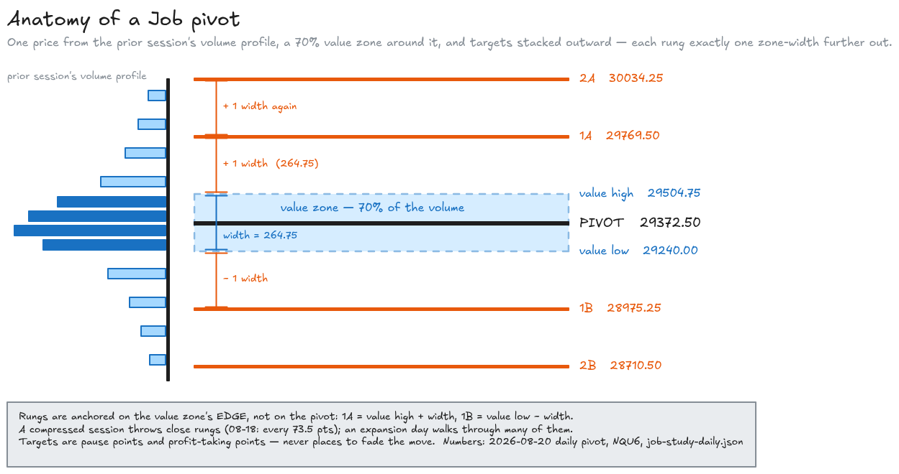
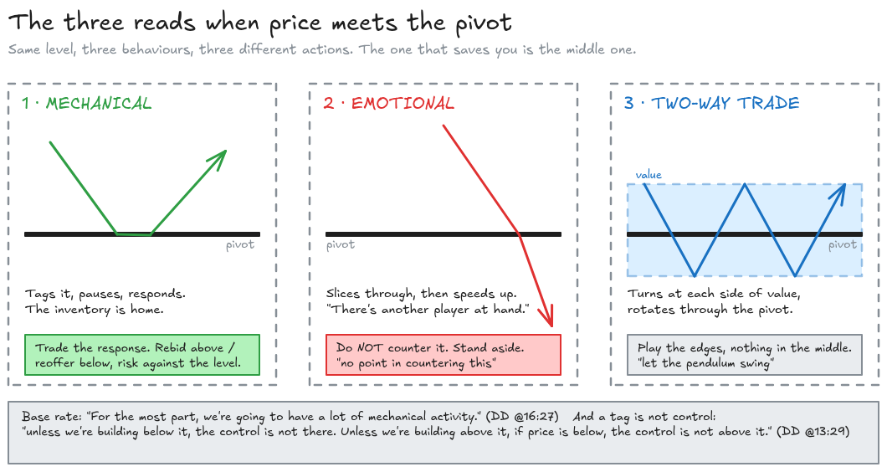
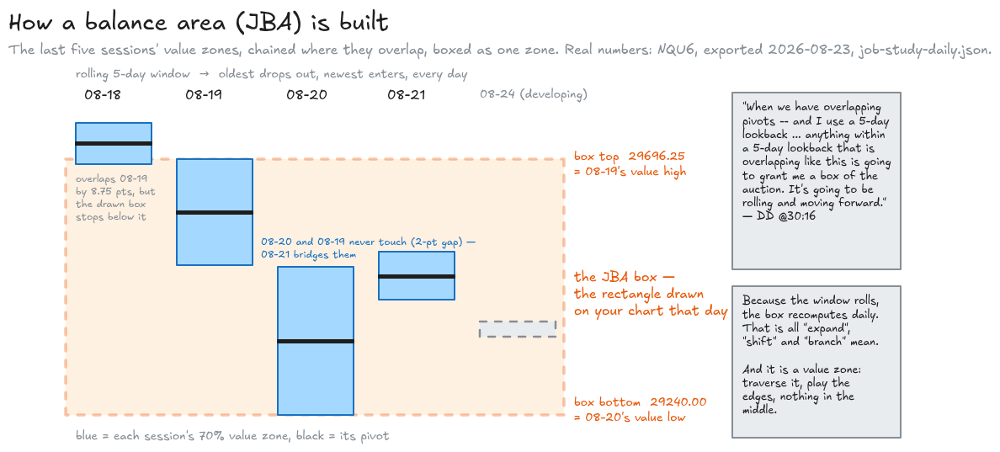
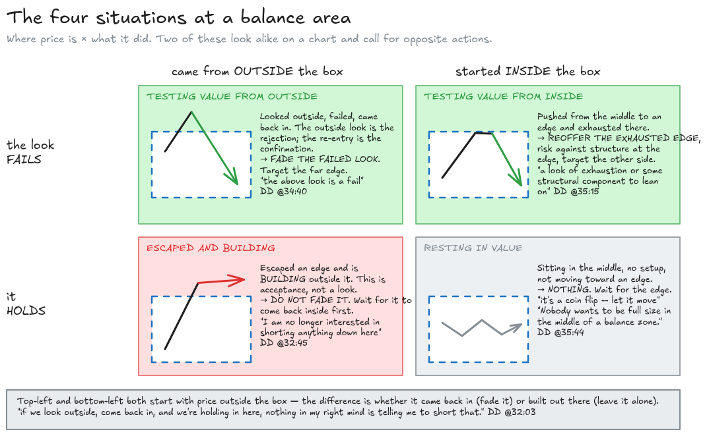
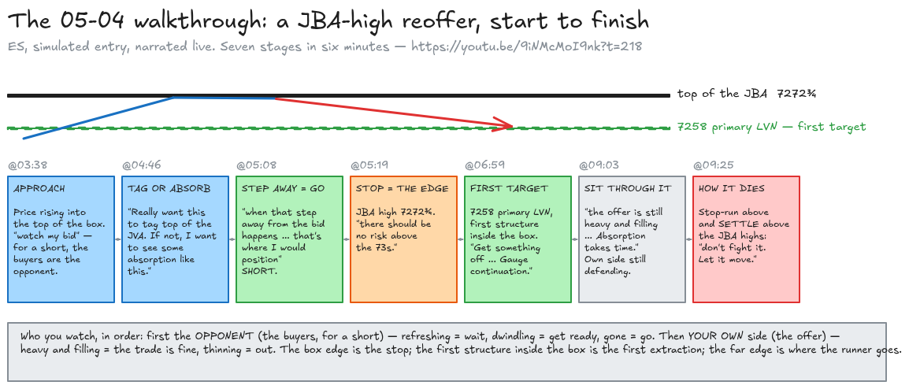

# Job pivots and balance areas, in plain English — with the receipts

Written 2026-09-06 from the author's own 39-minute deep dive on the study
([`reference/job-pivots-deep-dive.txt`](./reference/job-pivots-deep-dive.txt)), the volume-profile
101 session ([`reference/volume_profile_101.txt`](./reference/volume_profile_101.txt)), the nine
market-replay transcripts in [`replays/`](./replays/), the 25 morning-prep transcripts in
[`transcripts/`](./transcripts/), and one real export of the study off your own chart
([`chart-data/job-study-daily.json`](../../chart-data/job-study-daily.json)). Every timestamp below
is a real link into a real video — click it and watch the thing happen.

Two caveats on the receipts, up front. **The prep transcripts carry no timestamps** — they were
pulled as flat text — so prep-video links go to the start of the video, not the moment. Those
videos run 1.5–3.5 minutes, which is close enough. And the deep dive names *Cap* as the person who
"discusses this as well in his morning preps" ([DD @21:18](https://youtu.be/CoKoCpLYnC8?t=1278)),
so the prep-video speaker may not be the study's author. Below, "Job" means the deep-dive speaker,
and prep quotes are attributed to the prep video by date.

**Terminology note.** Job uses OFL shorthand throughout. The decoder ring is here; my own prose
uses the plain-English column, and Job's quotes stay verbatim because that is what you will hear.

| Job says | Means |
| --- | --- |
| **pivot** / **Job pivot** | a single price computed from a *volume profile* — not a floor-trader pivot from high/low/close. It is the price where the prior session's control was decided. |
| **value zone** / **pivot value** | the band around the pivot holding 70% of that profile's volume |
| **1A, 2A, 3A** / **1B, 2B, 3B** | targets stacked *above* (A) and *below* (B) the value zone, each one value-zone-width further out |
| **balance zone** / **balance area** / **JBA** | Job Balance Area — the box where several days' value zones overlap |
| **weekly pivot** / **weekly Job pivot** | the same construction run on the prior *week's* profile; "1A on the weekly" is that ladder |
| **RP** | the *Rolling Pivot* — a different study (your chart's "Rip"). It is not the Job pivot. |
| **autoplot** | Leo's balance study — the larger box that the JBAs sit inside |
| **MGI** | "market generating information" — his umbrella term for every computed reference level |
| **rebid** / **reoffer** | a buy on a pullback / a sell on a bounce, at a level that just proved itself |
| **bid** / **offer** | resting buy orders below the market / resting sell orders above it |
| **traverse value** | cross the value zone from one edge to the other |
| **two-way trade** / **purgatory** | no directional bias — price rotating inside a box, tradeable only at the edges |

---

## 1. What a Job pivot actually is

### The setup

Every trade that happens is recorded at a price. Stack a session's trades by price and you get a
**volume profile**: a sideways histogram showing where the session did most of its business. The
fat part of the histogram is where both sides agreed to trade a lot — where positions were built.
The thin parts are where price moved through quickly and nobody stayed.

The course material gives the standard vocabulary:

> *"the value area which is shaded in a darker gray is where 70% of the volume on a particular
> session or period that you're using uh occurs the value area high is the specific price level of
> where the top of that value area is and the value or low uh vice versa for the low"*
> — [`reference/volume_profile_101.txt`](./reference/volume_profile_101.txt)

That fat middle is *inventory*. People are holding positions that they put on in there. When price
comes back to it, those people react — that is why value areas act as support, resistance and
magnets.

### The event

**A Job pivot is a single price from the prior session's volume profile that marks where control
was decided, wrapped in a 70% value zone, with targets ladder-stacked outward in multiples of that
zone's width.**

That is the whole object, and it has exactly three parts. Job's own opening definition:

> *"So what is the Job Pivot? Well, it's based upon the Volume Profile that definitely acts as a
> line in the sand or a crucial line for the session, and that's going to help create a bias or
> directional sense of where we need to be re-bidding or re-offering versus who's in control of the
> auction. … And so the components of the Pivot themselves are the Pivots, the Value Zone around the
> Pivot, which is 70% of that volume, and the Targets that are expanded from this."*
> — [DD @0:29](https://youtu.be/CoKoCpLYnC8?t=29)

The targets are not arbitrary. They are the value zone's own width, stacked:

> *"here is a Pivot, okay? A certain amount of volume was needed in order to create that and
> protect that. Now, upon building that volume, we have a certain amount of range expectancy from
> this. So we could start stacking that zone, that distance. Stacking that, moving out in either
> direction. And as we do that, we get this compounding effect"*
> — [DD @1:41](https://youtu.be/CoKoCpLYnC8?t=101)

Your own chart confirms the arithmetic to the tick. The 2026-08-20 daily pivot in
[`chart-data/job-study-daily.json`](../../chart-data/job-study-daily.json) has a value zone of
29240.00–29504.75, which is 264.75 points wide. Every target sits an exact multiple of that width
beyond the zone's edge:

| Rung | Price | Distance from value-zone edge | ÷ zone width |
| --- | ---: | ---: | ---: |
| 1A | 29769.50 | 264.75 | 1.00 |
| 2A | 30034.25 | 529.50 | 2.00 |
| 3A | 30299.00 | 794.25 | 3.00 |
| 1B | 28975.25 | 264.75 | 1.00 |
| 2B | 28710.50 | 529.50 | 2.00 |
| 3B | 28445.75 | 794.25 | 3.00 |

The same holds for every daily row in the export (the daily study draws six rungs each way) and for
the weekly row (three rungs each way). Note the anchor: **1A is one width above the value zone's
*top*, not above the pivot.** So a session that built a wide value zone throws its targets far; a
compressed session keeps them close. That is what Job means by:

> *"the distance between the Targets and so forth vary based upon the activity. So it's consistently
> adapting based upon the actual volume traded throughout the day in and day out sessions. And with
> that fact, there's no arbitrary sense of where the inventory is."*
> — [DD @4:15](https://youtu.be/CoKoCpLYnC8?t=255)

*Every diagram in this document has its editable source alongside it in [`diagrams/`](./diagrams/)
as a `.excalidraw` file — drop one into [excalidraw.com](https://excalidraw.com) to change it.*

### Why it matters — three jobs the pivot does

**1. It is the bias line.** Above the pivot and building, buyers are in control; below and
building, sellers are. The word that matters is *building* — a tag is not control:

> *"if you're initiating a position, allow the response to show. Gauge the absorption at pivot, but
> understand that unless we're building below it, the control is not there. Unless we're building
> above it, if price is below, the control is not above it."*
> — [DD @13:29](https://youtu.be/CoKoCpLYnC8?t=809)

**2. It is a magnet.** Price that opens away from it tends to come back and touch it, and this
holds all day, not just at the open:

> *"It acts as a magnet, not only just off the open, but even through the midday when we're looking
> at other MGI, such as 24 hour VWAP or the IB high low, overnight high low, in previous day, high
> low, the weekly open and so forth. If we're within vicinity, then I typically look at this as
> let's complete the auction up to that to gauge and assess response."*
> — [DD @14:05](https://youtu.be/CoKoCpLYnC8?t=845)

**3. The targets are pause points.** Not reversal points — *pause* points, where the move stops to
breathe and you find out whether it continues:

> *"the targets themselves, whether or not you visualize them, can be pretty good pause points,
> stopping points, areas of interest in order to reference during a session."*
> — [DD @8:53](https://youtu.be/CoKoCpLYnC8?t=533)

And the explicit instruction not to fade one:

> *"If we're moving down and you want to get short, we come down here and we pause and we're at the
> 1B. Don't short this. Let it pull back. Where could it pull back to? Could pull back to into a
> prior reference in order to gauge a re-offer in order to push down."*
> — [DD @8:19](https://youtu.be/CoKoCpLYnC8?t=499)

So a target is where you *take profit* and where you *wait for the pullback to re-enter* — never
where you initiate against the move. The same goes for a late-session break of the box: *"That in
itself is not initially an area to fade … no sense in fading that because that extension can go up
here and double this range"* ([DD @7:11](https://youtu.be/CoKoCpLYnC8?t=431)).

### The three reads at the pivot

Job names three things to decide when price meets the pivot: where did we open, is it acting as a
magnet, and is the market *mechanical or emotional*
([DD @9:31](https://youtu.be/CoKoCpLYnC8?t=571)). The last one is the regime classifier, and it is
the read that saves you from countering a runaway.

| What price does at the pivot | Job's name | What it means | What you do |
| --- | --- | --- | --- |
| Tags it, pauses, responds — *"push down, tag, pivot to the T, and we just drive out"* | **mechanical** | The inventory is home. The level worked as expected. | Trade the response: rebid above / reoffer below, risk against the level. |
| Slices through and *speeds up* — *"instead of it pausing, it accelerates"* | **emotional** | Somebody bigger is running through every level. | Do not counter it. *"there's no point in countering this. There's another player at hand and we're just slapping through some levels along the way."* |
| Rotates back and forth through it, turning at each side of value | **two-way trade** | A Gaussian curve is forming; the middle is a coin flip. | Play the edges; *"move towards the middle, allow it to rotate, let the pendulum swing"*. |

Receipts: mechanical vs emotional at [DD @15:22](https://youtu.be/CoKoCpLYnC8?t=922) and
[DD @15:54](https://youtu.be/CoKoCpLYnC8?t=954); the base rate — *"For the most part, we're going
to have a lot of mechanical activity"* — at [DD @16:27](https://youtu.be/CoKoCpLYnC8?t=987);
two-way trade at [DD @17:00](https://youtu.be/CoKoCpLYnC8?t=1020) and
[DD @18:36](https://youtu.be/CoKoCpLYnC8?t=1116).

### Where did we open

The open's location relative to the pivot sets the first read of the day, and every row of this
table says the same thing: **the location gives you a lean, never an entry.**

| Open location | Job's read | But |
| --- | --- | --- |
| At the top of pivot value, above the pivot, not extended | *"that's productive. That's bullish."* | *"However, I don't want to buy that. I want to see that interaction to gauge the strength at that inventory"* |
| Directly at the pivot | *"it's going to be necessary absolutely to gauge the volume build around the pivot itself."* | — |
| Way outside range (at or beyond 1A/2A) with all the inventory far below | *"not so sure we're not going to at least test some of that inventory."* | *"does that make me get short immediately and right away? No, absolutely not … let's come back inside of a zone of initiation into a prior zone of distribution and begin to work in that direction. That way I have structure to lean upon above me."* |

Receipts: [DD @9:47](https://youtu.be/CoKoCpLYnC8?t=587),
[DD @10:33](https://youtu.be/CoKoCpLYnC8?t=633), [DD @11:17](https://youtu.be/CoKoCpLYnC8?t=677).

### Compression and expansion

The ladder is what makes "we need a 12B today" a real sentence. A quiet session builds a narrow
value zone, so the rungs are close together and a normal day walks through many of them:

> *"if we get a lot of compression, then simply what that means is what? Prepare for expansion. And
> then what we get following is expansion. We look at this going, oh my goodness, 1B is all the way
> down. Yep, it is because we're in expansion."*
> — [DD @25:15](https://youtu.be/CoKoCpLYnC8?t=1515)

He gives no threshold for how much compression is "a lot" — *"Is there an arbitrary rule for how
much compression? Nope, nope."* ([DD @25:31](https://youtu.be/CoKoCpLYnC8?t=1531)) — and instead
defers to the ATR study and relative volume. His one piece of sizing advice in the whole corpus
lives here: *"if you're not comfortable with the read, reduce size or pause, allow for a move to
begin"* ([DD @26:20](https://youtu.be/CoKoCpLYnC8?t=1580)).

### The weekly pivot is the same object, one size up

> *"So what is the weekly Joe pivot? It's based on the prior week's volume profile. It indicates a
> controller bias for the current week."* — [DD @28:17](https://youtu.be/CoKoCpLYnC8?t=1697)

Same pivot, same value zone, same ladder — your weekly export carries 1A–3A and 1B–3B off a
391.25-point zone. One handling difference, and it matters for how tightly you can lean on it:

> *"with a pivot on the intraday aspect, how many times have you seen a target to the tick, just
> slightly over or so forth, turn and run. On a weekly aspect, you have to view this as a zone.
> It's a wider zone. And so it's going to take some digestion around."*
> — [DD @29:29](https://youtu.be/CoKoCpLYnC8?t=1769)

Daily rungs get hit to the tick. Weekly rungs are areas. In the prep videos the weekly ladder is
always a *destination*: *"pressing the 2A on the weekly"* ([08-04](https://youtu.be/jvSf2rtihWY)),
*"beline to the 1B"* ([07-23](https://youtu.be/j3B0BuFxT_E)), *"I want to see us B line to the 2B
down here, 7439"* ([07-20](https://youtu.be/66ryWxqne8k)).

---

## 2. What a balance area actually is

### The construction

**A Job Balance Area is the box where several days' value zones overlap, over a rolling window of
the last five sessions.** It is that simple, and Job says so in one sentence:

> *"What about the balance area? When we have overlapping pivots -- and I use a 5-day lookback; that
> time frame you can change however you'd like, I'm going to be sticking with a 5-day -- that
> offers actionable insights to auction changes. Anything within a 5-day lookback that is
> overlapping like this is going to grant me a box of the auction. It's going to be rolling and
> moving forward."* — [DD @30:16](https://youtu.be/CoKoCpLYnC8?t=1816)

Your export has the receipt for the setting: the daily study's `(BA) Lookback` is `5`. And you can
see the overlap chain in the five daily rows it carries (2026-08-18 through 08-24):

| Session | Value zone | Overlaps |
| --- | --- | --- |
| 08-18 | 29687.50 – 29761.00 | the top of 08-19's zone, by 8.75 pts |
| 08-19 | 29506.75 – 29696.25 | 08-18 above, 08-21 below |
| 08-20 | 29240.00 – 29504.75 | 08-21 (does *not* touch 08-19 — a 2-point gap) |
| 08-21 | 29445.25 – 29531.25 | bridges 08-20 and 08-19 |
| 08-24 | developing | — |

The rectangle drawn on the chart that day spans **29240.00 – 29696.25** — exactly 08-20's value
low to 08-19's value high, the union of the 08-19/08-21/08-20 chain. That is the box.

### Why it matters — it is a value zone, so every value rule applies

> *"The way I look at this: think about it in the same way as a pivot zone. We have a lot of
> interest in this area. This is a value zone -- an overlapping value zone. We look outside of value
> and come back in and we're holding it. On an intraday aspect you would look at this on your TPO
> and say, okay, let's traverse value. I would do the same."*
> — [DD @30:54](https://youtu.be/CoKoCpLYnC8?t=1854)

A chain of overlapping value zones means several sessions' positions built in the same band. That
is a lot of people with a reason to defend the edges and a lot of two-way business in the middle. Hence the
one rule Job repeats more than any other about these boxes:

> *"Nobody wants to be full size in the middle of a balance zone. We patiently wait to exploit the
> edges."* — [DD @35:44](https://youtu.be/CoKoCpLYnC8?t=2144)

### The four situations at a balance area, and they are not symmetric

This is the part to get right, because two of the four look alike on a chart and call for opposite
actions.

| Where price is | What it did | Job's read | What you do |
| --- | --- | --- | --- |
| **Outside, coming back in** | Looked outside value, failed, re-entered | *"that tells me the above look is a fail, and therefore I need to lean on this … to push down and across this zone."* | Fade the failed look: sell the re-entry from above / buy it from below, target the far edge. |
| **Outside, holding out** | Escaped and *building* beyond the edge | *"If this pushes … and winds up granting a new balance zone … if we get above this, I am no longer interested in shorting anything down here."* | Do not fade acceptance. Wait for it to come back inside before countering. |
| **Inside, pushing to an edge** | Dead centre → drives to the top and *exhausts* | *"we might not be able to set our stop loss directly at the top of the balance zone. That's fine. You should have a look of exhaustion or some sort of structural component to lean on up there."* | Reoffer the exhausted edge, risk against structure at the edge, target the other side. |
| **Inside, resting** | Sitting in the middle, no setup, not moving to an edge | *"where I'm at right now it's a coin flip -- let it move … pause."* | Nothing. Wait for the edge. |

Receipts: from outside at [DD @34:40](https://youtu.be/CoKoCpLYnC8?t=2080); the new-zone case at
[DD @32:45](https://youtu.be/CoKoCpLYnC8?t=1965); from inside at
[DD @35:15](https://youtu.be/CoKoCpLYnC8?t=2115); resting at
[DD @35:44](https://youtu.be/CoKoCpLYnC8?t=2144).

The strongest sentence in the section is the negative one, for the case people get wrong most:

> *"Not to fade: if we look outside, come back in, and we're holding in here, nothing in my right
> mind is telling me to short that. If this wants to slam from there, by all means -- that's fine."*
> — [DD @32:03](https://youtu.be/CoKoCpLYnC8?t=1923)

Read it carefully: a look *below* the box that fails and comes back *up* inside is a **buy**, not a
sell. The failed look is the rejection; the re-entry is the confirmation. It is the mirror of the
"outside, coming back in" row above, and the prep videos use it constantly — *"look outside of the
JBA and back in uh would be a long"* ([06-02](https://youtu.be/D7sEQ7dYisk)), *"we've stepped out
of the JBA. We step back in … I want to see that bid"* ([02-17](https://youtu.be/TAn4ly-3MDw)).

### What ends it

> *"Where does the auction change? As soon as we're no longer respecting this zone."*
> — [DD @37:25](https://youtu.be/CoKoCpLYnC8?t=2245)

"No longer respecting" means *building* outside, not poking outside. And the ban on anticipating it
is explicit in the same breath: *"You're going to get updates in the inventory and the activity at
hand, but no need to anticipate. Allow it to move, show its hand."* When a directional move does
begin, the deep dive says where it ends — at the thin spots it left behind:

> *"if we start to push in one direction … then when does it stop? It stops when the areas of
> initiation are breached back through. So if we're buy, buy, buy, buy, buy, buy, buy, and then
> these buyers get hosed and we come back down into this prior distribution, that's where something
> can be changing. First, we expect balance. Balance can lead to continuation."*
> — [DD @22:56](https://youtu.be/CoKoCpLYnC8?t=1376)

An *area of initiation* is a low-volume node — *"Areas of initiation on the volume profile are low
volume nodes. There's not a lot of volume there. It just jams out of there"*
([DD @22:29](https://youtu.be/CoKoCpLYnC8?t=1349)). The [LVN explainer](./lvn-criteria-explained.md)
covers how those are found.

### The boxes move, and that is arithmetic, not behaviour

Because the window rolls, the oldest session drops out and the newest enters every day, so the
box recomputes. That is all the prep-video language about zones that "expand", "shift" and "branch"
means:

- *"once this JBA forms, I want to see this 6 7615 area bid"* — [06-16](https://youtu.be/_oU-URhOEUM):
  planning against a box whose overlap has not met the criterion yet.
- *"I do expect it to expand. And in that expanding, I'd be looking for low portion of the of the
  JBA to be right around here, 6640 to 45."* — [03-19](https://youtu.be/h4oc2xoEMlY): forecasting
  the new edge, which is possible precisely because it is arithmetic.
- *"ES unable to get outside of that top of the JBA. It did shift in the night. So, 6818 is the
  top."* — [03-18](https://youtu.be/1sx-X1B6MGc).
- *"we're also outside of the wide JBA. So, anytime that happens, we tend to branch off, create a
  couple"* — [03-19](https://youtu.be/h4oc2xoEMlY): the window no longer yields one contiguous
  overlap, so it yields two boxes.
- *"we don't have any overlapping JBAs. The other one's way down there naturally."* —
  [06-15](https://youtu.be/LnFBIc8V168).

Job says it himself in the replay on 05-04, explaining why the zone edge on the recording is not
where it was live: *"because it's 5day rolling aspect is is that the JBA uh low was actually right
here"* ([05-04 @22:56](https://youtu.be/9iNMcMoI9nk?t=1376)).

### The nesting: autoplot ⊃ JBA ⊃ pivot

> *"With respect to autoplot, Job pivots are a tighter time frame -- so you're going to have more
> zones, they're smaller, they're not going to traverse the entire zone of autoplot. But within
> autoplot itself you're going to see this sliced and diced based upon how pivots have been built.
> That context, from a top-down approach, grants understanding."*
> — [DD @33:44](https://youtu.be/CoKoCpLYnC8?t=2024)

So there are three sizes of the same idea: autoplot (Leo's larger balance box), the JBAs that
subdivide it, and the daily pivot value zones the JBAs are made of. The weekly pivot sits alongside
as the widest *pivot*. Job calls this a fractal outright — *"I view the weekly pivots, the balance
zones, auto-plot and so forth as a top-down approach … as a fractal"*
([DD @27:46](https://youtu.be/CoKoCpLYnC8?t=1666)).

---

## 3. How to use them in your trading

### The order of operations: top-down, left-to-right

This is the frame every prep video follows, and Job states it as the closing sentence of the deep
dive:

> *"So: top-down, left-to-right. Top-down meaning high time frame, from the weekly aspect, moving
> down and in. Left-to-right meaning where did we come from -- did we just reject the above or the
> below -- and then going from there."* — [DD @38:24](https://youtu.be/CoKoCpLYnC8?t=2304)

In practice, before the open:

1. **Weekly first.** Where is price against the weekly pivot and its value zone? Which weekly rung
   is nearest, and which side of it are we on? That is the week's lean.
2. **Then the box.** Locate the active JBA — top, bottom, and the neighbouring boxes above and
   below. Neighbours become targets the moment an edge gives way
   ([07-17 @15:08](https://youtu.be/glG8-dCLba0?t=908): *"bottom of the JBAS right here around 32s.
   We also have the overnight low"*).
3. **Then today's pivot.** Where did we open relative to it and its value zone (the table in §1)?
4. **Then left-to-right.** Did price just reject from above the box or from below it? The same
   level reads oppositely depending on the direction of arrival — the four-situations table.
5. **Then find confluence.** A JBA edge that coincides with another reference is one level, not
   two, and a stronger one: *"So, I'm watching this overlap between the RP and the bottom of the
   JBA, the 66 37 3/4"* ([03-20](https://youtu.be/_X30tjUvddc)); *"the weekly pivot, which
   overlaps JBA high and the which is 7551"* ([06-02](https://youtu.be/D7sEQ7dYisk)).

### The entry is at the edge, and the box defines the risk

What the replays add to the deep dive is the *execution* at a box edge. Three points, each on tape.

**The edge is where you position — after the response, not before it.** Approaching the top of the
box on 05-04: *"Really want this to tag top of the JVA. If not, I want to see some absorption like
this"* ([05-04 @04:46](https://youtu.be/9iNMcMoI9nk?t=286)); then *"when that step away from the
bid happens, um, that's where I would position on that"*
([05-04 @05:08](https://youtu.be/9iNMcMoI9nk?t=308)). The order-flow tell that fires the entry is
the subject of the [refreshing explainer](./refreshing-explained.md) — this document is about
*where* you are standing when you watch for it.

**The box edge is the stop reference.** *"We have the JBA highs here at 72 uh 3/4 and therefore
there should be no risk above the 73s"* ([05-04 @05:19](https://youtu.be/9iNMcMoI9nk?t=319)); a
minute later, *"70 zone 70 zone risk should not be outside of that JBA. We're at the upper portion
of this. Therefore, there's no part of me that wants to look for getting long on this"*
([05-04 @06:42](https://youtu.be/9iNMcMoI9nk?t=402)). And the case where the stop is *not* at the
edge is named too — if a stop-run pops above and settles there, *"All right, don't fight it. Let it
move. Let it get out of this zone."* — *"because this zone is not read appropriately"*
([05-04 @09:44](https://youtu.be/9iNMcMoI9nk?t=584)).

**The far edge is the target, and you extract along the way.** On 04-08, long from the bottom of
the box: *"I'm not looking to take this all the way to the top of the JBAs with all of the
position"* ([04-08 @11:08](https://youtu.be/u-S6Rvj7hIY?t=668)); *"as long as we're holding on to
those JBA lows, I want to take this as close to the RP as possible"*
([04-08 @15:54](https://youtu.be/u-S6Rvj7hIY?t=954)). And the general rule from 07-17: *"if we
stepped out of a wide zone from the JBAS and we come back into this test that take something off
to try to leave some to rotate that node"* ([07-17 @18:44](https://youtu.be/glG8-dCLba0?t=1124)).

### The edge is a question, not an answer

The most useful single sentence about *why* to stand at a box edge is on 05-19, long from the
bottom of the JBAs:

> *"We're utilizing that bottom of the JBA to gauge response. How much effort are you willing to
> put in to be able to press down through that JBA to go back to a previous week's low? Well, we
> weren't seeing that step-wise."* — [05-19 @14:21](https://youtu.be/RaJRUnHR_Rg?t=861)

The level does not predict. It *asks* — and the opponent's effort at that price is the answer. On
06-26, asked how many times a support should be tested before it fails:

> *"there's no true uh number to this … No, it's when the activity removes itself from um the book
> itself."* — [06-26 @07:14](https://youtu.be/l4xvVNTE_H8?t=434)

### The ladder is how a trend moves through the boxes

When there are several boxes stacked, Job describes the move between them as a ladder — each
responsive reference hands off to the next:

> *"it's stepwise going from one piece of MGI that is responsive to the next piece that then
> responds and you're working your way through this like a ladder. And that's also how I visualize
> the JBA when we do have multiple zones like that."*
> — [04-24 @13:20](https://youtu.be/JMWo4IpN8yA?t=800)

And the "pivot as magnet" idea is used for management: on 05-28, an ES long is carried because
*"We are above pivot or above 5-minute or mid … We have support from the pivot 24-hour view app RP
below us"* ([05-28 @21:46](https://youtu.be/bFU1dXf5uw8?t=1306)); earlier the entry condition was
stated at the pivot itself — *"Coming down to the pivot. So if we're going to respond from the
pivot, I want to see this disappear. Step away. Be scared."*
([05-28 @03:30](https://youtu.be/bFU1dXf5uw8?t=210)).

### A concrete six-minute walkthrough: the JBA-high reoffer, 05-04

The cleanest single example of a balance-area edge being traded end to end. ES, simulated entry,
narrated in real time. Watch from [05-04 @03:38](https://youtu.be/9iNMcMoI9nk?t=218).

1. **[@03:38](https://youtu.be/9iNMcMoI9nk?t=218)** — *"So, we're coming up to the JBA highs …
   watch my bid."* Price is rising into the top of the box. The opponent for a short is the buyer,
   so that is what he watches.
2. **[@04:46](https://youtu.be/9iNMcMoI9nk?t=286)** — *"Really want this to tag top of the JVA. If
   not, I want to see some absorption like this."* Two acceptable forms of the response: a tag, or
   absorption just short of it.
3. **[@05:08](https://youtu.be/9iNMcMoI9nk?t=308)** — *"you see when that step away from the bid
   happens, um, that's where I would position on that."* The buyers stop defending. Short.
4. **[@05:19](https://youtu.be/9iNMcMoI9nk?t=319)** — *"We have the JBA highs here at 72 uh 3/4 and
   therefore there should be no risk above the 73s."* The stop is the box edge.
5. **[@06:59](https://youtu.be/9iNMcMoI9nk?t=419)** — *"I want to see a rotation back. In fact, if
   you look at the 7258s primary LVN right here … that 7258 should be a target. Get something off in
   that zone. Gauge continuation."* First target is the first structure inside the box.
6. **[@09:03](https://youtu.be/9iNMcMoI9nk?t=543)** — *"the offer is still heavy and filling and
   filling and filling. This is going to take time. Absorption takes time."* Sitting through it,
   with the offer (his side) still defending.
7. **[@09:25](https://youtu.be/9iNMcMoI9nk?t=565)** — the two ways it can end, both named in
   advance: *"If we stop run out of that and come back in, resetting position is absolutely viable.
   But if we stop run out of that and we settle above those JBA highs … don't fight it."*

The mirror image, long from the *bottom* of the box, is on 05-19 from
[@08:21](https://youtu.be/RaJRUnHR_Rg?t=501) (*"Bottom of the JBA is 73 um 83 half … we're going
to watch the 84s"*) through [@14:21](https://youtu.be/RaJRUnHR_Rg?t=861) (*"To be able to pit risk
against an 84 zone. Because we saw that offer step away."*). And 07-17 is a whole video on the
case where price steps *outside* the box, builds an exhausted node, and comes back in
([07-17 @00:02](https://youtu.be/glG8-dCLba0?t=2): *"the step outside of the JBAS, step back and
in"*).

---

## 4. Reading it on your own screen

### What the study draws

The Sierra study runs twice — a daily instance and a weekly instance — and both export to the
bundle (`job-study-daily.json`, `job-study-weekly.json`, shipped 2026-08-23). What each row carries:

| Field | What it is | Daily | Weekly |
| --- | --- | --- | --- |
| `pivot` | the Job pivot price | one per session, five sessions kept | one per week |
| `valueLow` / `valueHigh` | the 70% value zone; the parser rejects any row where the pivot is not inside it | ✓ | ✓ |
| `targets[]` | the ladder, labelled `1A…6A` / `1B…6B` (daily) or `1A…3A` / `1B…3B` (weekly), each exactly *n* × zone-width beyond the zone edge | ±6 | ±3 |
| `balanceAreas[]` | the JBA boxes — as **rectangles you drew** (`source: "user"`), low/high only | ✓ | — |
| `autoplot` | Leo's box, likewise read from a drawn rectangle | — | ✓ |

The settings block in the export is worth knowing because it is the study telling you how it was
configured that day: `(BA) Balance Area Mode: Off`, `(BA) Lookback: 5`,
`(BA) User Drawing Mode Enabled: 1`. In words — the study's own automatic balance-area drawing is
switched off, its lookback is set to Job's five, and the boxes on the chart are hand-drawn.

The engine side is [`lib/job-plan/parseJobStudy.ts`](../../lib/job-plan/parseJobStudy.ts) and
[`lib/job-plan/pivotLadder.ts`](../../lib/job-plan/pivotLadder.ts): strict parse, fail closed,
ladder rungs must be unique and strictly monotonic outward on the correct side. Ladders are treated
as destinations only — a thin ladder never blocks a plan — which matches how the preps use them.

### The read, as a procedure

1. Note the weekly pivot, its zone, and the nearest weekly rung. Which side are we on? That is the
   lean, if we are near it.
2. Find the box price is in or nearest to. Note top, bottom, and the boxes above and below.
3. Note today's pivot and zone. Where did we open relative to it (the table in §1)?
4. Which direction did price arrive from — did it just fail outside an edge, or is it building
   outside? (The four-situations table in §2.)
5. Merge coincident references into one band (RP on a JBA low, weekly pivot on a JBA high, G line
   on a box edge) and lead with the tightest stack.
6. Middle of the box with no push toward an edge: nothing. Edge reached: watch the opponent's
   resting orders for the step-away, and only then position, with the edge as the stop reference.
7. Extract at the first structure inside the box; carry a runner toward the far edge or the
   magnet (pivot, RP).

### What it looks like when it fires

Mechanical, in Job's own words: *"Push down, tag, pivot to the T, and we just drive out and
everything's hunky dory"* ([DD @15:22](https://youtu.be/CoKoCpLYnC8?t=922)). At a box edge:
opponent's size refreshing on the approach, then dwindling, then gone, then your side stepping in
at the same price — 05-04 @03:38–05:08 above is exactly that sequence.

### Known defects and unverified points

- **The boxes on your chart are hand-drawn, not computed.** The export says so (`source: "user"`),
  and on 2026-08-20 the drawn box stopped at 08-19's value high even though 08-18's zone overlaps
  it by 8.75 points. Whether that day's 08-18 zone "counts" was your judgement, not the study's.
  A historical reproduction cannot assume the drawn box equals the strict five-day overlap.
- **Which "session" builds the daily pivot is not stated on tape.** The prep on 03-18 says the box
  *"did shift in the night"*, and the export's daily settings carry `Pit Session: Indexes 9:30ET`,
  which suggests the daily profile is the pit session. The deep dive never says. Treat the
  overnight-vs-RTH boundary as unverified.
- **Prep-video links have no timestamps** (transcripts pulled flat). Every deep-dive and replay link
  is to the second.
- **Attribution.** The deep dive credits *Cap* with the morning preps. The prep videos in this
  corpus may therefore be Cap's, not Job's. Nothing in this document depends on which — the
  vocabulary and the reads are identical across both sources — but the byline is uncertain.
- **The "yellow light" caution band** ([03-02](https://youtu.be/zRU22muRdlI)) is a drawn zone
  distinct from a JBA whose construction is not explained anywhere in the corpus.

---

## 5. Where to see it — timestamped index

### Source index

| Date | Title | Link |
| --- | --- | --- |
| Deep dive | Job Pivots — Deep Dive (38:44) | [CoKoCpLYnC8](https://youtu.be/CoKoCpLYnC8) |
| 04-08 | Market Replay 4.8.2026 (JBA low bid for con't) | [u-S6Rvj7hIY](https://youtu.be/u-S6Rvj7hIY) |
| 04-24 | Market Replay 4.24.2026 (Rebid and DOM discussion) | [JMWo4IpN8yA](https://youtu.be/JMWo4IpN8yA) |
| 05-04 | Market Replay 5.4.2026 (JBA high reoffer & ONL Rebid) | [9iNMcMoI9nk](https://youtu.be/9iNMcMoI9nk) |
| 05-19 | Market Replay 5.19.2026 (ES PW_LO fail, RP change of auction for longs) | [RaJRUnHR_Rg](https://youtu.be/RaJRUnHR_Rg) |
| 05-28 | Market Replay 5.28.2026 (RP, Pivot, LVN Bid/Rebid ES) | [bFU1dXf5uw8](https://youtu.be/bFU1dXf5uw8) |
| 06-26 | Market Replay 6.26.2026 (rebid scenarios and interaction on ES) | [l4xvVNTE_H8](https://youtu.be/l4xvVNTE_H8) |
| 06-30 | Market Replay 6.30.2026 (discussion) | [FrSP2kDoJvs](https://youtu.be/FrSP2kDoJvs) |
| 07-17 | Market Replay 7.17.2026 (Exhaustive Node at Edge of Range) | [glG8-dCLba0](https://youtu.be/glG8-dCLba0) |
| Preps | 25 morning preps, 02-13 → 08-11 | linked by date below |

### Start here — the seven clearest clips

| # | Clip | Why this one |
| --- | --- | --- |
| 1 | [DD @0:29](https://youtu.be/CoKoCpLYnC8?t=29) | The definition: pivot, 70% value zone, targets — in one breath. |
| 2 | [DD @1:41](https://youtu.be/CoKoCpLYnC8?t=101) | Targets are the zone width stacked outward. The arithmetic in one minute. |
| 3 | [DD @30:16](https://youtu.be/CoKoCpLYnC8?t=1816) | The balance area defined: overlapping pivots, five-day lookback. Eight minutes of everything that matters about the boxes follow. |
| 4 | [DD @13:29](https://youtu.be/CoKoCpLYnC8?t=809) | "Unless we're building below it, the control is not there." The bias rule. |
| 5 | [DD @8:19](https://youtu.be/CoKoCpLYnC8?t=499) | "Don't short this. Let it pull back." Targets are pauses, never fades. |
| 6 | [05-04 @03:38](https://youtu.be/9iNMcMoI9nk?t=218) | A JBA-high reoffer from approach to exit, narrated. The walkthrough in §3. |
| 7 | [05-19 @14:21](https://youtu.be/RaJRUnHR_Rg?t=861) | "How much effort are you willing to put in to press down through that JBA?" — what an edge is *for*. |

### Full index — the deep dive

| Time | What he says | Gloss |
| --- | --- | --- |
| [@0:29](https://youtu.be/CoKoCpLYnC8?t=29) | "based upon the Volume Profile … a line in the sand … the Pivots, the Value Zone around the Pivot, which is 70% of that volume, and the Targets" | The three components. |
| [@1:25](https://youtu.be/CoKoCpLYnC8?t=85) | "the Targets above and below the Pivot, they represent those price range expectancies" | Targets = expected range. |
| [@1:41](https://youtu.be/CoKoCpLYnC8?t=101) | "we could start stacking that zone, that distance … we get this compounding effect" | The ladder is zone-width multiples. |
| [@2:34](https://youtu.be/CoKoCpLYnC8?t=154) | "the Targets themselves are expected to have some interaction and pause in the order flow activity" | Targets = pause points. |
| [@3:00](https://youtu.be/CoKoCpLYnC8?t=180) | "a test up into Pivot. We reject Pivot and we start to push down … come down into the 1B and we start to rotate and balance" | Worked example one. |
| [@3:32](https://youtu.be/CoKoCpLYnC8?t=212) | "the Pivots versus the Autoplot are going to be like a smaller fractal" | Nesting, first mention. |
| [@3:52](https://youtu.be/CoKoCpLYnC8?t=232) | "push back up into Zone and test into Pivot, because Pivot can act as a magnet" | Magnet, first mention. |
| [@4:15](https://youtu.be/CoKoCpLYnC8?t=255) | "the distance between the Targets … vary based upon the activity … there's no arbitrary sense of where the inventory is" | Ladder spacing adapts to volume. |
| [@5:31](https://youtu.be/CoKoCpLYnC8?t=331) | "We jam up into the 1A … a bit of absorption and a flush back down into range" | Worked example two. |
| [@5:54](https://youtu.be/CoKoCpLYnC8?t=354) | "Where's the auction? Where can the auction go? How good of a job are we doing getting back into prior auction?" | The three questions. |
| [@7:01](https://youtu.be/CoKoCpLYnC8?t=421) | "as long as we're respecting either end, we get boxed into this range" | Boxed = two-way. |
| [@7:11](https://youtu.be/CoKoCpLYnC8?t=431) | "That in itself is not initially an area to fade … that extension can go up here and double this range" | Don't fade a late break. |
| [@7:38](https://youtu.be/CoKoCpLYnC8?t=458) | "Clearly, we can see who's in control. We're underneath Pivot. We're re-offering" | Below and building = sellers. |
| [@8:19](https://youtu.be/CoKoCpLYnC8?t=499) | "we pause and we're at the 1B. Don't short this. Let it pull back." | Never enter at a target. |
| [@8:38](https://youtu.be/CoKoCpLYnC8?t=518) | "If this is pushing down, you're not on the ride for this. You're looking for a scalp for a long." | At the 1B the counter-scalp is the only trade. |
| [@8:53](https://youtu.be/CoKoCpLYnC8?t=533) | "the targets themselves, whether or not you visualize them, can be pretty good pause points, stopping points" | Restated. |
| [@9:31](https://youtu.be/CoKoCpLYnC8?t=571) | "consider a few nuances of the pivot. One is where do we open? Second is the pivot tends to act as a magnet. And the third is the market mechanical or emotional." | The three reads. |
| [@9:47](https://youtu.be/CoKoCpLYnC8?t=587) | "opening at the top of the pivot value … that's productive. That's bullish. However, I don't want to buy that." | Location is a lean, not an entry. |
| [@10:33](https://youtu.be/CoKoCpLYnC8?t=633) | "if we're opening directly at the pivot, then it's going to be necessary absolutely to gauge the volume build around the pivot itself" | Open at pivot. |
| [@10:50](https://youtu.be/CoKoCpLYnC8?t=650) | "how many times have you seen tag a pivot and it never comes home?" | Magnet base rate. |
| [@11:17](https://youtu.be/CoKoCpLYnC8?t=677) | "does that make me get short immediately and right away? No, absolutely not … come back inside of a zone of initiation" | Open way outside: wait for structure. |
| [@12:57](https://youtu.be/CoKoCpLYnC8?t=777) | "opening slightly above value, come down, tag pivot, and then we're off and running. You're going to see this quite a bit." | The common day. |
| [@13:29](https://youtu.be/CoKoCpLYnC8?t=809) | "unless we're building below it, the control is not there" | The bias rule. |
| [@14:05](https://youtu.be/CoKoCpLYnC8?t=845) | "It acts as a magnet, not only just off the open, but even through the midday" | Magnet all day. |
| [@15:22](https://youtu.be/CoKoCpLYnC8?t=922) | "Push down, tag, pivot to the T, and we just drive out" / "what happens if we just jam down through that?" | Mechanical vs emotional. |
| [@15:42](https://youtu.be/CoKoCpLYnC8?t=942) | "MGI is market generating information. The pivot is also a piece of MGI." | The acronym, defined. |
| [@16:09](https://youtu.be/CoKoCpLYnC8?t=969) | "there's no point in countering this. There's another player at hand" | Emotional = stand aside. |
| [@17:00](https://youtu.be/CoKoCpLYnC8?t=1020) | "rotating back and forth around pivot … we just rotate through pivot" | Two-way trade at the pivot. |
| [@17:25](https://youtu.be/CoKoCpLYnC8?t=1045) | "we're creating a Gaussian curve … it's kind of pitch and catch" | The shape of balance. |
| [@17:53](https://youtu.be/CoKoCpLYnC8?t=1073) | "It changes when it stops respecting the tapers. It stops respecting the LVNs below" | When balance ends. |
| [@18:36](https://youtu.be/CoKoCpLYnC8?t=1116) | "move towards the middle, allow it to rotate, let the pendulum swing" | Extracting inside a box. |
| [@19:13](https://youtu.be/CoKoCpLYnC8?t=1153) | "How do we know if it's exhaustive? It moves away and aggressively." | Exhaustion on the profile. |
| [@20:26](https://youtu.be/CoKoCpLYnC8?t=1226) | "if we're finding ourselves consistently traversing value … that's the ebb and flow at hand" | Traverse value. |
| [@21:18](https://youtu.be/CoKoCpLYnC8?t=1278) | "if we are to step outside of a target, we can't progress. Instead, we step back inside. We seek the opposite target." | Failed look → opposite target. |
| [@22:29](https://youtu.be/CoKoCpLYnC8?t=1349) | "Areas of initiation on the volume profile are low volume nodes" | LVN = initiation. |
| [@22:43](https://youtu.be/CoKoCpLYnC8?t=1363) | "these targets tend to find themselves at areas of high volume nodes that are built upon the current session" | Targets land on HVNs. |
| [@22:56](https://youtu.be/CoKoCpLYnC8?t=1376) | "It stops when the areas of initiation are breached back through … First, we expect balance. Balance can lead to continuation." | Where a push ends. |
| [@25:00](https://youtu.be/CoKoCpLYnC8?t=1500) | "hey, we need a 12B or we need a 12A target. Yep, absolutely." | Expansion days. |
| [@25:15](https://youtu.be/CoKoCpLYnC8?t=1515) | "if we get a lot of compression, then simply what that means is what? Prepare for expansion." | Compression → expansion. |
| [@26:20](https://youtu.be/CoKoCpLYnC8?t=1580) | "if you're not comfortable with the read, reduce size or pause, allow for a move to begin" | The only sizing rule on tape. |
| [@27:46](https://youtu.be/CoKoCpLYnC8?t=1666) | "I view the weekly pivots, the balance zones, auto-plot and so forth as a top-down approach … as a fractal" | Fractal, stated. |
| [@28:17](https://youtu.be/CoKoCpLYnC8?t=1697) | "the weekly Joe pivot? It's based on the prior week's volume profile. It indicates a controller bias for the current week." | Weekly pivot defined. |
| [@29:29](https://youtu.be/CoKoCpLYnC8?t=1769) | "On a weekly aspect, you have to view this as a zone. It's a wider zone." | Weekly = area, daily = tick. |
| [@29:51](https://youtu.be/CoKoCpLYnC8?t=1791) | "always start out from a higher time frame and then build down to a smaller time frame" | Why the preps are shaped that way. |
| [@30:16](https://youtu.be/CoKoCpLYnC8?t=1816) | "When we have overlapping pivots -- and I use a 5-day lookback … a box of the auction" | **The JBA defined.** |
| [@30:54](https://youtu.be/CoKoCpLYnC8?t=1854) | "think about it in the same way as a pivot zone … an overlapping value zone … let's traverse value" | JBA = value zone. |
| [@31:43](https://youtu.be/CoKoCpLYnC8?t=1903) | "gauge this against the 5-day rolling volume profile or a 4-hour volume profile, to see where I have some overlap" | Check the box against actual volume. |
| [@32:03](https://youtu.be/CoKoCpLYnC8?t=1923) | "if we look outside, come back in, and we're holding in here, nothing in my right mind is telling me to short that" | Never fade a hold-back-inside. |
| [@32:21](https://youtu.be/CoKoCpLYnC8?t=1941) | "We can reoffer that zone until it stops -- until you take a stop into that." | Reoffer the failed top; stops exist. |
| [@32:45](https://youtu.be/CoKoCpLYnC8?t=1965) | "if we get above this, I am no longer interested in shorting anything down here. But while we're down here in balance -- short that, buy that" | Acceptance above ends the shorts. |
| [@33:14](https://youtu.be/CoKoCpLYnC8?t=1994) | "Want to be active on the edges … If you're jumping off a trampoline … you want to know where your feet are going to land" | Edges, and neighbours as landing spots. |
| [@33:44](https://youtu.be/CoKoCpLYnC8?t=2024) | "Job pivots are a tighter time frame … within autoplot itself you're going to see this sliced and diced" | Autoplot ⊃ JBA. |
| [@34:40](https://youtu.be/CoKoCpLYnC8?t=2080) | "If we move outside of value and come back in … that tells me the above look is a fail" | Testing value from outside. |
| [@35:15](https://youtu.be/CoKoCpLYnC8?t=2115) | "we might not be able to set our stop loss directly at the top of the balance zone … a look of exhaustion or some sort of structural component to lean on" | Testing value from inside; structural stops. |
| [@35:44](https://youtu.be/CoKoCpLYnC8?t=2144) | "Nobody wants to be full size in the middle of a balance zone. We patiently wait to exploit the edges." | The sizing rule for boxes. |
| [@36:33](https://youtu.be/CoKoCpLYnC8?t=2193) | "we're in balance, where do I want to be looking for reoffer, where do I want to be looking for rebid?" | The planning question. |
| [@37:25](https://youtu.be/CoKoCpLYnC8?t=2245) | "Where does the auction change? As soon as we're no longer respecting this zone … no need to anticipate. Allow it to move, show its hand." | The change trigger, and the anticipation ban. |
| [@38:24](https://youtu.be/CoKoCpLYnC8?t=2304) | "top-down, left-to-right" defined | The closing frame. |

### Full index — the replays

**04-08 — JBA low bid for continuation** ([u-S6Rvj7hIY](https://youtu.be/u-S6Rvj7hIY))

| Time | What he says | Gloss |
| --- | --- | --- |
| [@00:02](https://youtu.be/u-S6Rvj7hIY?t=2) | "we had a box um after that giant move up … Give it a little time to find its bearings … And then we wind up getting a JBA through that" | A box forms after a big move. |
| [@00:46](https://youtu.be/u-S6Rvj7hIY?t=46) | "wanted to see it move to the lower portion of that distribution to see a response because at the bottom of that JBA … if we're going to do this, it's going to go fast" | Wait for the edge; below it is thin. |
| [@03:48](https://youtu.be/u-S6Rvj7hIY?t=228) | "based upon the pivot zone through here, expecting that um we're going to have some sort of JBA build out" | Forecasting a box from the pivot zone. |
| [@04:41](https://youtu.be/u-S6Rvj7hIY?t=281) | "24 937 quarter is the bottom of the JBAs … 81 half is the bottom of the JBAs on on ES" | Box lows on both instruments. |
| [@04:56](https://youtu.be/u-S6Rvj7hIY?t=296) | "there's nothing in my being that wants to counter this. Let's gravitate into this first." | Don't counter on the way to the edge. |
| [@10:28](https://youtu.be/u-S6Rvj7hIY?t=628) | "when we come down into the edge of JBA and it's aligning with ES and NQ, pretty powerful" | Cross-instrument confluence at the edge. |
| [@11:08](https://youtu.be/u-S6Rvj7hIY?t=668) | "I'm not looking to take this all the way to the top of the JBAs with all of the position" | Extract along the way. |
| [@12:05](https://youtu.be/u-S6Rvj7hIY?t=725) | "We've stepped into the bottom of the JBAs, and now we're pressing out … if we step back into the value with potential to traverse that, come into the RP" | Traverse, RP as target. |
| [@15:54](https://youtu.be/u-S6Rvj7hIY?t=954) | "as long as we're holding on to those JBA lows, I want to take this as close to the RP as possible" | The runner rule. |
| [@18:30](https://youtu.be/u-S6Rvj7hIY?t=1110) | "This can come back to the bottom of JBAs, or we can push, push, push … When you're in multiples, extract." | Managing inside the box. |
| [@19:01](https://youtu.be/u-S6Rvj7hIY?t=1141) | "we have this mapped out um automatically within JBAs … And then, we have the RP that's acting like a magnet" | Boxes plus magnet. |
| [@31:46](https://youtu.be/u-S6Rvj7hIY?t=1906) | "dominator itself, that's my baby. And so um that and the JBAs and the pivot and that type of stuff." | Authorship of the studies. |
| [@32:25](https://youtu.be/u-S6Rvj7hIY?t=1945) | "Your MGI, your zones … I gravitate towards the JBAs and auto plot" | What he keeps on screen. |

**04-24 — Rebid and DOM discussion** ([JMWo4IpN8yA](https://youtu.be/JMWo4IpN8yA))

| Time | What he says | Gloss |
| --- | --- | --- |
| [@01:57](https://youtu.be/JMWo4IpN8yA?t=117) | "we've been in balance and just traversing that zone" | Balance = traversing. |
| [@13:20](https://youtu.be/JMWo4IpN8yA?t=800) | "working your way through this like a ladder. And that's also how I visualize the JBA when we do have multiple zones" | The ladder image. |

**05-04 — JBA high reoffer & ONL rebid** ([9iNMcMoI9nk](https://youtu.be/9iNMcMoI9nk))

| Time | What he says | Gloss |
| --- | --- | --- |
| [@02:03](https://youtu.be/9iNMcMoI9nk?t=123) | "pressing into the upper portion of this, we're looking at the JBA highs. I'd like to see that interacted with." | Setup. |
| [@03:38](https://youtu.be/9iNMcMoI9nk?t=218) | "we're coming up to the JBA highs … watch my bid" | Walkthrough step 1. |
| [@04:46](https://youtu.be/9iNMcMoI9nk?t=286) | "Really want this to tag top of the JVA. If not, I want to see some absorption like this." | Step 2. |
| [@05:08](https://youtu.be/9iNMcMoI9nk?t=308) | "when that step away from the bid happens, um, that's where I would position on that" | Step 3 — entry. |
| [@05:19](https://youtu.be/9iNMcMoI9nk?t=319) | "We have the JBA highs here at 72 uh 3/4 and therefore there should be no risk above the 73s" | Step 4 — stop. |
| [@06:42](https://youtu.be/9iNMcMoI9nk?t=402) | "risk should not be outside of that JBA. We're at the upper portion of this. Therefore, there's no part of me that wants to look for getting long" | No longs at the top of the box. |
| [@06:59](https://youtu.be/9iNMcMoI9nk?t=419) | "that 7258 should be a target. Get something off in that zone. Gauge continuation." | Step 5 — first target. |
| [@08:08](https://youtu.be/9iNMcMoI9nk?t=488) | "clearly defined risk above us because if it's not the JBA highs, then boom, it's the Gline up there in the 76s" | The next reference above is the outer stop. |
| [@09:25](https://youtu.be/9iNMcMoI9nk?t=565) | "if we stop run out of that and we settle above those JBA highs … don't fight it. Let it move." | Step 7 — how it dies. |
| [@19:49](https://youtu.be/9iNMcMoI9nk?t=1189) | "Primary location for entry is up at the upper portion of that JBA" | Restated. |
| [@22:56](https://youtu.be/9iNMcMoI9nk?t=1376) | "because it's 5day rolling aspect is is that the JBA uh low was actually right here" | The rolling window moves the edge. |
| [@24:30](https://youtu.be/9iNMcMoI9nk?t=1470) | "potential to either dip our toe into the JBA, come out and rebid the top of it" | Dip-and-rebid at the bottom. |
| [@26:39](https://youtu.be/9iNMcMoI9nk?t=1599) | "We're at the top of the JBS. If we want to step out immediately again, then I would do the same thing for [clears throat] a rebid from that JBA high." | Rebid off the top after an escape. |
| [@32:48](https://youtu.be/9iNMcMoI9nk?t=1968) | "It's already failed at top the JBAS. So now be specific. Allow it to move into that structural component." | Failed top → wait for structure below. |
| [@33:17](https://youtu.be/9iNMcMoI9nk?t=1997) | "when do you look at uh this as being back inside JBA and not willing to take longs?" | The audience question on re-entry. |

**05-19 — ES PW_LO fail, RP change of auction** ([RaJRUnHR_Rg](https://youtu.be/RaJRUnHR_Rg))

| Time | What he says | Gloss |
| --- | --- | --- |
| [@08:21](https://youtu.be/RaJRUnHR_Rg?t=501) | "Bottom of the JBA is 73 um 83 half … we're going to watch the 84s because the 84s provide a nice response up and out of this" | The box low as the reference. |
| [@10:03](https://youtu.be/RaJRUnHR_Rg?t=603) | "At the bottom of the JBAs. I'm going to push out of that. Or is the offer going to shy away?" | The question at the edge. |
| [@11:41](https://youtu.be/RaJRUnHR_Rg?t=701) | "And now we're back into the JBA. Which leads us into the next piece of MGI which is pivot." | Back inside; next reference is the pivot. |
| [@12:03](https://youtu.be/RaJRUnHR_Rg?t=723) | "my rebid locations I'd be looking at are around the 84s at the bottom portion of the JBAs" | Rebid at the box low. |
| [@13:19](https://youtu.be/RaJRUnHR_Rg?t=799) | "We're at the bottom of the JBAs. Want to see that responsive. Want to see the offer step away." | The trigger condition. |
| [@14:21](https://youtu.be/RaJRUnHR_Rg?t=861) | "We're utilizing that bottom of the JBA to gauge response. How much effort are you willing to put in to be able to press down through that JBA" | What the edge is for. |
| [@15:22](https://youtu.be/RaJRUnHR_Rg?t=922) | "it's a natural response here from the pivot" | Pivot response on the way up. |
| [@16:41](https://youtu.be/RaJRUnHR_Rg?t=1001) | "this is where you'd be risking against that current low down there at the 84s, bottom of the JBAs" | Stop under the box. |

**05-28 — RP, Pivot, LVN bid/rebid ES** ([bFU1dXf5uw8](https://youtu.be/bFU1dXf5uw8))

| Time | What he says | Gloss |
| --- | --- | --- |
| [@02:18](https://youtu.be/bFU1dXf5uw8?t=138) | "So we pivot here right here at 32s. 24-hour VWAP at 30s. And then we have this overlapping down here. And we have the JBAs right at the G line" | The stack: pivot, VWAP, JBA, G line. |
| [@02:35](https://youtu.be/bFU1dXf5uw8?t=155) | "which one of these is most important from my end? The one that responds." | Confluence resolved by response. |
| [@03:30](https://youtu.be/bFU1dXf5uw8?t=210) | "Coming down to the pivot. So if we're going to respond from the pivot, I want to see this disappear. Step away. Be scared." | Pivot entry condition. |
| [@14:39](https://youtu.be/bFU1dXf5uw8?t=879) | "Now, we're starting to hold pivot." | Holding = control. |
| [@16:32](https://youtu.be/bFU1dXf5uw8?t=992) | "Want to lean against that 5-minute warm mid and pivot zone in this particular distribution for continuation" | Pivot zone as the lean. |
| [@18:46](https://youtu.be/bFU1dXf5uw8?t=1126) | "Are we below pivot? 24-hour view up RP. We're not. We're not. But it looks scary." | Thesis check against the pivot. |
| [@21:46](https://youtu.be/bFU1dXf5uw8?t=1306) | "Trade thesis is not off. We are above pivot … We have support from the pivot 24-hour view app RP below us." | Carrying on the pivot. |
| [@23:31](https://youtu.be/bFU1dXf5uw8?t=1411) | "we don't necessarily always have to come back and and um traverse that area, when that happens, take it immediately" | Take the traverse when it comes. |

**06-26 — rebid scenarios on ES** ([l4xvVNTE_H8](https://youtu.be/l4xvVNTE_H8))

| Time | What he says | Gloss |
| --- | --- | --- |
| [@05:56](https://youtu.be/l4xvVNTE_H8?t=356) | "I know the JBAS have expanded, but essentially … we tested to the JBA low, right? … We came above the RP. We drove up and out" | Box low tested, RP recovered. |
| [@06:39](https://youtu.be/l4xvVNTE_H8?t=399) | "we tested this three times. How many times should we test a support before it fails?" | The question. |
| [@07:14](https://youtu.be/l4xvVNTE_H8?t=434) | "there's no true uh number to this … it's when the activity removes itself from um the book itself" | The answer. |
| [@07:38](https://youtu.be/l4xvVNTE_H8?t=458) | "no progress taking out the JB AB JBA lows and also we've recovered the RP" | Failure to progress at the box low. |
| [@11:04](https://youtu.be/l4xvVNTE_H8?t=664) | "we're not able to take out JBA low and we drove straight up and out … some sort of purgatory or balance" | Post-fail balance. |

**06-30 — discussion** ([FrSP2kDoJvs](https://youtu.be/FrSP2kDoJvs))

| Time | What he says | Gloss |
| --- | --- | --- |
| [@02:08](https://youtu.be/FrSP2kDoJvs?t=128) | "in the overnight, we had tested down into the lower portion of the JBAS. We came back in and we're kind of in two-way trade … now we're at the top of the JBAS … below us? We have, um RP pivot" | Bottom to top of the box overnight. |
| [@22:04](https://youtu.be/FrSP2kDoJvs?t=1324) | "Being that we auction through that piece of MGI, we're looking at that as potential short-term balance. Give it a few minutes, balance around it" | Balance after a level is taken. |
| [@22:35](https://youtu.be/FrSP2kDoJvs?t=1355) | "this is an hour after we broke out of the JBAS. Offer still heavy through the 28s. That's off." | Breakout, then the thesis dies on the offer. |

**07-17 — exhaustive node at edge of range** ([glG8-dCLba0](https://youtu.be/glG8-dCLba0))

| Time | What he says | Gloss |
| --- | --- | --- |
| [@00:02](https://youtu.be/glG8-dCLba0?t=2) | "what we're looking at is the step outside of the JBAS, step back and in" | The day's subject. |
| [@00:54](https://youtu.be/glG8-dCLba0?t=54) | "if we're tagging into the bottom of the range, we have a nice build, then where do we create our exhausted node and we have to come back into a prior distribution" | Exhaustion at the edge, then re-entry. |
| [@01:20](https://youtu.be/glG8-dCLba0?t=80) | "If we tagged the bottom of the JBAS and jammed above the 370s into about the 410s, then this here would have been longs for the rest of the day" | The clean version that did not happen. |
| [@02:19](https://youtu.be/glG8-dCLba0?t=139) | "if we're outside of the overnight low and outside of the JBA low … I want to see an exhausted look in order to get on board" | Requirement for a long below the box. |
| [@04:02](https://youtu.be/glG8-dCLba0?t=242) | "the bottom of the JBA is at the 2930 or 332s, and the previous day was at the 272s … yes, we have a 5day rolling look back" | The edge moved with the window. |
| [@05:48](https://youtu.be/glG8-dCLba0?t=348) | "we start to dwindle a little bit as we push up and respect the JBA low" | Sellers dwindling at the box low. |
| [@08:53](https://youtu.be/glG8-dCLba0?t=533) | "get down the 72s, previous JBA low, building out a nice little node" | Yesterday's edge still matters. |
| [@09:19](https://youtu.be/glG8-dCLba0?t=559) | "potential to come back into that prior distribution being that we're escaping those JBAs" | Escape, then return. |
| [@15:08](https://youtu.be/glG8-dCLba0?t=908) | "Naturally, bottom of the JBAS right here around 32s. We also have the overnight low" | Targets up the ladder. |
| [@17:10](https://youtu.be/glG8-dCLba0?t=1030) | "if we do traverse this zone up into this area, then we have the potential to retest back into this area" | Traverse and retest. |
| [@18:44](https://youtu.be/glG8-dCLba0?t=1124) | "if we stepped out of a wide zone from the JBAS and we come back into this test that take something off" | Extract at the re-entry. |

### Full index — the morning preps (no timestamps; links go to the video)

| Date | What is said | Gloss |
| --- | --- | --- |
| [02-13](https://youtu.be/deqIr8DaydA) | "the 68.40 area right here that splits these two JBAs. I want to see some two-way trades … above that um 68.96 weekly pivot" / "a nice little standalone JBA" | Two boxes split by a level; two-way between weekly pivot and box. |
| [02-17](https://youtu.be/TAn4ly-3MDw) | "Yes, I do expect some expansion of the JBAS" / "we've stepped out of the JBA. We step back in … I want to see that bid" / "I'm expecting us to dive into the 1B" | Expansion, hold-back-inside, weekly 1B as target. |
| [02-20](https://youtu.be/yjv7fJnkwTA) | "We still haven't left this zone. Still in balance." / "interact with the top of the JBAS for um for an offer" | Still boxed; offer at the top. |
| [03-02](https://youtu.be/zRU22muRdlI) | "continue to see that wide balance between 6830 and 6771" / "press up into the weekly pivot" / "test into the 1B down at 411 to gauge for continuation" | Wide balance, weekly ladder. |
| [03-06](https://youtu.be/5EAXvm36rbA) | "we're back to the bottom of the JBAS … we can probably expect them to expand a little bit here um at the open" / "the 1B on the weekly, uh left and right" / "it's essentially the JBA low, but let's keep it real simple" | Expansion at the open; collapse coincident references. |
| [03-16](https://youtu.be/1h_JeSgR9_A) | "we're currently above the weekly pivot … just rotating … building below the weekly pivot. I want to press in the direction of this high volume edge" / "the bottom of the JBAS, which overlaps the weekly um with the Gline" | Weekly pivot as the rotation axis; box low on the G line. |
| [03-17](https://youtu.be/KNxA1k-RL94) | "I want to assume we're still in balance. I want to see this rotate back through" / "want to see us go to the top of the JBA's 6825, where I'd expect some um, trouble" | Rotation, trouble at the top. |
| [03-18](https://youtu.be/1sx-X1B6MGc) | "ES unable to get outside of that top of the JBA. It did shift in the night. So, 6818 is the top." / "210s top of the JBAS um right up here certainly uh potential reoffer points. I want to see the edges." | Box shifted overnight; edges. |
| [03-19](https://youtu.be/h4oc2xoEMlY) | "we're also outside of the wide JBA. So, anytime that happens, we tend to branch off, create a couple" / "I do expect it to expand … low portion of the of the JBA to be right around here, 6640 to 45" | Branching; forecasting the new edge. |
| [03-20](https://youtu.be/_X30tjUvddc) | "two very clear distributions here on the week split by the weekly pivot" / "this overlap between the RP and the bottom of the JBA, the 66 37 3/4" | Weekly pivot splits the week; RP-on-box-low confluence. |
| [05-26](https://youtu.be/rAwVpIPlpro) | "we're building [snorts] some overlapping JBA zones" / "A nice wide JBA. Obviously, we just rebid from there." / "Escape and build above the um top of this JBA 64s, then I would need to have it come back into that zone before countering" | Overlap forming; never counter acceptance. |
| [06-02](https://youtu.be/D7sEQ7dYisk) | "the 24s top of the JBAs, 77s bottom of the JBAs … look outside of the JBA and back in uh would be a long" / "the weekly pivot, which overlaps JBA high" | Edges by number; hold-back-inside long. |
| [06-10](https://youtu.be/uvanT97KEpk) | "the G line on both is basically at the bottom of the JBA's as well, and we're above the RP … if we're able to hold this um JBA low" | Box low on the G line. |
| [06-15](https://youtu.be/LnFBIc8V168) | "we don't have any overlapping JBAs. The other one's way down there" / "I want to see this pivot right here around 75 65 bid" / "back up into the 1A 7607" | No overlap; daily pivot as bid; daily 1A. |
| [06-16](https://youtu.be/_oU-URhOEUM) | "once this JBA forms, I want to see this 6 7615 area bid for continuation" | Planning against a box not yet formed. |
| [06-17](https://youtu.be/Y400TUvIH_A) | "this 1A zone, 7608's, uh top of the JBAs. I want to see this area just continually uh offer" / "this is going to expand to 500 area" / "a rebid scenario top of JBA's as long as we're above the RP when that formed" | 1A on the box top; expansion forecast; formation context. |
| [06-18](https://youtu.be/kSTzKPQFCC4) | "top of the JBAs as these have balanced out uh is currently 7559, but that will expand potentially into the mid 60s" | Expansion forecast. |
| [06-22](https://youtu.be/BieHs_bLlt4) | "Back above G line and testing weekly pivot" / "leaning against top of that JBA and pressing this back into the direction of the pivot" | Box top to pivot. |
| [07-07](https://youtu.be/X0NpbKM2KUA) | "60 76 58 1A on the weekly" / "the G line and the top of this JBA, I could I could see some two-way trade" / "bottom of the JBA is 29 567. Also pretty much the overnight low" | Weekly 1A; two-way between G line and box top. |
| [07-10](https://youtu.be/XItRia6NPbQ) | "we have auto plot high, previous week's high, uh JBA high, everything right here. We're not out of the woods." | Autoplot and JBA edges stacked. |
| [07-20](https://youtu.be/66ryWxqne8k) | "I want to see us B line to the 2B down here, 7439" / "the bottom of the JBA's 28 753 down here pretty much at G line … the split zone between 255 and 332" | Weekly 2B; split box. |
| [07-23](https://youtu.be/j3B0BuFxT_E) | "Beneath the Gline and [clears throat] underneath the JBAS. So, I want to lean against this 81 to 85 area uh for continuation at least into the 2B 7439" | Below the box: short bias to the weekly 2B. |
| [08-04](https://youtu.be/jvSf2rtihWY) | "we got our JBA build here and we're pressing the 2A on the weekly" / "The high volume edge to the bottom of the JBA. Looking for bid there." | Weekly 2A; HVE-on-box-low confluence. |
| [08-07](https://youtu.be/TpIyLl3_aVY) | "primary LBN right here around the 77 58 to 60 area … just above the JBA lows here. And so, this is where I want to see rebid" / "just below the 2A on the weekly" | LVN inside the box low; weekly 2A. |
| [08-11](https://youtu.be/G-4-sVT_uok) | "we're above the weekly pivot. I'm looking for re-bid here around 29,800" | Weekly pivot as the lean. |

---

## 6. Supporting detail

### The ladder arithmetic, for the record

Checked against every row in
[`chart-data/job-study-daily.json`](../../chart-data/job-study-daily.json) and
[`job-study-weekly.json`](../../chart-data/job-study-weekly.json) (exported 2026-08-23, NQU6):
for every rung *n* on side A, `price = valueHigh + n × (valueHigh − valueLow)`; on side B,
`price = valueLow − n × (valueHigh − valueLow)`. The ratio came out to exactly 1.00, 2.00, … 6.00 on
each of the five daily rows and 1.00, 2.00, 3.00 on the weekly row. Three examples:

| Session | Value zone | Width | 1A | 1B |
| --- | --- | ---: | ---: | ---: |
| 08-18 | 29687.50 – 29761.00 | 73.50 | 29834.50 | 29614.00 |
| 08-19 | 29506.75 – 29696.25 | 189.50 | 29885.75 | 29317.25 |
| Week of 08-24 | 29292.25 – 29683.50 | 391.25 | 30074.75 | 28901.00 |

So the 08-18 session, about two and a half times narrower than 08-19, had rungs every 73.5 points
— that is the compression case from §1 in numbers.

### "Pivot" versus "RP"

The replays say "pivot" for two different studies, and the 05-28 replay lists them side by side:
*"We are above pivot or above 5-minute or mid … We have support from the pivot 24-hour view app RP
below us"* ([05-28 @21:46](https://youtu.be/bFU1dXf5uw8?t=1306)). The **RP** is the Rolling Pivot
— your chart's "Rip", already exported as an MGI level — and it is a separate study with its own
behaviour (a hold/fail line and magnet). Every "pivot" in this document that is not "RP" is the Job
pivot. Where a replay quote is ambiguous, it is not used as evidence.

### Related explainers

- [`refreshing-explained.md`](./refreshing-explained.md) — the order-book tell that fires the entry
  once you are standing at an edge.
- [`absorption-exhaustion-initiative-explained.md`](./absorption-exhaustion-initiative-explained.md)
  — the three words for what the tell means.
- [`lvn-criteria-explained.md`](./lvn-criteria-explained.md) — how the areas of initiation that end
  a push are found on the profile.
- [`jba-analysis-process.md`](./jba-analysis-process.md) — the planning rules, with the pivots and
  boxes as inputs.

---

## 7. The one-paragraph summary

A Job pivot is one price taken from the prior session's volume profile, marking where that
session's control was decided, wrapped in the band that held 70% of the session's volume — its
value zone — with targets stacked outward above and below, each one exactly one zone-width further
out, so a quiet session throws close targets and a busy one throws far ones. Price building above
the pivot means buyers hold control, building below means sellers do, and a mere tag means nothing;
the pivot pulls price back to it like a magnet all day; and the targets are places a move pauses,
never places to fade it. A Job Balance Area is the box where the last five sessions' value zones
overlap, recomputed every day as the window rolls, and it is treated exactly like any value zone:
nothing in the middle, everything at the edges, where a look outside that fails and comes back in
is the trade in the direction of the re-entry, a push from the centre to an edge that exhausts is
the trade back across, and building outside the box is the one thing you never fade. The edge is
not a prediction but a question — how much effort is the other side willing to spend here — and
the answer comes from the resting orders at that price; the box edge is the stop, the first
structure inside is the first extraction, and the far edge or the pivot is where the runner goes.
Read it top-down (weekly pivot, then the box, then today's pivot) and left-to-right (which side did
price just reject from), and when price slices through the pivot and accelerates instead of
pausing, stand aside — somebody bigger is driving.
