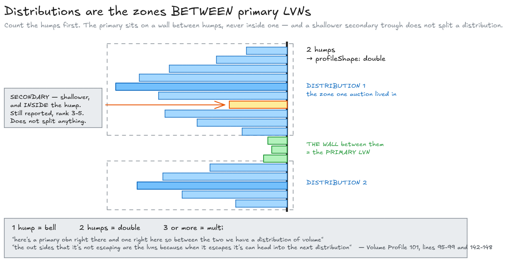
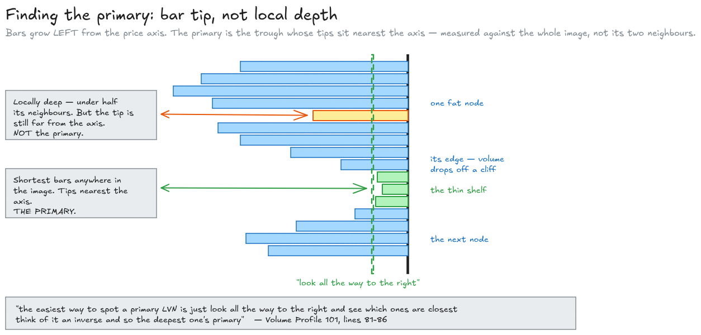
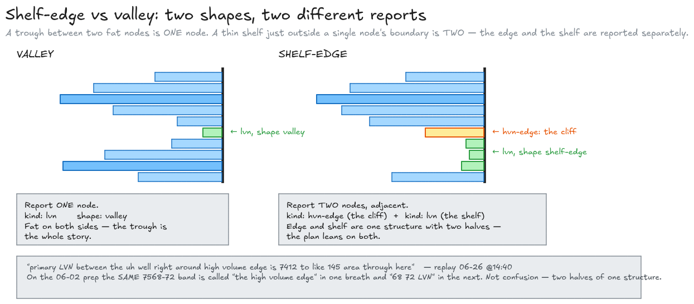
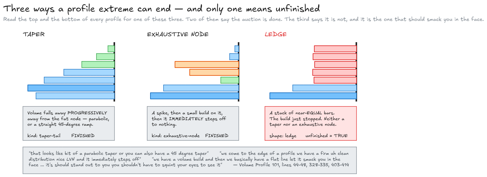

# How the profile read finds an LVN, in plain English — with the receipts

Written 2026-08-30. This document explains, one at a time, the **eighteen criteria** the
profile-vision prompt uses to look at a volume-by-price picture and say *there is the low-volume
node*. It is written for you to check: does this encode your method, or has something been
invented along the way?

Sources, in order of authority:

| Source | Path | What it is |
| --- | --- | --- |
| The one-on-one teaching session | [`reference/volume_profile_101.txt`](./reference/volume_profile_101.txt) | Job defining the vocabulary from the ground up — the only place the *anatomy* is named |
| The mined corpus | [`lvn-corpus.md`](./lvn-corpus.md) | 122 numbered worked examples (section A), the synthesis rules B1–B16, the negative set D |
| Nine market replays | [`replays/`](./replays/) | Job reading live profiles, timestamped |
| The Job Pivots deep dive | [`reference/job-pivots-deep-dive.txt`](./reference/job-pivots-deep-dive.txt) | initiation / destination, exhaustive looks |
| 25 prep videos | [`transcripts/`](./transcripts/) | the prices he named on the morning |

**About the links.** Replays and the deep dive are timestamped, so those links drop you at the
moment — click and watch. Prep transcripts are stored as one long line with no timestamps, so a
prep link opens the video but not the moment. **Volume Profile 101 has neither timestamps nor a
video URL anywhere in the repository**, so the four newest rules — the ones that matter most —
are cited by line number into the text file only. That is the single biggest sourcing gap in this
document and it is called out again at the end of section 6.

**Terminology note.** The auto-captions mangle almost every term. Quotes are left exactly as
transcribed, disfluencies and all, because that is what you will hear. Here is the decoder ring.

| Transcript says | Means |
| --- | --- |
| **LBN**, **obn**, **OVN**, **lvan**, **Lans**, **VM**, **LV** | LVN — low volume node |
| **HPN** | HVN — high volume node |
| **PAC**, **pock**, **pocket** | POC — point of control |
| **node** (unqualified) | a fat stack of volume — a high volume node |
| **distribution** | the price zone one auction lived in — *not* accumulation-vs-distribution |
| **kennel** | a wide thin span price ripped through |
| **sticks** | a run of tiny bars that should be read as one mass |
| **zone of initiation** | the LVN a leg started from |
| **taper**, **taper tail** | volume falling off progressively away from a fat node |
| **ledge** | a stack of near-equal bars where the build just stopped |
| **exhaustive node** / **exhausted node** | spike, small build, immediate step off |
| **deepest**, **most prominent** | the same ranking — thinnest |

---

## 1. What the read is actually being asked to do

**The vision call is a perception job, not a trading job.** It gets one picture and returns a list
of what is in it. It is not allowed to know where your boxes are, and it is not allowed to have an
opinion about the market.

### What goes into the call

One rendered profile image — horizontal bars growing left from a price axis on the right, the way
it sits on your screen — plus a few lines of text: the instrument, which profile and lookback it
is, the price span of the image, the row step in points, POC, VAH, VAL, and current price. That is
all.

### What is deliberately kept out, and why

No JBA boxes. No MGI. No pivots. No G line. No Autoplot. Nothing you drew.

The reason is in the prompt's own docblock and in
[`docs/job-planning-task-plan.md`](../job-planning-task-plan.md) under "The perception contract":

> *"**No structure** (no JBA boxes, MGI, pivots) — relating nodes to structure is planner math
> (R1/R2), and showing the boxes would invite the model to find LVNs where the boxes suggest. The
> call is perception only."*

That last clause is the whole argument. If the picture showed the JBA low, a model asked to find
notable LVNs would find one at the JBA low — every time, on every chart, whether or not the volume
is actually thin there. You would then feed that back into a plan that already believes in the JBA
low, and the profile would have told you nothing it did not get told first. Blinding the read is
what keeps it an independent witness.

### What comes back

At most eight nodes. Each one is a price band, a kind, a rank, a position in the image, a shape,
and a rationale under twenty words. Plus up to three thin zones, a one-word profile shape, and a
single `unfinished` flag for the whole picture. If the image reports any LVNs at all, exactly one
of them is flagged primary — and if a big profile is split into two overlapping tiles, a tile that
happens to be nothing but one fat node may legitimately come back with **no** LVN and no primary.
The one-primary-per-profile guarantee is settled afterwards, when the tiles and the repeat samples
are combined, not inside a single call.

The five kinds are: **lvn**, **hvn-edge** (the boundary of a fat node), **hvn-core** (its peak),
**exhaustive-node**, and **taper-tail**.

---

## 2. The vocabulary, from the ground up

Every definition below is Job's own, from the one-on-one. The one-line glosses after each quote are mine.

### Peaks and lacks

> *"one is a high volume node and those are the Peaks volume the large projections of volume out
> there a low volume node is where we're lacking in volume the low areas the point of control is
> the highest of the high volume node"*
> — [`reference/volume_profile_101.txt:19-33`](./reference/volume_profile_101.txt)

A high volume node is a long bar. A low volume node is a short one. The point of control is the
longest bar in the picture. The value area is the shaded 70%. That is the entire base vocabulary,
and it is worth noticing how little of it there is.

### Build versus taper

> *"a volume build is when we're in an area and building out of note even if it's small if it's
> transacting and we're gaining volume there um it's a build a taper is a little bit of a
> different thing"* — [`:33-48`](./reference/volume_profile_101.txt)

> *"that looks like bit of a parabolic taper or you can also have a 45 degree taper but it's a
> it's a lack of um accumulation As you move away from the high volume node"*
> — [`:44-48`](./reference/volume_profile_101.txt)

Two different things can happen as you move away from a fat node. Either volume keeps
accumulating — a **build** — or it falls away progressively — a **taper**. This distinction does
almost all the work at the top and bottom of a profile, and it is the subject of criterion 5.

### Distribution

Job stops mid-sentence to disambiguate this word, which tells you how often it gets misread:

> *"when I say distribution I don't mean um accumulation versus distribution I mean the Zone in
> which that auction is located"* — [`:93-96`](./reference/volume_profile_101.txt)

A distribution is a hump. One auction, one hump, one zone.

### Initiation and destination

> *"Areas of initiation on the volume profile are low volume nodes. There's not a lot of volume
> there. It just jams out of there. Not a lot of opportunity to place interest. So it pushes and
> then it finds a new place where there's interest to be had. And these targets tend to find
> themselves at areas of high volume nodes"*
> — [deep dive @22:29](https://youtu.be/CoKoCpLYnC8?t=1349)

**A thin place is where a move starts. A fat place is where it ends.** That single sentence is
why the read bothers to mark both.

And the reverse gives you the regime signal:

> *"It stops when the areas of initiation are breached back through… that's where something can be
> changing. First, we expect balance."* — [deep dive @22:56](https://youtu.be/CoKoCpLYnC8?t=1376)

> *"If we get two LVN's behind, then something's changed, right?"*
> — [07-17 @26:50](https://youtu.be/glG8-dCLba0?t=1610)

---

## 3. The read, in six passes

The eighteen criteria are not a checklist to be run in any order. They fall naturally into six
passes over the same picture, and each pass depends on the one before it. The numbers in brackets
are the criterion's position in the prompt, so you can put this document beside
`lib/job-plan/profile-vision/prompt.ts` and check them off.

### Pass 1 — Read the whole shape before reading any single node

**[4] Distributions are the zones *between* primary LVNs.** Count the humps first. One hump is a
bell. Two is a double. Three or more is multi. That count is the answer to "what shape is this
profile", and it is also what tells you where the primary LVN is allowed to be: on a **wall
between** humps, never inside one.

> *"here's a primary obn right there and one right here so between the two we have a distribution
> of volume"* — [`reference/volume_profile_101.txt:95-99`](./reference/volume_profile_101.txt)

The picture Job uses for it is an electron and a nucleus:

> *"the out sides that it's not escaping are the lvns because when it escapes it's can head into
> the next distribution the same way that an electron when it escapes a veence it can be attracted
> to a separate nucleus"* — [`:142-148`](./reference/volume_profile_101.txt)

Price orbits a fat node. The thin walls are the edges of the orbit. Escape one and you fall into
the next nucleus. So a profile is not a list of bumps — it is a chain of zones with walls between
them, and the walls are the LVNs.

This also settles what "one large distribution" means when the troughs inside it are shallow:

> *"if you're looking at this all the way through yes um between those primar ends going to be
> distributions I mentioned this one here would be a secondary therefore this overall picture here
> would be one large distribution"* — [`:99-106`](./reference/volume_profile_101.txt)

A shallow trough does not split a distribution. Only a primary-grade wall does. Get this pass
wrong and every later pass inherits the error.

*Every diagram in this document has its editable source alongside it in
[`diagrams/`](./diagrams/) as a `.excalidraw` file — drop one into
[excalidraw.com](https://excalidraw.com) to change it.*

### Pass 2 — Find the one that matters

Three criteria, and they have to be read together because two of them pull in slightly different
directions.

**[1] Depth ranks.** The primary LVN is the deepest trough, ranked *within this profile only*.
Exactly one LVN gets flagged primary.

> *"Now where's our primary LVN's? Well, this is the deepest LVN. So deepest meaning primary. So
> we have 28s, we have the 18s down to this mix."*
> — [06-30 @10:37](https://youtu.be/FrSP2kDoJvs?t=637)

"Within this profile only" is load-bearing. The same day, the same screen, a different lookback,
and the answer changes:

> *"Now on the RTH volume profile or on the volume profile that's showing the day there um 18s are
> the primary"* — [06-30 @16:47](https://youtu.be/FrSP2kDoJvs?t=1007)

So the read never ranks across profiles. Each image gets its own primary, and reconciling them is
somebody else's job.

**[2] Find it by bar tip, across the whole image.** This is the *procedure* behind [1], and it is
one of the four rules added on 2026-08-30. Bars grow left from the axis, so the shortest bar is
the one whose tip sits closest to the price axis. Job's instruction is almost comically physical:

> *"the easiest way to spot a primary LVN is just look all the way to the right and see which ones
> are closest think of it an inverse and so the deepest one's primary"*
> — [`reference/volume_profile_101.txt:81-86`](./reference/volume_profile_101.txt)

**The comparison is absolute, against every trough in the picture — not local, against a trough's
two neighbours.** That distinction is the entire point of the rule. A dip inside a fat node can
look dramatic because the bars either side of it are enormous; measured against the axis it is
still a long bar, and it is not the primary. Meanwhile the genuinely thin shelf at the edge of the
profile can look unremarkable in its own neighbourhood because everything around it is thin too —
and it is the one that matters.

**[3] Secondary LVNs are demoted, not dropped.** A shallower trough sitting *inside* a
distribution is a **secondary** LVN. It still gets reported, with a rank of 3–5 and the primary
flag off. It never competes for primary.

> *"that's a secondary LVN and although it can offer an initial uh response that it's more likely
> to be filled in between the distributions"*
> — [`reference/volume_profile_101.txt:87-92`](./reference/volume_profile_101.txt)

The trading meaning is precise: it gives you a first response, and then it fills. Job's scenario
for it, a few lines later, is that continuation *through* a secondary is expected and unremarkable,
while continuation through the primary is the thing that accelerates:

> *"if we do find continuation through secondary lven then I would expect this to be pretty
> responsive show some Bid… whereas getting underneath this primary lvan we can accelerate and
> begin to come and seek uh those lower distributions much quicker"*
> — [`:121-130`](./reference/volume_profile_101.txt)

This rule exists to stop the read throwing away the second-best trough. Before it, an LVN that was
not the primary had nowhere to go and would quietly vanish from the output.

### Pass 3 — Qualify the thin places

Five criteria about *which* thin places deserve to be in the list at all, and how to describe them.

**[6] A departure scar, not a random dip.** A notable LVN is where price drove through quickly and
left thinness behind — the initiation of a leg.

> *"We came above the RP. We drove up and out of that area. We left an LVN in this area."*
> — [06-26 @06:06](https://youtu.be/l4xvVNTE_H8?t=366)

> *"Area of initiation. We're thinking LVN or we're thinking where we just absolutely slammed
> through, where we expanded very quickly and left a wide kennel."*
> — [deep dive @27:17](https://youtu.be/CoKoCpLYnC8?t=1637)

The thinness is *evidence of an event*, not a statistical curiosity. That is why "any local
minimum" is not a candidate.

**[7] Adjacent to a high-volume edge.** The notable LVN is very often the thin shelf immediately
*outside* a fat node's boundary — not a dip inside the node. When that is the shape, the read
reports **two** nodes: the `hvn-edge` and the `lvn` beside it.

> *"what you can see is primary LVN between the uh well right around high volume edge is 7412 to
> like 145 area through here."* — [06-26 @14:40](https://youtu.be/l4xvVNTE_H8?t=880)

> *"there are two locations here that are pretty clean. One is high volume edge, 34s… I was looking
> to go long on a pullback into the LVN from the day profile and the five-day profile at 34 to 32"*
> — [05-28 @00:33](https://youtu.be/bFU1dXf5uw8?t=33)

On 06-02 he calls the *same* 7568–72 band "the high volume edge" in one breath and "68 72 LVN" in
the next ([prep 06-02](https://youtu.be/D7sEQ7dYisk), corpus rows #22 and #24). He is not confused.
The edge and the thin shelf beneath it are one structure with two halves, and in his shorthand the
whole thing takes the name of whichever half he happens to be leaning on. Reporting them as two
adjacent nodes is how the read preserves both halves instead of picking one.

**[8] Width is a qualifier, not a disqualifier.** A wide LVN is reported as a band spanning the
whole thin zone. A narrow one gets a tight band — 2–4 points on ES.

> *"we have a small amount of support here at around 6802 into this wide LVN 682 to 6806 range"*
> — [prep 03-02](https://youtu.be/zRU22muRdlI)

> *"in that sweep, uh, we do get a very wide LVN. And this comes into, uh, that 710 or 7510 area up
> to about the 14s. We get a burst up and out."*
> — [06-30 @04:34](https://youtu.be/FrSP2kDoJvs?t=274)

Width changes the expectation, not the eligibility: wide means it gets traversed fast
(*"if we're going to do this, it's going to go fast"*,
[04-08 @01:06](https://youtu.be/u-S6Rvj7hIY?t=66)), and Job will happily squint at a wide one
rather than discard it (*"it's a little bit wide… squint and look at that zone"*,
[07-17 @14:25](https://youtu.be/glG8-dCLba0?t=865)).

**[9] Group the tiny sticks.** A run of tiny adjacent bars is one mass. Read the LVNs at the
boundaries of the grouped mass, not between every stick.

> *"We have this ambiguous type of looks like a bunch of sticks on the volume profile… these HPNs
> that are tiny. And then up here, we have a defined node. Therefore, I'm going to group this like
> this. Use this an LVN, and this is an LVN"*
> — [04-08 @23:17](https://youtu.be/u-S6Rvj7hIY?t=1397)

This is the rule that stops the output being noise. Without it a jagged profile yields a dozen
"LVNs" that are all the same structure seen at too fine a resolution.

**[14] Thin zones.** Separately from the node list, the read returns up to three *spans* where the
profile is thin across many rows — the wide-LVN or "kennel" stretches.

> *"where we just absolutely slammed through, where we expanded very quickly and left a wide
> kennel"* — [deep dive @27:17](https://youtu.be/CoKoCpLYnC8?t=1637)

A thin zone is a region price crosses quickly, not a level it responds at. Keeping them in their
own list stops them being confused with the levels.

### Pass 4 — Mark the fat side too

The read is not only an LVN detector. Four criteria cover the fat bars, because a thin place is
only meaningful relative to the fat places around it.

**[11] High-volume edges on both sides.** Every fat node has a boundary above and a boundary below
where volume drops off a cliff. Both are reported. These are the distribution boundaries — the
edges to lean on.

> *"high volume edge, 34s… LVN… at 34 to 32"* (corpus B4, from
> [05-28 @00:33](https://youtu.be/bFU1dXf5uw8?t=33))

> *"Where is the most ideal range to short this? Uh up the upper high volume edge. Where's the most
> ideal range to long this down here? Right in between."*
> — [06-26 @19:19](https://youtu.be/l4xvVNTE_H8?t=1159)

**[12] `hvn-core` is only for the peak.** The core kind is reserved for the POC-class peak of each
distribution — usually one per hump. Not for every fat bar.

> *"the high volume uh node of that distribution is right here in the low 80s."*
> — [07-17 @13:37](https://youtu.be/glG8-dCLba0?t=817)

Note "of that distribution". Each hump has its own peak. On a double-distribution profile there
are two cores and only one of them is the image's POC.

**[13] Semantics: initiation versus destination.** An LVN is where a move starts. A high-volume
node is where it is destined to stop. The read is meant to produce a map of initiation and
destination — not a list of bumps.

> *"Areas of initiation on the volume profile are low volume nodes."*
> — [deep dive @22:29](https://youtu.be/CoKoCpLYnC8?t=1349)

**[16] A small high-volume node sitting under an LVN is a warning, not a base.** It is reported as
a low-prominence `hvn-edge` and never as a core.

> *"7410s right here, we have a little high volume node. If we spend too much time there, then by
> all means, uh, that's not going to be great"*
> — [06-26 @15:38](https://youtu.be/l4xvVNTE_H8?t=938)

The little node is not support. It is a clock. Time spent there is the thing that spoils the
setup, which is exactly why it must not be dressed up as a core.

### Pass 5 — Read the two ends

The top and the bottom of a profile are read differently from the middle, because the question
there is not "how thin is this" but "is this auction finished".

**[5] Extreme anatomy has three outcomes: taper, ledge, exhaustive node.** This is the fourth of
the 2026-08-30 additions and the one with the most moving parts.

1. **Taper** — volume falls off *progressively* as you move away from a fat node, either
   parabolic or as a straight 45-degree ramp. The extreme is finished.
   > *"that looks like bit of a parabolic taper or you can also have a 45 degree taper but it's a
   > it's a lack of um accumulation As you move away from the high volume node"*
   > — [`reference/volume_profile_101.txt:44-48`](./reference/volume_profile_101.txt)
   > *"We have a nice taper tail down underneath the 160s."*
   > — [04-24 @06:55](https://youtu.be/JMWo4IpN8yA?t=415)

2. **Exhaustive node** — a spike, then a small build, then an immediate step off. Also finished,
   but for the opposite reason: somebody went there, transacted, and left in a hurry.
   > *"we come to the edge of a profile we have a firm uh clean distribution nice LVN and it
   > immediately steps off"* — [`:328-335`](./reference/volume_profile_101.txt)
   > *"if you have something like this, and you get a spike up, and you get a volume build from
   > that, traverse back across… How do we know if it's exhaustive? It moves away and
   > aggressively"* — [deep dive @18:36](https://youtu.be/CoKoCpLYnC8?t=1116)

3. **Ledge** — neither. A stack of near-**equal**-length bars where the build simply stopped.
   > *"we have a volume build and then we basically have a flat line let it smack you in the face"*
   > … *"we're just building a Le literally a ledge well how to use this this is a sign of temporary
   > exhaustion"* — [`:403-414`](./reference/volume_profile_101.txt)

**The ledge is the tell that the auction is unfinished**, and it is the case B7 missed before this
rule was added. Job is emphatic that it should be obvious:

> *"it's should stand out to you you shouldn't have to squint your eyes to see it"*
> — [`:407-409`](./reference/volume_profile_101.txt)

> *"here's a volume ledge watch this up here as price is moving up it's not finished it's not
> finished"* — [`:427-434`](./reference/volume_profile_101.txt)

And you can hear him applying the test live, twice, on 07-17 — including the near-miss, which is
the most useful version of it:

> *"It's not a ledge. It's not a volume ledge, but it's pretty darn close where 310's built in."*
> — [07-17 @01:50](https://youtu.be/glG8-dCLba0?t=110)

> *"you can almost qualify that as a ledge. I I don't qualify this as a ledge, but um yeah, it's
> it's right about there. It's not finished."*
> — [07-17 @04:40](https://youtu.be/glG8-dCLba0?t=280)

**[10] Extremes are exhaustive-node territory.** At the very top or bottom, look for the anatomy
before anything else: spike, small build just inside it, aggressive departure.

> *"you get a spike up, and you get a volume build from that, traverse back across"*
> — [deep dive @18:36](https://youtu.be/CoKoCpLYnC8?t=1116)

A thin parabolic run into an extreme with **no** build is not an exhaustive node — that is a
taper-tail, and the read has a separate kind for it.

**[15] Unfinished.** The whole-image flag. It is set when an extreme shows *neither* a taper *nor*
an exhaustive node.

> *"we still have unfinished business at the bottom of that volume profile. We don't have either a
> parabolic taper. We don't have an exhaustive node."*
> — [07-17 @07:16](https://youtu.be/glG8-dCLba0?t=436)

That is the definition, said out loud, in exactly that form: two shapes, and their absence is the
flag. The ledge from [5] is the positive form of the same observation.

### Pass 6 — Stop

Two negative criteria, and they exist because a model asked to find things will find things.

**[17] Do not pad.** Report only what is there. Fewer nodes is better than invented ones. Do not
mark every minor local minimum.

The corpus grounds this on Job declining to rank without evidence:

> *"if you want to tag that as saying which one is the most prominent, then you're gonna have to do
> some work on your back end"* — [06-26 @04:38](https://youtu.be/l4xvVNTE_H8?t=278)

(See section 6 — the line the prompt actually quotes for this criterion is the corpus editor's
summary, not Job's words.)

**[18] No primary inside the value bulk.** A trough inside the value-area bulk of a fat
distribution is not the primary. The primary sits at a distribution edge or between distributions.

> *"not looking to just dive in like a dragon with a hemorrhoid at that LVN because we're back
> inside of value."* — [04-30 @03:42](https://youtu.be/5124WmFuurg?t=222)

This is the same fact as [4] approached from the other side: if the primary is a wall between
distributions, it cannot be in the middle of one.

### The eighteen at a glance

| # | Short name | Pass | Corpus |
| --- | --- | --- | --- |
| 1 | Depth ranks | 2 — find the one | B1, B2 |
| 2 | Find it by bar tip, across the whole image | 2 — find the one | **B13** |
| 3 | Secondary LVNs are demoted, not dropped | 2 — find the one | **B13, B14** |
| 4 | Distributions are the zones between primary LVNs | 1 — shape | **B14, B15** |
| 5 | Extreme anatomy: taper vs ledge vs exhaustive | 5 — the ends | **B16**, B7 |
| 6 | Departure scar, not random dip | 3 — qualify | B3 |
| 7 | Adjacent to a high-volume edge | 3 — qualify | B4 |
| 8 | Width is a qualifier | 3 — qualify | B6, D7 |
| 9 | Group tiny sticks | 3 — qualify | B11 |
| 10 | Extremes are exhaustive-node territory | 5 — the ends | B7 |
| 11 | High-volume edges on both sides | 4 — fat side | B4, B12 |
| 12 | hvn-core only for the peak | 4 — fat side | B8, B12 |
| 13 | Semantics: initiation vs destination | 4 — fat side | B12 |
| 14 | Thin zones | 3 — qualify | B3, B6 |
| 15 | Unfinished | 5 — the ends | B7, B8, **B16** |
| 16 | Small HVN under an LVN | 4 — fat side | D11 |
| 17 | Do not pad | 6 — stop | D10 |
| 18 | No primary inside the value bulk | 6 — stop | B8, D3 |

The four in bold are the ones added on 2026-08-30 from Volume Profile 101.

---

## 4. Two worked examples

Both are in the few-shot set the model sees on every call
([`knowledge/job-plan/few-shot/`](../../knowledge/job-plan/few-shot/)), so they are not just
illustrations — they are the calibration.

**How to read the numbers.** The bar lengths below come out of the replayed `.vbp.md` exports. Those
exports are far finer than the rows anyone actually looks at — 0.25-point bins on the ES file, 1-point
bins on the NQ one — so a single raw bin is not a bar. Each table therefore **aggregates** the raw
bins into readable rows (**2 points on ES, 10 points on NQ**) and normalises so the tallest
aggregated row in that image is 1.00. The price in the first column is the bottom of its row. Add up
the raw bins yourself and you will get these figures; compare a single raw bin against them and you
will not.

### 4.1 The clean one — 2026-02-13 NQ, 5-day rolling

Span 24621–25465, POC 25370, rows aggregated to 10 points. Two obvious humps:

| Row (10 pts) | Bar length | |
| --- | --- | --- |
| 25350 | **1.00** | peak of the upper distribution |
| 25080 | 0.22 | value area low |
| 25000 | 0.10 | |
| 24960 | 0.08 | |
| **24950** | **0.04** | **the shortest bar in the picture except the two tails** |
| 24940 | 0.05 | |
| 24920 | 0.17 | volume climbing again |
| 24900 | 0.42 | peak of the lower distribution |

Everything lines up. Nothing between 24940 and 25460 is thinner than 0.04, and the only shorter
bars anywhere are the taper rows at the very top and bottom of the profile — tails, not troughs.
So the thinnest trough in the whole image sits between the two humps, which makes it a wall by
[4], the primary by [1] and [2], and the profile a **double** by the hump count. It
is what Job called that morning:

> *"960 right here is the most prominent LVN. It's the deepest LVN on the 5day rolling. We've got
> PAC up high. So, the pressure is still on as long as we're in this distribution."*
> — [prep 02-13](https://youtu.be/deqIr8DaydA)

The labeled band is 24948–24959. Nothing here is contested — this is what a textbook
double-distribution wall looks like, and it is in the few-shot set precisely so the model has one
unambiguous instance to anchor on.

### 4.2 The awkward one — 2026-06-02 ES, 5-day rolling, and where two rules collide

Span 7505.75–7632.25, POC 7595, VAL 7551, rows aggregated to 2 points. The relevant stretch, top to
bottom:

| Row (2 pts) | Bar length | Labeled as |
| --- | --- | --- |
| 7594 | **1.00** | `hvn-core` — the tallest 2-pt row; POC-class peak (band 7592–99) |
| 7580 | 0.53 | |
| 7578 | 0.44 | volume starting to fall off |
| 7576 | 0.35 | |
| 7574 | 0.21 | `hvn-edge` (band 7574–77) — the cliff |
| 7572 | 0.12 | ┐ |
| 7570 | **0.09** | ├ **`lvn`, PRIMARY** (band 7568–72) |
| 7568 | 0.10 | ┘ |
| 7566 | 0.11 | |
| 7560 | 0.17 | |
| 7554 | 0.13 | |
| 7552 | 0.11 | ┐ |
| **7550** | **0.05** | ├ `lvn`, secondary, rank 3 (band 7548–52) |
| 7548 | 0.07 | ┘ |
| 7546 | 0.11 | |
| 7542 | 0.37 | volume climbing again |
| 7538 | 0.62 | `hvn-core` of the lower distribution (band 7535–41) |

**Look at the two bold rows. The bar at 7550 is shorter than the bar at 7570 — 0.05 against 0.09 —
and yet 7568–72 is the primary and 7548–52 is only the secondary.**

Read criterion [2] literally — *look all the way to the right and see which ones are closest* — and
of the two troughs you pick 7550, because its tip is nearer the axis. Criterion [7] picks
7568–72, because that is the thin shelf sitting immediately below the fat node's boundary at
7574–77. The two rules genuinely
disagree here, and the prompt does not contain a sentence that adjudicates between them.

**The few-shot set adjudicates it, in favour of [7].** And Job adjudicated it on the morning, in
the same direction:

> *"here we are coming down to the high volume edge in the night rotating now back across this
> zone… This down here 68 to 72, want to see it defend otherwise pretty quick to this 7549"*
> — [prep 06-02](https://youtu.be/D7sEQ7dYisk)

> *"We could see that the 24s top of the JBAs, 77s bottom of the JBAs, 68 72 LVN right down here.
> So, look outside of the JBA and back in uh would be a long."* — same video

Notice what he does with 7549 in the first quote: it is not ignored, it is the *next* place —
"otherwise pretty quick to this 7549". That is exactly the secondary's role from [3]: a real
level, one you name, but the one price passes through on the way rather than the one it turns at.

The way to state the resolution in one line — and this sentence is **not** in the prompt, which is
the finding:

> When the thin region is a wide span rather than a narrow notch, the primary anchors at the span's
> edge against the fat node, and the deepest point inside the span is the secondary.

The expected read for this image lists the thin zone as 7546–7574 — one span covering *both* the
primary and the secondary — which is the shape that makes the rule necessary.

The same image carries the other two anatomies, both clean:

- **Exhaustive node, 7624–28.** Rows 7620 (0.08) and 7622 (0.11) are thin, then 7624 spikes to
  0.29 and 7626 holds 0.17 — a small build — and then 7628 collapses to 0.02 and 7630 to 0.003.
  Spike, build, immediate step off. Job: *"I want to watch this as an exhaust of note on top of
  the volume profile. So, watching this 2024 area um for resistance."*
  — [prep 06-02](https://youtu.be/D7sEQ7dYisk)
- **Taper tail, 7506–16.** Reading down from 7524: 0.18, 0.16, 0.16, 0.12, 0.05, 0.03, 0.027,
  0.022, 0.024, 0.008. Progressive fall-off, no spike and no build — the one uptick, 7508 at 0.024
  against 7510 at 0.022, is noise at that scale. That is a taper, so the bottom is finished and
  `unfinished` stays false.

---

## 5. What the read deliberately does not do

Eleven rules in the corpus are **not** in the prompt, and their absence is a design decision, not
an oversight. Every one of them needs something the image does not contain: your boxes, the clock,
the other timeframes, or a view about the trade.

| Corpus rule | What it says | Why perception cannot do it |
| --- | --- | --- |
| **B5** | Preferred LVNs sit on a JBA edge or just outside it, or split two JBAs | The image has no boxes. Showing them would make the model find LVNs where the boxes are |
| **B9** | Lookback by purpose — 5-day for structure, 4-hour for entries, overnight for fresh response | One call sees one profile. Choosing between profiles is a later step |
| **B10** | Tolerance scales with lookback | A banding rule about combining reads, not about seeing one |
| **D1** | Build quality is overridden by MGI confluence | Needs the MGI |
| **D2** | A nearer 4-hour LVN beats the farther primary | Needs two profiles and the current price's relationship to structure |
| **D4** | Leg-to-leg LVNs and skip volume are de-weighted | Needs to know which profile it is looking at, and to rank across profiles |
| **D5** | An unfinished build means the LVN above is an offer, not a bid | A directional trade decision |
| **D6** | No exhaustion, no counter-trade at the LVN | A trade-entry gate |
| **D8** | Enter at the JBA build; the LVN is only the risk reference | Needs the boxes, and is about entry placement |
| **D9** | A thin gap can be noted and deferred | A planning choice about when to act |
| **D12** | A newer LVN does not displace the initiation LVN as primary | **Needs time.** A static profile has no time axis at all |

D12 is the sharpest illustration. Here is Job doing it:

> *"my eyes are on this zone down here, 14 down to 10. That primary LVN right there. Yes. Did we
> create another one at 18? We certainly did. Zone of initiation is right here around the 14 to 10
> zone."* — [06-30 @06:53](https://youtu.be/FrSP2kDoJvs?t=413)

Two LVNs, and he picks the older one because it is where the leg started. Nothing in a volume
histogram records which trough formed first. The image simply cannot answer it — so the read is
not asked, and the planner, which does have the session's history, decides.

The same logic explains why the read returns *descriptions* rather than *levels to trade*. It says
"there is a thin shelf at 7568–72 immediately below a boundary at 7574–77, and it is the thinnest
notable place in this picture". It never says "bid it".

---

## 6. Where I think the criteria are weak

Eight things I could not fully support from the corpus. None of them is a reason to distrust the
read wholesale; all of them are places where the prompt states more than the evidence does, or
less than the evidence needs.

**1. Two criteria quote the corpus editor, not you.** The prompt introduces its list as
*"CRITERIA (each with the trader's own words from the corpus)"*. For sixteen of the eighteen that
is true. For two it is not:

| # | Quote in the prompt | What it actually is |
| --- | --- | --- |
| 17 | *"Which of several is most prominent cannot always be eyeballed"* | the heading of corpus rule D10 — written by whoever mined the corpus |
| 18 | *"An LVN inside value is not an entry"* | a sentence inside corpus rule B8 — same |

Your own words for both exist and are better. For 17:
*"if you want to tag that as saying which one is the most prominent, then you're gonna have to do
some work on your back end"* ([06-26 @04:38](https://youtu.be/l4xvVNTE_H8?t=278)). For 18:
*"not looking to just dive in like a dragon with a hemorrhoid at that LVN because we're back inside
of value"* ([04-30 @03:42](https://youtu.be/5124WmFuurg?t=222)). Swapping them in would cost
nothing and make the claim on the tin true.

**2. Criteria [1] and [2] define depth differently, and nothing reconciles them.** [1] says
"the least volume **relative to the nodes on either side**" — a local measure. [2] says compare
tips "against every trough in the image, **not just its two neighbours**" — an absolute measure.
Section 4.2 is a real profile where the two answers differ. The few-shot resolves it; the text
does not. **This is the single change I would make**: add the sentence from section 4.2 about wide
spans anchoring at the edge, or delete "relative to the nodes on either side" from [1].

**3. The ledge has a shape but no kind.** [5] tells the model to report `shape: ledge`. But every
node must also carry a `kind`, and the five kinds are `lvn`, `hvn-edge`, `hvn-core`,
`exhaustive-node`, `taper-tail`. A ledge is explicitly *not* an exhaustive node — [5] says so — and
it is not thin, so it is not an LVN. The prompt never says which kind to pair it with. A model
that spots a textbook ledge has no unambiguous way to report it.

**4. Neither few-shot example contains a ledge, and both are `unfinished: false`.** The four
newest rules were added on 2026-08-30; [3] (secondary) is demonstrated by the ES example, and [4]
(distributions) by both. But the ledge — the one shape the source insists should *smack you in the
face* — appears in text only, with no picture. That is the weakest-supported criterion in the set,
and it is the one whose absence leaves `unfinished` stuck on false.

**5. `trend-up`, `trend-down` and `thin` are not in the corpus.** [4] grounds the hump count —
one is a bell, two a double, three or more multi — and that much is solid (the "Gaussian look on a
curve" of [deep dive @18:17](https://youtu.be/CoKoCpLYnC8?t=1097) is the bell). The other three
profile shapes are engineering conveniences with no source behind them. Harmless, but do not read
`trend-up` as one of your terms — it is not.

**6. The NQ band widths are arithmetic, not a quote.** [8] asks for "a 2–4 point band on ES,
8–16 points on NQ". The ES numbers come straight from the corpus: 6816–18 and 7758–60 are 2-point
bands, 682–6806 is the 4-point "wide LVN". No NQ figure like that is ever spoken. The 8–16 is the
ES number multiplied by four, matching the ES 5 / NQ 20 tolerance ratio the planner uses
elsewhere. Defensible, but it is a derivation.

**7. "Tiny" is undefined in [9].** The grouping rule is real and well-quoted, but neither the
corpus nor the prompt says how short a bar has to be to count as a stick, or how many in a row
make a mass. The model is left to eyeball it. That is probably right — you eyeball it too — but it
means [9] will be the least reproducible criterion across samples.

**8. The secondary in the ES example is not where [3] says secondaries live.** [3] and corpus B14
both put a secondary *inside a distribution*. The 7548–52 secondary in section 4.2 is inside the
**void between** two distributions. Same demotion, different anatomy. Either B14 is narrower than
practice, or the ES label is stretching the word.

### One thing I could not check at all

Volume Profile 101 — the source of the four newest and most important rules — exists in this
repository as a bare text file with no timestamps and no video URL
([`reference/volume_profile_101.txt`](./reference/volume_profile_101.txt), added in commit
`7ecdb86`). Every other primary source here can be clicked and watched. For B13 through B16 you
have to take the transcript's word for it, and I could not confirm the transcription against the
audio. If you have the link, adding it as a header line to that file would make the four newest
rules as checkable as the rest.

---

## 7. Where to see it — timestamped index

### Source index

| Date | What | Link |
| --- | --- | --- |
| — | Volume Profile 101 (the one-on-one) | no URL in the repo — [`reference/volume_profile_101.txt`](./reference/volume_profile_101.txt) |
| — | Job Pivots deep dive | [youtu.be/CoKoCpLYnC8](https://youtu.be/CoKoCpLYnC8) |
| 04-08 | Replay — grouping the tiny sticks; how fast a wide LVN goes | [youtu.be/u-S6Rvj7hIY](https://youtu.be/u-S6Rvj7hIY) |
| 04-24 | Replay — "a nice taper tail" named on a live chart | [youtu.be/JMWo4IpN8yA](https://youtu.be/JMWo4IpN8yA) |
| 04-30 | Replay — declining an LVN because price is back inside value | [youtu.be/5124WmFuurg](https://youtu.be/5124WmFuurg) |
| 05-28 | Replay — the high-volume edge and the LVN two points apart | [youtu.be/bFU1dXf5uw8](https://youtu.be/bFU1dXf5uw8) |
| 06-26 | Replay — ES rebid scenarios (the teaching one) | [youtu.be/l4xvVNTE_H8](https://youtu.be/l4xvVNTE_H8) |
| 06-30 | Replay — discussion, "deepest meaning primary" | [youtu.be/FrSP2kDoJvs](https://youtu.be/FrSP2kDoJvs) |
| 07-17 | Replay — NQ, ledge and exhaustive node | [youtu.be/glG8-dCLba0](https://youtu.be/glG8-dCLba0) |
| 02-13 | Prep — NQ 24960 primary (few-shot date) | [youtu.be/deqIr8DaydA](https://youtu.be/deqIr8DaydA) |
| 03-02 | Prep — "wide LVN 682 to 6806" | [youtu.be/zRU22muRdlI](https://youtu.be/zRU22muRdlI) |
| 06-02 | Prep — ES 7568-72 + exhaustive node (few-shot date) | [youtu.be/D7sEQ7dYisk](https://youtu.be/D7sEQ7dYisk) |

### Start here — the seven clips that carry the whole method

| Clip | Why this one |
| --- | --- |
| [06-30 @10:37](https://youtu.be/FrSP2kDoJvs?t=637) | *"this is the deepest LVN. So deepest meaning primary."* The ranking rule, stated outright. Criterion [1]. |
| [`volume_profile_101.txt:81-86`](./reference/volume_profile_101.txt) | *"look all the way to the right and see which ones are closest"* The procedure behind it. Criterion [2] — no video, read the lines. |
| [06-26 @14:40](https://youtu.be/l4xvVNTE_H8?t=880) | *"primary LVN between the uh well right around high volume edge"* The shelf-next-to-the-edge shape. Criterion [7]. |
| [07-17 @01:50](https://youtu.be/glG8-dCLba0?t=110) | *"It's not a ledge. It's not a volume ledge, but it's pretty darn close"* The ledge test applied to a near-miss — more instructive than a clean one. Criterion [5]. |
| [07-17 @07:16](https://youtu.be/glG8-dCLba0?t=436) | *"We don't have either a parabolic taper. We don't have an exhaustive node."* The `unfinished` flag, defined by absence. Criterion [15]. |
| [deep dive @22:29](https://youtu.be/CoKoCpLYnC8?t=1349) | *"Areas of initiation on the volume profile are low volume nodes."* Why the read marks both thin and fat. Criterion [13]. |
| [04-08 @23:17](https://youtu.be/u-S6Rvj7hIY?t=1397) | *"these HPNs that are tiny… I'm going to group this like this."* The grouping rule, done live. Criterion [9]. |

### Full index, by source

#### Volume Profile 101 — `reference/volume_profile_101.txt` (no timestamps available)

| Lines | Verbatim | What it establishes |
| --- | --- | --- |
| `:19-33` | *"one is a high volume node and those are the Peaks volume the large projections of volume out there a low volume node is where we're lacking in volume the low areas the point of control is the highest of the high volume node"* | Base vocabulary. |
| `:33-48` | *"a volume build is when we're in an area and building out of note even if it's small if it's transacting and we're gaining volume there um it's a build a taper is a little bit of a different thing"* | Build vs taper — the distinction the extremes rest on. |
| `:44-48` | *"that looks like bit of a parabolic taper or you can also have a 45 degree taper but it's a it's a lack of um accumulation As you move away from the high volume node"* | **Taper anatomy.** Criterion [5]. |
| `:81-86` | *"the easiest way to spot a primary LVN is just look all the way to the right and see which ones are closest think of it an inverse and so the deepest one's primary"* | **How to spot the primary — B13.** Criterion [2]. |
| `:87-92` | *"that's a secondary LVN and although it can offer an initial uh response that it's more likely to be filled in between the distributions"* | **The secondary class — B14.** Criterion [3]. |
| `:93-96` | *"when I say distribution I don't mean um accumulation versus distribution I mean the Zone in which that auction is located"* | Disambiguates "distribution". |
| `:95-99` | *"here's a primary obn right there and one right here so between the two we have a distribution of volume"* | **Distributions live between primaries — B15.** Criterion [4]. |
| `:99-106` | *"if you're looking at this all the way through yes um between those primar ends going to be distributions I mentioned this one here would be a secondary therefore this overall picture here would be one large distribution"* | A secondary does not split a distribution — sets the hump count. |
| `:121-130` | *"if we do find continuation through secondary lven then I would expect this to be pretty responsive show some Bid… whereas getting underneath this primary lvan we can accelerate"* | Why the demotion matters in the plan. |
| `:142-148` | *"the out sides that it's not escaping are the lvns because when it escapes it's can head into the next distribution"* | The electron picture — LVNs are walls. |
| `:328-335` | *"we come to the edge of a profile we have a firm uh clean distribution nice LVN and it immediately steps off"* | **Exhaustive-node anatomy at an extreme.** Criteria [5], [10]. |
| `:403-414` | *"we have a volume build and then we basically have a flat line let it smack you in the face"* … *"we're just building a Le literally a ledge well how to use this this is a sign of temporary exhaustion"* | **The ledge — B16.** Criterion [5]. |
| `:407-409` | *"it's should stand out to you you shouldn't have to squint your eyes to see it"* | The ledge must be obvious. |
| `:427-434` | *"here's a volume ledge watch this up here as price is moving up it's not finished it's not finished"* | The ledge is the unfinished tell. Criterion [15]. |
| `:476-486` | *"where you'd want to be looking is where those zones of initiation are for a toe touch into that"* | Trade selection — deliberately **not** in the prompt. |

#### Job Pivots deep dive — `youtu.be/CoKoCpLYnC8`

| Time | Verbatim | Gloss |
| --- | --- | --- |
| [@17:53](https://youtu.be/CoKoCpLYnC8?t=1073) | *"It changes when it stops respecting the tapers. It stops respecting the LVNs below and so forth, and it starts to push and build."* | Balance becomes trend when the thin places stop holding. |
| [@18:36](https://youtu.be/CoKoCpLYnC8?t=1116) | *"if you have something like this, and you get a spike up, and you get a volume build from that, traverse back across… How do we know if it's exhaustive? It moves away and aggressively"* | **Exhaustive node defined visually.** Criteria [5], [10]. |
| [@22:29](https://youtu.be/CoKoCpLYnC8?t=1349) | *"Areas of initiation on the volume profile are low volume nodes… these targets tend to find themselves at areas of high volume nodes"* | **Initiation vs destination.** Criterion [13]. |
| [@22:56](https://youtu.be/CoKoCpLYnC8?t=1376) | *"It stops when the areas of initiation are breached back through… First, we expect balance."* | Breaching an LVN back through is the regime signal. |
| [@27:17](https://youtu.be/CoKoCpLYnC8?t=1637) | *"Area of initiation. We're thinking LVN or we're thinking where we just absolutely slammed through, where we expanded very quickly and left a wide kennel."* | **The departure scar, and the "kennel".** Criteria [6], [14]. |
| [@33:14](https://youtu.be/CoKoCpLYnC8?t=1994) | *"If we have a primary LVN right here and this comes down and pauses, that grants you context of where you are."* | The primary as location context. |

#### 06-30 — ES discussion, the ranking video

| Time | Verbatim | Gloss |
| --- | --- | --- |
| [@04:34](https://youtu.be/FrSP2kDoJvs?t=274) | *"in that sweep, uh, we do get a very wide LVN. And this comes into, uh, that 710 or 7510 area up to about the 14s. We get a burst up and out."* | A wide LVN reported as a band. Criterion [8]. |
| [@06:53](https://youtu.be/FrSP2kDoJvs?t=413) | *"That primary LVN right there. Yes. Did we create another one at 18? We certainly did. Zone of initiation is right here around the 14 to 10 zone."* | **D12** — the older LVN keeps primary. Needs time, so not in the prompt. |
| **[@10:37](https://youtu.be/FrSP2kDoJvs?t=637)** | *"Now where's our primary LVN's? Well, this is the deepest LVN. So deepest meaning primary."* | **The ranking rule.** Criterion [1]. |
| [@16:47](https://youtu.be/FrSP2kDoJvs?t=1007) | *"Now on the RTH volume profile or on the volume profile that's showing the day there um 18s are the primary"* | Ranking is per profile — same day, different answer. Criterion [1]. |
| [@29:31](https://youtu.be/FrSP2kDoJvs?t=1771) | *"are we holding that most that deepest LVN along the way"* | The deepest one is the level he tracks live. |

#### 06-26 — ES rebid scenarios, the teaching replay

| Time | Verbatim | Gloss |
| --- | --- | --- |
| [@04:38](https://youtu.be/l4xvVNTE_H8?t=278) | *"if you want to tag that as saying which one is the most prominent, then you're gonna have to do some work on your back end"* | Don't guess a ranking you can't see. Criterion [17]. |
| [@06:06](https://youtu.be/l4xvVNTE_H8?t=366) | *"We came above the RP. We drove up and out of that area. We left an LVN in this area."* | **The departure scar.** Criterion [6]. |
| **[@14:40](https://youtu.be/l4xvVNTE_H8?t=880)** | *"what you can see is primary LVN between the uh well right around high volume edge is 7412 to like 145 area through here."* | **The shelf next to the edge.** Criterion [7]. |
| [@15:38](https://youtu.be/l4xvVNTE_H8?t=938) | *"7410s right here, we have a little high volume node. If we spend too much time there, then by all means, uh, that's not going to be great"* | The small node under the LVN is a clock, not support. Criterion [16]. |
| [@19:19](https://youtu.be/l4xvVNTE_H8?t=1159) | *"Where is the most ideal range to short this? Uh up the upper high volume edge. Where's the most ideal range to long this down here? Right in between."* | Why both edges of a node get reported. Criterion [11]. |
| [@20:21](https://youtu.be/l4xvVNTE_H8?t=1221) | *"On our leg to leg, we have an LVN at 23 range. But looking at this overall in the profile on the right, what we can see is this LVN."* | **D4** — leg-to-leg de-weighted. A cross-profile call, so not in the prompt. |
| [@34:23](https://youtu.be/l4xvVNTE_H8?t=2063) | *"that's the zone I want to see respected because that's zone of initiation."* | The LVN, not the low, is the reference. |

#### 07-17 — NQ, the ledge and exhaustion video

| Time | Verbatim | Gloss |
| --- | --- | --- |
| **[@01:50](https://youtu.be/glG8-dCLba0?t=110)** | *"It's not a ledge. It's not a volume ledge, but it's pretty darn close where 310's built in."* | **The near-miss.** How close counts as a ledge. Criterion [5]. |
| [@04:40](https://youtu.be/glG8-dCLba0?t=280) | *"you can almost qualify that as a ledge. I I don't qualify this as a ledge, but um yeah, it's it's right about there. It's not finished."* | Not a ledge, still unfinished — the two are not the same test. Criterion [15]. |
| **[@07:16](https://youtu.be/glG8-dCLba0?t=436)** | *"we still have unfinished business at the bottom of that volume profile. We don't have either a parabolic taper. We don't have an exhaustive node."* | **`unfinished` defined by absence.** Criterion [15]. |
| [@13:37](https://youtu.be/glG8-dCLba0?t=817) | *"the high volume uh node of that distribution is right here in the low 80s."* | One core per hump. Criterion [12]. |
| [@14:25](https://youtu.be/glG8-dCLba0?t=865) | *"and it's a little bit wide. So let's say primary OVN right here at the upper 90s, low 90s right here and squint and look at that zone"* | A wide primary is squinted at, not discarded. Criterion [8]. |
| [@26:50](https://youtu.be/glG8-dCLba0?t=1610) | *"If we get two LVN's behind, then something's changed, right?"* | Two breached walls = regime change. |

#### 04-08, 04-24, 04-30, 05-28

| Clip | Verbatim | Gloss |
| --- | --- | --- |
| [04-08 @01:06](https://youtu.be/u-S6Rvj7hIY?t=66) | *"we have that wide LVN through here, if we're going to do this, it's going to go fast."* | Wide means fast, not invalid. Criteria [8], [14]. |
| **[04-08 @23:17](https://youtu.be/u-S6Rvj7hIY?t=1397)** | *"this ambiguous type of looks like a bunch of sticks on the volume profile… these HPNs that are tiny. And then up here, we have a defined node. Therefore, I'm going to group this like this. Use this an LVN, and this is an LVN"* | **The grouping rule.** Criterion [9]. |
| [04-24 @06:55](https://youtu.be/JMWo4IpN8yA?t=415) | *"We have a nice taper tail down underneath the 160s."* | `taper-tail` named on a live chart. Criteria [5], [10]. |
| [04-30 @03:42](https://youtu.be/5124WmFuurg?t=222) | *"not looking to just dive in like a dragon with a hemorrhoid at that LVN because we're back inside of value."* | **No primary inside value.** Criterion [18]. |
| [05-28 @00:33](https://youtu.be/bFU1dXf5uw8?t=33) | *"there are two locations here that are pretty clean. One is high volume edge, 34s… I was looking to go long on a pullback into the LVN from the day profile and the five-day profile at 34 to 32"* | The edge and the shelf named in the same breath, overlapping at the 34s. Criteria [7], [11]. |

---

## 8. The one-paragraph summary

The profile read is a perception job: one picture of a volume profile, no boxes, no MGI, no
opinion — and back comes a list of at most eight nodes, up to three thin spans, a profile shape,
and a single flag saying whether the auction looks finished. Eighteen criteria drive it, and they
run in six passes: count the humps first, because a distribution is the zone between two primary
LVNs and the primary may only sit on a wall between humps; find the primary by looking across the *whole* image
for the bar tips closest to the price axis, demoting shallower troughs to secondary rather than
discarding them; qualify each thin place as a departure scar rather than a random dip, usually the
shelf immediately outside a fat node's boundary, reported as a band whose width is a qualifier and
never a disqualifier; mark the fat side too, because a thin place is where a move starts and a fat
place is where it stops; read the top and the bottom for one of three anatomies — a progressive
taper, an exhaustive spike-build-step-off, or a flat ledge of equal bars that means the auction is
unfinished; and then stop, padding nothing and never calling a trough inside the value bulk the
primary. Everything that needs your boxes, the clock, another timeframe, or a view about the trade
is deliberately left out and handled downstream. The known soft spots are that criteria [1] and
[2] define depth locally and absolutely without saying which wins when they disagree — the
few-shot set, and Job on 06-02, both resolve it in favour of the shelf against the fat node — that
the ledge has a shape but no kind to report it under and no worked example, and that two of the
eighteen quote the corpus editor rather than the trader.
