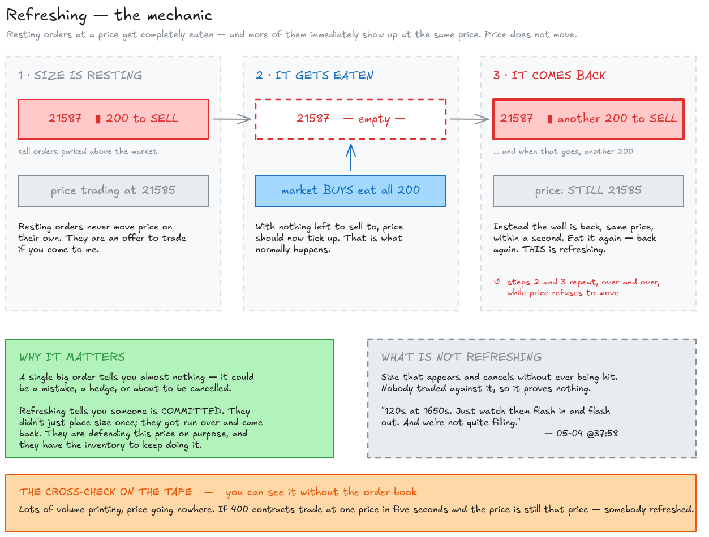
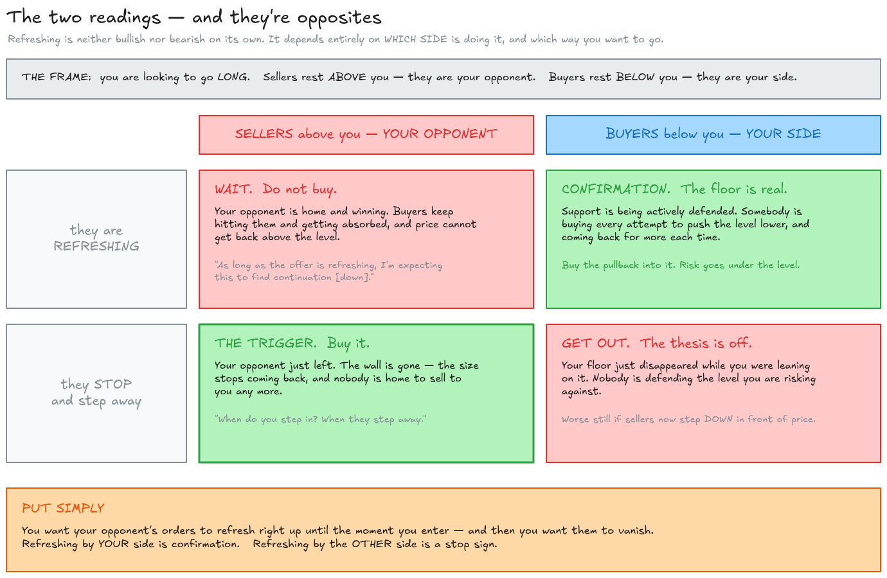
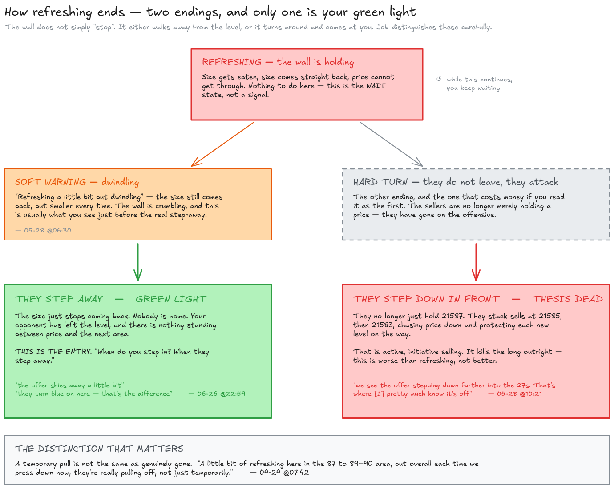
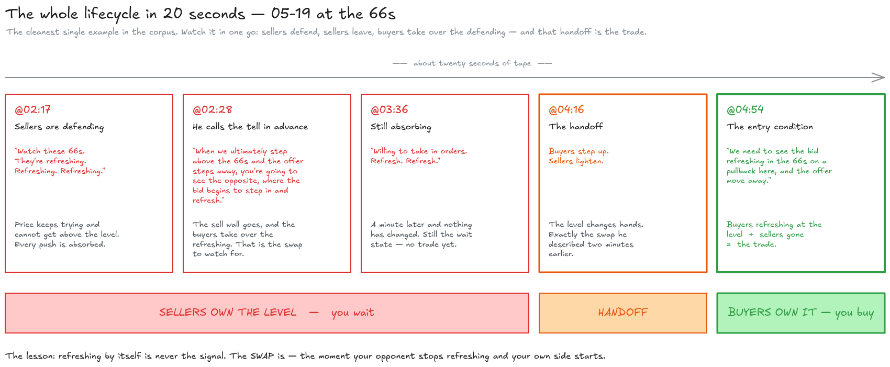

# Order refreshing, in plain English — with the receipts

Written 2026-08-28 from the nine market-replay transcripts in
[`docs/jba-research/replays/`](./replays/) plus the OFL course material in
[`docs/jba-research/reference/`](./reference/). Every timestamp below is a real link into a real
video — click it and watch the thing happen.

**Terminology note.** You asked for buy/sell instead of bid/ask/offer, so all of my own prose uses
buy and sell. Job's quotes are left verbatim because that is what you will actually hear on the
video. The translation is one line:

| Job says | Means |
| --- | --- |
| **bid** | resting **buy** orders sitting below the market |
| **offer** / **ask** | resting **sell** orders sitting above the market |
| "watch your offer" (when he is long) | watch the **sellers** — they're your opponent |
| "watch your bid" (when he is short) | watch the **buyers** — they're your opponent |

---

## 1. What refreshing actually is

### The setup

At any moment there is a queue of resting orders at each price. People who want to **buy** park
orders below the market; people who want to **sell** park orders above it. Those orders just sit
there. They don't move price. They are an *offer to trade if you come to me*.

Price only moves when somebody gets impatient and crosses the spread — a market order. A market
buy eats through the resting sell orders. A market sell eats through the resting buy orders.

### The event

**Refreshing is when resting orders at a price get eaten, and then more of them show up at the
same price.**

That's the whole idea. Somebody has 200 to sell at 21587. A wave of buying comes in and takes all
200. Under normal conditions the price should now tick up, because there's nothing left there to
sell to. Instead — within a second — there's another 200 sitting at 21587. Take that, and there's
another 200. The price does not move.

The course material calls this **reloading**:

> *"This occurs when orders persistently replace their bid or offer as their limit orders get
> filled. This could denote absorption, showing buying or selling interest at that particular price
> level."* — [`reference/dom.txt`](./reference/dom.txt)

Job's own working definition, said out loud on 06-26:

> *"When I say watch your offer, I'm trying to define exactly what I'm looking at — the stepping in
> to those orders, maintaining dominance, and inability to get back above the prior levels that we
> were looking at where they were refreshing."*
> — [06-26 @20:47](https://youtu.be/l4xvVNTE_H8?t=1247)



*The whole idea in one picture. Every diagram in this document has its editable source alongside it in
[`diagrams/`](./diagrams/) as a `.excalidraw` file — drop one into [excalidraw.com](https://excalidraw.com) to change it.*

### Why it matters

A single big order at a price tells you almost nothing — it could be a mistake, a hedge, or someone
about to cancel it. **Refreshing tells you someone is committed.** They didn't just place size
once; they got run over and *came back*. They're defending that price on purpose, and they have
the inventory to keep doing it.

So refreshing is the answer to the only question that matters at a level: *is somebody actually
home here, or is this price going to give way?*

### The two readings, and they're opposites

This is the part that trips people up. Refreshing is not bullish or bearish on its own. **It
depends entirely on which side is doing it and which way you want to go.**

| Who is refreshing | What it means | What Job does |
| --- | --- | --- |
| **Sellers** refresh above you, while you want to go **long** | Your opponent is home and winning. Buyers keep hitting them and getting absorbed. | Wait. Don't buy. *"As long as the offer is refreshing, I'm expecting this to find continuation [down]."* |
| **Sellers stop** refreshing / step away | Your opponent just left. The wall is gone. | **This is the trigger.** Buy it. *"When do you step in? When they step away."* |
| **Buyers** refresh below you, holding a level | Support is real and defended. | Buy the pullback into it, risk under the level. |
| **Buyers stop** refreshing below you while you're long | Your floor just disappeared. | Get out / thesis is off. |

Put simply: **you want your opponent's orders to refresh right up until the moment you enter, and
then you want them to vanish.** Refreshing by *your* side is confirmation. Refreshing by the *other*
side is a stop sign.



### What ends it

Two different endings, and Job distinguishes them carefully:

1. **They step away / shy away / pull.** The size just stops coming back. Nobody's home. This is
   the green light. — *"the offer shies away a little bit"*, *"they turn blue on here — that's the
   difference"* ([06-26 @22:59](https://youtu.be/l4xvVNTE_H8?t=1379)).
2. **They step down and get in front.** Worse than refreshing. The sellers don't just hold 21587 —
   they now stack sells at 21585, then 21583, chasing price down and protecting each new level.
   That is active, initiative selling, and it kills the long thesis outright. — *"we see the offer
   stepping down further into the 27s. That's where [I] pretty much know it's off"*
   ([05-28 @10:21](https://youtu.be/bFU1dXf5uw8?t=621)); *"then the offer gets underneath, begins to
   protect, and then we get our little sweep"*
   ([04-24 @06:31](https://youtu.be/JMWo4IpN8yA?t=391)).

There's also a soft ending — **"refreshing a little bit but dwindling"** — where the size still
comes back but smaller each time. That's the wall crumbling, and it's usually what you see just
before the real step-away ([05-28 @06:30](https://youtu.be/bFU1dXf5uw8?t=390)).



### The companion signal on the tape

Refreshing is a DOM (order book) observation, but it leaves a fingerprint in time & sales that you
can check independently: **lots of volume printing, price going nowhere.**

> *"sweeps… but price is not moving at all and we're seeing replenishing… that's potential
> absorption"* — [OFL 101 Time & Sales @2:49](https://youtu.be/3sNu2TIfae8?t=169)

If you see 400 contracts trade at one price in five seconds and the price is still that price,
somebody refreshed. That's the cross-check.

### A concrete 20-second walkthrough

The cleanest single example in the whole corpus is 05-19 at the 66s. Watch it in one go — it
contains the entire lifecycle:

1. **[@02:17](https://youtu.be/RaJRUnHR_Rg?t=137)** — *"Watch these 66s. They're refreshing.
   Refreshing. Refreshing."* Sellers are defending. Price can't get above.
2. **[@02:28](https://youtu.be/RaJRUnHR_Rg?t=148)** — he tells you the tell in advance:
   *"When we ultimately step above the 66s and the offer steps away, you're going to see the
   opposite, where the bid begins to step in and refresh."* i.e. the sell wall goes, and the buyers
   take over the refreshing.
3. **[@03:36](https://youtu.be/RaJRUnHR_Rg?t=216)** — *"Willing to take in orders. Refresh.
   Refresh."* Still absorbing.
4. **[@04:16](https://youtu.be/RaJRUnHR_Rg?t=256)** — the handoff. Buyers step up, sellers lighten.
5. **[@04:54](https://youtu.be/RaJRUnHR_Rg?t=294)** — the entry condition stated cleanly:
   *"We need to see the bid refreshing in the 66s on a pullback here, and the offer move away."*
   Buyers refreshing at the level + sellers gone = the trade.



---

## 2. Reading it on your own DOM

Section 1 is what refreshing *is*. This is where it lives on screen. Worked out 2026-08-28 on a Sierra
Chart Trade DOM on NQ, configured to match what Job describes on the videos.

### The seven columns

| Sierra column name | Header | What it holds | What you read it for |
| --- | --- | --- | --- |
| Label Column | — | chart levels drawn onto the ladder | *whether to be looking at the DOM at all yet* |
| Bid Size/Buy Order Column | `Buy` | resting buy size | the thing that refreshes, bid side |
| Ask Size/Sell Order Column | `Sell` | resting sell size | the thing that refreshes, ask side |
| Bid Market Depth Pulling/Stacking | — | net orders added / removed on the bid | **the trigger** |
| Ask Market Depth Pulling/Stacking | — | net orders added / removed on the ask | **the trigger** |
| Recent Bid Volume | `RBid` | volume recently traded at the bid | how much just got eaten — sell aggressors |
| Recent Ask Volume | `RAsk` | volume recently traded at the ask | how much just got eaten — buy aggressors |

Use the **separate** Bid and Ask Pulling/Stacking columns, not the Combined one, so each sits with its
own half of the book.

Naming trap: Sierra calls the same column three different things depending on where you are standing.
The column picker says "Bid Size/Buy Order Column", the header says `Buy`, and the colour setting is
`Bid Depth Quantities`. Nothing links them, and searching for one name will not find the others.

### Order

```
Buy │ BidP/S │ PRICE │ AskP/S │ Sell │ RBid │ RAsk
```

Mirrored around price, with the two trigger columns flanking the ladder where the eye already sits.
The two recent-volume columns go **adjacent to each other** as a footprint block, because the read
there is `RBid` against `RAsk` on the same row — which side is winning at this price — and that
comparison is impossible when they sit at opposite ends of the DOM.

### Colours

Colour by **event, not by side.** Position already tells you which side you are on, so spending colour
on it wastes the channel.

None of these live in Chart Settings. They are under **Global Settings → Graphics Settings - Colors →
TradeDOM tab** (or `Chart → Graphics Settings` per-chart, in which case *uncheck* "Use Global Graphics
Settings Instead of These Settings" or nothing you set will apply). Every name below carries a
`Trade DOM` prefix there — `Chart DOM` if your window is a Chart DOM instead. Several of the
background settings also have an **Enable checkbox** beside the colour button and do nothing until it
is ticked.

| Column | Value | Means | Colour |
| --- | --- | --- | --- |
| Bid P/S | positive | buyers adding | blue |
| Bid P/S | negative | buyers pulling | red |
| Ask P/S | positive | sellers adding | red |
| Ask P/S | **negative** | **sellers pulling** | **blue** |

Blue means bulls are winning that row, red means bears are, regardless of which side of the ladder it
is on. That last row is Job's tell — *"when they pull off, I have it turn blue to show me that"*
([04-30 @24:40](https://youtu.be/5124WmFuurg?t=1480)) — and it is the one that gets set wrong, because
Sierra's defaults want to colour by side.

**Then set the volume bars to match the text rather than the side.** This is the change that actually
makes the thing work:

- `Bid Market Depth Pulling/Stacking Negative Volume Bar` → red
- `Ask Market Depth Pulling/Stacking Negative Volume Bar` → blue

With bars coloured by side and text by sentiment, a pulling row renders a blue number on a maroon bar.
The cell contradicts itself, and you have to stop and *read* it. With both agreeing, the row flashes a
single colour across its whole width and you catch it in peripheral vision without reading anything.
That is the difference between the thing people describe — you see it flash and you know it is going
to dump — and squinting at digits.

Keep `Buy` and `Sell` neutral grey with grey magnitude bars. You are watching those numbers *change*,
and saturation makes a delta harder to see.

**The recent-volume columns go quiet, with one conditional exception.** Left at full saturation,
`RBid` / `RAsk` compete with the pull/stack flash — which is the one thing that has to win.
Desaturate both their text and their volume bars, then hand the loud colour to a pair of conditional
settings instead:

- `Recent Bid Same Price and Side` — Text Color **and** Background Color
- `Recent Ask Same Price and Side` — Text Color **and** Background Color

Sierra's description: *"the background color at the price of the last Bid update when the previous
update was also a Bid at the same price."* **Consecutive prints, same price, same side** — which is
the section 1 tape fingerprint rendered directly onto the ladder. It is the condition that was firing
at 29800 in the walkthrough below, while 211 lots went through the offer and price travelled 1.25
points. Configured this way the recent-volume columns stay dark until a level is being hit repeatedly
from one side, and light up exactly when it is.

Skip `Last Traded Recent Bid/Ask Volume Background` and `Recent Bid Best Bid Background` — redundant
once Same-Price-and-Side is carrying that signal.

**Colour the last-price cell by aggressor** so the price row tells you which way the last print went:
`Last Price Text Bid Trade` / `Ask Trade`, and `Last Price Background Bid Trade` / `Ask Trade`. Free
directional context at the spot the eye already anchors.

**Three cheap structural ones:**

- `Best Bid/Ask Box Background` — shades the band between best bid and best ask on the price scale, so
  the inside market is always visibly located.
- `Daily High Line` / `Daily Low Line` — session extremes drawn onto the ladder, worth having given how
  often his levels are ONH / ONL / PDH / PDL.
- `Column Separator Lines` — a subtle separator around the `RBid │ RAsk` block sets it apart as its own
  unit.

**Leave these two off deliberately.** `Bid Market Depth Pulling/Stacking Background` and
`Ask Market Depth Pulling/Stacking Background` should stay at Enable = No. Turning them on puts a fill
behind the entire pull/stack column and swamps the bar flash the paragraph above exists to produce.

### Settings

**Compression — three settings, not one.** NQ book depth is 2–9 contracts per tick. You cannot see
"eaten and back" in a 4-lot; the noise floor is the signal. At four ticks the same ladder reads 15–46.

| Setting | Where | Value |
| --- | --- | --- |
| `Market Depth Combine Increment In Ticks` | Chart Settings → Market Depth | 4 |
| `Apply Combine Increment in Ticks to Other Market Data Columns` | same page | checked |
| `Scale Increment` | Chart Scale and Scale Adjusting → Scale Settings | 1.00 |

Without the third, the ladder still draws one row per tick and three of every four come up empty. Do
not change `Tick Size` — Sierra support says not to, and it breaks volume profile display on the same
chart.

Four ticks is what Job runs: *"this is set on a four tick compression in order to match the DOM. It has
four tick compression on the pull stack activity"*
([07-17 @06:39](https://youtu.be/glG8-dCLba0?t=399)). Four ticks is one point on both ES and NQ, and it
is why he talks in bands — *"this zone between 17 and 14 where we're trying to re-refresh"* — rather
than single prices.

**Pulling/Stacking**

| Setting | Value | Why |
| --- | --- | --- |
| `Add Trade Volume To Pulling Stacking Value For Price` | **Yes** | the setting that makes refreshing measurable at all — see below |
| `Limit Maximum Pulling Stacking Value To Current Depth Quantity` | **No** | clamps the value to whatever happens to be resting, so a triple-refresh of 185 displays as 185 |
| `Max Bid/Ask Depth Pulling/Stacking Levels` | **0** (All) | counts raw ticks, not compressed rows — a setting of 30 gives only ±7.5 points of coverage on NQ |

**Recent volume**

| Setting | Value | Why |
| --- | --- | --- |
| `Recent Bid Ask Volume Timeout in Milliseconds` | 6000–8000 | 2400 empties between waves of trade, losing the accumulation that proves a level was eaten repeatedly |
| `Reset Recent Bid/Ask Volume on Bid/Ask Change` | No | Yes wipes the count every time the inside market ticks, which is constantly |

Set the large-size highlight (`Bid` / `Ask Market Depth Quantity High Threshold Background Color`) to
roughly 3× the post-compression baseline. On NQ at four ticks that baseline is 15–35, so a threshold
around 75–100 marks genuine outliers.

### The three-state read

With `Add Trade Volume` on, fills are netted out of the pull/stack figure and what is left is orders
*added*. That collapses the whole mechanic from section 1 into a single number per row:

| What happened | P/S reads |
| --- | --- |
| eaten and replaced — **refreshing** | **positive** |
| eaten and not replaced — giving way | ≈ zero |
| cancelled and gone — **pulling** | **negative** |

The cross-check is what it always was, now on one row instead of across two windows: `RAsk` against
`Sell`. If 500 traded there and 185 is still sitting, they replaced it twice. If 150 traded and the
size vanished, they cancelled the rest and left.

### What it looks like when it fires

NQ, 2026-08-28, around 10:00am, after a 230-point run that had already exceeded the day's average
range.

1. **The setup.** 186 lots resting at 29800 against neighbours of 16–30. Price 29788. `AskP/S` at
   29801–29811 all **negative**, `AskP/S` at 29789–29800 all **positive** — sellers pulling from up
   high and re-stacking just over price. The offer stepping down, which is Job's kill signal
   ([04-24 @06:31](https://youtu.be/JMWo4IpN8yA?t=391)).
2. **The hit.** Buyers sweep: 19, 19, 19, 14 at 29799.75, then 10, 8, 5 at 29800. `RAsk` @29800 reaches
   **211** against a 186 wall — consumed, not refreshed. Price prints 29801.50.
3. **The tell.** `RBid` @29800 reads **107** at the same moment. 318 contracts at one price, net travel
   1.25 points. *"Sweeps… but price is not moving at all"* — the section 1 tape fingerprint, on the
   ladder.
4. **The reload.** Within seconds `AskP/S` from 29802 to 29823 flips from all-negative to **positive on
   nearly every row.** They gave up 29800 and re-established the ceiling above it.
5. **The break.** `BidP/S` under price — the breakout buyers — goes red. Price runs back through 29800
   to 29790, with `AskP/S` stacking every level from 29791 to 29814 at 12–17 while `BidP/S` underneath
   manages 1–7. Two to three times the commitment on the sell side, offer protecting each new level
   down.

The entry was neither the wall nor the break. It was the **failed break**: 29800 given up, then
immediately re-defended from above, with nobody bidding underneath.

### One known defect

Sierra sometimes fails to display the negative sign on pulling values, so the pull never trips its
negative colour — and it reportedly degrades over a session until depth data is cleared and
re-downloaded ([support thread](https://www.sierrachart.com/SupportBoard.php?ThreadID=90017)). Since
"they pulled" is the single event this entire layout exists to catch, know that it can fail silently.
If pulls stop appearing, clear and re-pull depth before concluding that nobody is leaving.

---

## 3. Where to see it — timestamped index

Links jump to the exact caption. **Back up ~5 seconds** if you want the lead-in.

Videos referenced:

| Date | Title | Link |
| --- | --- | --- |
| 2026-04-08 | JBA low bid for con't | [u-S6Rvj7hIY](https://youtu.be/u-S6Rvj7hIY) |
| 2026-04-24 | Rebid and DOM discussion | [JMWo4IpN8yA](https://youtu.be/JMWo4IpN8yA) |
| 2026-05-04 | JBA high reoffer & ONL Rebid | [9iNMcMoI9nk](https://youtu.be/9iNMcMoI9nk) |
| 2026-05-19 | ES PW_LO fail, RP change of auction | [RaJRUnHR_Rg](https://youtu.be/RaJRUnHR_Rg) |
| 2026-05-28 | RP, Pivot, LVN Bid/Rebid ES | [bFU1dXf5uw8](https://youtu.be/bFU1dXf5uw8) |
| 2026-06-26 | Rebid scenarios and interaction on ES | [l4xvVNTE_H8](https://youtu.be/l4xvVNTE_H8) |
| 2026-06-30 | Discussion | [FrSP2kDoJvs](https://youtu.be/FrSP2kDoJvs) |
| 2026-07-17 | Exhaustive Node at Edge of Range | [glG8-dCLba0](https://youtu.be/glG8-dCLba0) |
| (reference) | OFL 101 — Time and Sales | [3sNu2TIfae8](https://youtu.be/3sNu2TIfae8) |

### Start here — the six clearest clips

| # | Link | Why this one |
| --- | --- | --- |
| 1 | [05-19 @02:17](https://youtu.be/RaJRUnHR_Rg?t=137) | The purest "here it is happening" clip. Three refreshes called in a row on the sell side. |
| 2 | [06-26 @20:47](https://youtu.be/l4xvVNTE_H8?t=1247) | Job explicitly defines what he means. This is the definition clip. |
| 3 | [05-19 @04:54](https://youtu.be/RaJRUnHR_Rg?t=294) | The complete entry condition in one sentence: buyers refreshing + sellers gone. |
| 4 | [05-04 @35:25](https://youtu.be/9iNMcMoI9nk?t=2125) | *"When do you step in? When they step away."* The trigger, stated bluntly. |
| 5 | [06-26 @22:59](https://youtu.be/l4xvVNTE_H8?t=1379) | Refreshing vs. **pulling** — he points at the DOM and says "that's the difference". |
| 6 | [05-28 @19:31](https://youtu.be/bFU1dXf5uw8?t=1171) | Refreshing used as an **exit** trigger: he adds, sellers refresh into the add, add comes straight off. |

### Full index, by video

#### 2026-05-19 — ES, previous week's low fail (the densest one: 19 mentions)

| Time | Job's words | In buy/sell terms |
| --- | --- | --- |
| [02:17](https://youtu.be/RaJRUnHR_Rg?t=137) | *"Watch these 66s. They're refreshing. Refreshing. Refreshing."* | Sellers keep replacing size at 66. Price can't get through. Stand down. |
| [02:28](https://youtu.be/RaJRUnHR_Rg?t=148) | *"When we ultimately step above the 66s and the offer steps away, you're going to see the opposite where the bid begins to step in and refresh."* | The handoff he's waiting for: sellers vanish, buyers take over the refreshing. |
| [03:20](https://youtu.be/RaJRUnHR_Rg?t=200) | *"But we haven't seen the offer pull away yet. Still refreshing in that zone."* | Sellers still home → no long yet, even though price is at the level. |
| [03:36](https://youtu.be/RaJRUnHR_Rg?t=216) | *"Willing to take in orders. Refresh. Refresh."* | Sellers absorbing everything thrown at them. |
| [04:00](https://youtu.be/RaJRUnHR_Rg?t=240) | *"As long as the offer is refreshing, I'm expecting this to find continuation."* | Sellers refreshing = expect the down move to keep going. |
| [04:16](https://youtu.be/RaJRUnHR_Rg?t=256) | *"Now I'd look at your bid in 64 halves. And now look at your offer. So the bid begins to step up…"* | The switch: buyers start stepping up, sellers lighten. |
| [04:54](https://youtu.be/RaJRUnHR_Rg?t=294) | *"We need to see the bid refreshing in the 66s on a pullback here and the offer move away."* | **The entry recipe.** Buyers refreshing at the level + sellers gone. |
| [05:16](https://youtu.be/RaJRUnHR_Rg?t=316) | *"They're refreshing pretty well above the 66s."* | Sellers still active just above — not clean yet. |
| [06:28](https://youtu.be/RaJRUnHR_Rg?t=388) | *"Doing its thing there, refreshing a little bit."* | Light refreshing — a weak wall, not a real one. |
| [07:34](https://youtu.be/RaJRUnHR_Rg?t=454) | *"Look at these 78s. Refreshing, refreshing, refreshing on the offer."* | Second clean example, at a different level. |
| [07:57](https://youtu.be/RaJRUnHR_Rg?t=477) | *"See how thin it is. Right there. Bid steps up in the 78s… This here is off."* | **The end of it.** Sellers thin out, buyers step up, the level flips. |
| [08:59](https://youtu.be/RaJRUnHR_Rg?t=539) | *"Not quite there. They're still refreshing the 85s."* | Next level up is still defended by sellers. |
| [09:57](https://youtu.be/RaJRUnHR_Rg?t=597) | *"We get some assimilation of absorption here… and you see refreshing on this."* | Refreshing tied explicitly to absorption on the chart. |
| [10:21](https://youtu.be/RaJRUnHR_Rg?t=621) | *"Refreshing a little bit in the 87s."* | |
| [10:54](https://youtu.be/RaJRUnHR_Rg?t=654) | *"Binning out, but that 87 and 87 half not moving. Once filled…"* | Volume printing, price frozen — the tape fingerprint of a refresh. |
| [15:16](https://youtu.be/RaJRUnHR_Rg?t=916) | *"With that refreshing, we're seeing that response, that response, response."* | Repeat refreshes producing repeat bounces. |
| [21:41](https://youtu.be/RaJRUnHR_Rg?t=1301) | *"…around those 84s where it was refreshed from the offer, and then the offer stepped back from that and the bid began to step back up into it."* | Full-cycle recap: sellers refreshed → sellers left → buyers took the level. |

#### 2026-05-28 — ES, RP / Pivot / LVN rebid

| Time | Job's words | In buy/sell terms |
| --- | --- | --- |
| [03:47](https://youtu.be/bFU1dXf5uw8?t=227) | *"Watch refreshing into this area… Are we refreshing through this zone and are we showing a dominant bid?"* | Asks the question directly: is anyone actually defending this zone? |
| [06:30](https://youtu.be/bFU1dXf5uw8?t=390) | *"Refreshing a little bit but dwindling."* | **The crumbling wall.** Size still comes back but smaller each time. |
| [06:38](https://youtu.be/bFU1dXf5uw8?t=398) | *"They're going to refresh. They're going to refresh. How do we respond to this?"* | Calling the refresh a beat before it prints. |
| [07:17](https://youtu.be/bFU1dXf5uw8?t=437) | *"Looking for that aggressive activity to step up the book. But instead, we get refreshing right there in the 28s."* | He wanted buyers to climb; sellers refreshed instead. |
| [08:01](https://youtu.be/bFU1dXf5uw8?t=481) | *"So this is a very poor or late type of entry. Cuz we're still refreshing in this 20s."* | Why the entry was bad: he bought while sellers were still refreshing. |
| [11:43](https://youtu.be/bFU1dXf5uw8?t=703) | *"That refreshing a little bit where we have that sell delta."* | |
| [12:05](https://youtu.be/bFU1dXf5uw8?t=725) | *"With that refreshing up into those 31s, where does that lean off? Where does it give way?"* | Using the refresh to locate where the wall ends. |
| [15:35](https://youtu.be/bFU1dXf5uw8?t=935) | *"Offer still refreshing those 34s. Want to see it leave."* | Long, waiting for the sellers to quit. |
| [19:31](https://youtu.be/bFU1dXf5uw8?t=1171) | *"Immediately that add is seeing refreshment or refreshing of the offer into that zone. It doesn't move in favor, get it off."* | **Refresh as an exit signal.** LIFO — the add comes straight back off. |
| [22:54](https://youtu.be/bFU1dXf5uw8?t=1374) | *"Offer refreshing. Offer refreshing."* | |
| [24:12](https://youtu.be/bFU1dXf5uw8?t=1452) | *"When this here was refreshing on the 37s with the offer… this is where you want your brackets in place."* | Refreshing against your position = get protection on. |

#### 2026-06-26 — ES, rebid scenarios (the teaching one)

| Time | Job's words | In buy/sell terms |
| --- | --- | --- |
| [13:19](https://youtu.be/l4xvVNTE_H8?t=799) | *"We want to identify where the offer is and where they're no longer refreshing."* | The whole job, in one sentence: find where sellers stop coming back. |
| [17:21](https://youtu.be/l4xvVNTE_H8?t=1041) | *"Recover and replace, replace, replace through that."* | Plain-language description of refreshing without using the word. |
| [18:00](https://youtu.be/l4xvVNTE_H8?t=1080) | *"See a 27s refreshing… starting to step above."* | |
| [18:32](https://youtu.be/l4xvVNTE_H8?t=1112) | *"If the offer is not able to step down and continually refresh, then you're not at that point where it's going to actually accelerate."* | No seller refreshing = no downside acceleration. |
| **[20:47](https://youtu.be/l4xvVNTE_H8?t=1247)** | *"When I say watch your offer, I'm trying to define exactly what I'm looking at — the stepping in to those orders, maintaining dominance, and inability to get back above the prior levels where they were refreshing."* | **The definition clip.** Play this one first. |
| [22:59](https://youtu.be/l4xvVNTE_H8?t=1379) | *"You see a difference here where we begin to see pulling. They turn blue on here. That's the difference."* | **Refreshing vs. pulling**, pointed at on the actual DOM. |
| [23:33](https://youtu.be/l4xvVNTE_H8?t=1413) | *"…creates this zone between 17 and 14 down here where we're trying to re-refresh."* | A whole band, not a single price — matches the NQ band behaviour. |
| [24:12](https://youtu.be/l4xvVNTE_H8?t=1452) | *"I want to see the refreshing from the 14s on the bid for it to push up and out of here."* | Buyers refreshing at his LVN = his go condition. |
| [31:51](https://youtu.be/l4xvVNTE_H8?t=1911) | *"Even in these 16s at this point, we're seeing that refreshing from the bid."* | Buy-side refreshing under a long — the floor holding. |
| [33:21](https://youtu.be/l4xvVNTE_H8?t=2001) | *"Same thing. Reload. Reload. Reload."* | His other word for it. |
| [36:24](https://youtu.be/l4xvVNTE_H8?t=2184) | *"We stepped into the 14s and we filled those orders, and then this was going to refresh and press down a little bit further."* | Getting filled, then the level refreshes *against* you and price keeps going. |
| [41:23](https://youtu.be/l4xvVNTE_H8?t=2483) | *"Are we actually refreshing? Because if we're refreshing, we can get a little sweep down into that to fill it and then remove."* | Refreshing predicts a fill-and-reverse — the exact shape he wants for an entry. |

#### 2026-06-30 — discussion

| Time | Job's words | In buy/sell terms |
| --- | --- | --- |
| [14:09](https://youtu.be/FrSP2kDoJvs?t=849) | *"You want to see the offer be allergic to that. Not refreshing."* | The best single phrase in the corpus: you want the sellers *allergic*. |
| [15:32](https://youtu.be/FrSP2kDoJvs?t=932) | *"I need to see that bid stepping above those 25s and not just refreshing from the offer in those 25s, taking on all those orders and pressing us down."* | Distinguishes buyers advancing vs. sellers refreshing and winning. |
| [15:59](https://youtu.be/FrSP2kDoJvs?t=959) | *"Yes, the offer is light, but we're not seeing the bid willing to refresh and stay above those 25s."* | Sellers gone isn't enough — buyers have to refresh too. |
| [16:21](https://youtu.be/FrSP2kDoJvs?t=981) | *"You can offset those positionings by simply refreshing above these 25s."* | Refreshing buys can neutralise aggressive selling without price moving. |
| [17:50](https://youtu.be/FrSP2kDoJvs?t=1070) | *"If we have a refreshing in 28s, it's a go for continuation."* | Buy-side refreshing as a green light. |
| [18:10](https://youtu.be/FrSP2kDoJvs?t=1090) | *"Needs to hold those 28s. Needs to refresh those 28s."* | Hold + refresh as the continuation requirement. |
| [27:09](https://youtu.be/FrSP2kDoJvs?t=1629) | *"We're getting refreshing up here, but we've already seen the weakness."* | Refreshing does **not** override structure he's already read. |

#### 2026-07-17 — NQ, exhaustive node at edge of range

| Time | Job's words | In buy/sell terms |
| --- | --- | --- |
| [10:38](https://youtu.be/glG8-dCLba0?t=638) | *"Watch the 87s. And if we can't refresh, then we could step back up up up."* | No refresh at the level → price is free to travel. |
| [13:56](https://youtu.be/glG8-dCLba0?t=836) | *"I want to see that respected and rebid… and not be able to cut that trade unless we refreshing either at the 87s or into the low 80s."* | Refreshing at 87 / the low 80s is what keeps the trade alive. (Auto-caption is garbled here — listen rather than read.) |
| [16:16](https://youtu.be/glG8-dCLba0?t=976) | *"We know the 87 mark is where they were refreshing previously."* | **Memory.** Where it refreshed earlier is a level for later. |
| [16:29](https://youtu.be/glG8-dCLba0?t=989) | *"At which point are we refreshing? Because now it's all on the table."* | The retest — refresh confirms or kills the thesis. |
| [17:48](https://youtu.be/glG8-dCLba0?t=1068) | *"You can see that refreshing in the 20s."* | |
| [19:18](https://youtu.be/glG8-dCLba0?t=1158) | *"Look at your 40s refreshing right here… Let that stick out in your mind."* | Explicitly tells you to remember the refresh location. |

#### 2026-05-04 — NQ, JBA high reoffer & ONL rebid

| Time | Job's words | In buy/sell terms |
| --- | --- | --- |
| [07:47](https://youtu.be/9iNMcMoI9nk?t=467) | *"We're absorbing at the top of that leg-to-leg delta profile… We're refreshing in the 70s."* | Refreshing named alongside absorption on the chart. |
| [14:31](https://youtu.be/9iNMcMoI9nk?t=871) | *"Are we holding those 58s? How we doing there? We're holding. Still refreshing."* | Buy-side refreshing checked as a live floor. |
| [14:43](https://youtu.be/9iNMcMoI9nk?t=883) | *"Watching the bid. I see it step away. Get away."* | The stop — twelve seconds after the previous clip. Watch them back to back. |
| [19:20](https://youtu.be/9iNMcMoI9nk?t=1160) | *"Give me a tick in front of this 155 guy that's been refreshing and just hanging out there the entire time."* | Uses a persistently-refreshing order as the thing to queue in front of. |
| [35:25](https://youtu.be/9iNMcMoI9nk?t=2125) | *"Refreshing those 17s. Overnight low tag, but the offer is still there. When do you step in? When they step away."* | **The trigger, stated bluntly.** Reaching the level is not the signal — the sellers leaving is. |

#### 2026-04-24 — rebid and DOM discussion

| Time | Job's words | In buy/sell terms |
| --- | --- | --- |
| [06:31](https://youtu.be/JMWo4IpN8yA?t=391) | *"The offer continues to respect that zone. Step in, step in… then the offer gets underneath, begins to protect, and then we get our little sweep."* | **The bad ending.** Sellers stop merely refreshing and start stepping *down* in front of price. |
| [07:42](https://youtu.be/JMWo4IpN8yA?t=462) | *"A little bit of refreshing here in the 87 to 89–90 area, but overall each time we press down now, they're really pulling off, not just temporarily."* | The distinction that matters: temporary pull vs. genuinely gone. |

#### 2026-04-08 — NQ, JBA low bid for continuation

| Time | Job's words | In buy/sell terms |
| --- | --- | --- |
| [34:57](https://youtu.be/u-S6Rvj7hIY?t=2097) | *"See an 8, 10 to 12 point type move outside of these zones with refreshing and things like that. That's the execution point."* | Refreshing is an **execution** tool, not a thesis tool. |
| [35:23](https://youtu.be/u-S6Rvj7hIY?t=2123) | *"I want to see this rotate back to where I saw previous refreshing… but be aware that if you're just staring at that sucker all day, you're going to go blind. Place your weight on structure."* | The warning: refreshing times entries inside a structural plan; it doesn't replace one. |

#### Reference — OFL 101, Time and Sales

| Time | Job's words | In buy/sell terms |
| --- | --- | --- |
| [02:49](https://youtu.be/3sNu2TIfae8?t=169) | *"Sweeps… but price is not moving at all and we're seeing replenishing… that's potential absorption."* | The tape-only cross-check: heavy volume, zero price movement. |

---

## 4. What size of orders is he actually looking for?

**Short answer: he never gives a number, and he says explicitly that he doesn't work off one.**

I swept all nine replays, the 25 prep transcripts, and all six OFL reference documents
(`dom`, `time-and-sales`, `ofl-101-time-and-sales`, `dominator-2.0`, `dominator-2-0-deep-dive`,
`job-pivots-deep-dive`). There is **no stated threshold** — no "I want to see 200+", no per-symbol
minimum, nothing. What there is: a clear statement of the principle, and about a dozen numbers he
reads off the screen in passing, which at least tell you the range he considers worth naming.

### The principle: size is relative, not absolute

This is the passage that settles it — 06-26, right at the top, before any of the trade discussion:

> *"Environments change. We're in the summer currently… There are plenty of times where we see
> several thousand stuck right in a liquidity zone. We pull down into it and you look at that and
> you go, 'Okay, this might be a no-brainer.' But essentially — **is that a small number right
> here? Yeah, I mean kind of it is, but it's not relative to our current environment.**"*
> — [06-26 @05:15](https://youtu.be/l4xvVNTE_H8?t=315)

Two things follow from that:

1. **Several thousand at a price can be "small"** if the market is thick that week. A number that
   would be a wall in a quiet August is noise in a fast June.
2. Which means **he's not filtering on size at all — he's filtering on behaviour.** Does it come
   back after it gets eaten? Does it step away? That question is scale-free, which is exactly why
   he uses it. It works the same whether the level shows 40 or 4,000.

The tool he uses for "is this big *for right now*" — Dominator 2.0 — is built the same way. Its
course material describes it as comparing current activity against *"analogous session behavior"*
over a lookback window, with the threshold derived per-session rather than fixed
([`reference/dominator-2.0.txt`](./reference/dominator-2.0.txt),
[`dominator-2-0-deep-dive.txt`](./reference/dominator-2-0-deep-dive.txt)). Same idea: normalise
against the current environment, never against a constant.

Everywhere else, his language for size is qualitative and comparative — **heavy / still heavy /
staying heavy → getting thin / toothy / dwindling → non-existent**. That vocabulary is doing the
work a number would do, and it's the vocabulary he actually trades on.

### The numbers he does say out loud

Every specific size figure in all nine replays, with the instrument each video is trading:

| Date | Instrument | Time | What he says | Context |
| --- | --- | --- | --- | --- |
| 05-04 | **ES** | [12:20](https://youtu.be/9iNMcMoI9nk?t=740) | *"Just below where I placed that order there, we have **120 lots**. Watch what's sitting down there."* | Size resting just below his own limit — enough that he expects price not to reach him. It didn't ("we get within a point"). |
| 05-04 | **ES** | [35:54](https://youtu.be/9iNMcMoI9nk?t=2154) | *"…and **145s** there at 17 quarters. Blink twice if you want me to bid this."* | The buy-side size sitting where he wants to enter. Directly precedes *"that's exactly where I would step in."* |
| 05-04 | **ES** | [37:58](https://youtu.be/9iNMcMoI9nk?t=2278) | *"**120s** at 1650s. Just watch them flash in and flash out. And we're not quite filling. And this is two-way trade."* | Size appearing and cancelling without being hit — explicitly *not* refreshing, and he says so. |
| 05-04 | **ES** | [38:21](https://youtu.be/9iNMcMoI9nk?t=2301) | *"We just slap in **133 lots** at 7215 that immediately pause"* — instead of accelerating. | A big print that fails to move price → absorption. His *"butt pucker moment."* |
| 05-28 | **ES** | [20:46](https://youtu.be/bFU1dXf5uw8?t=1246) | *"Watch your offer, they're non-existent. We have **120 lots** at the 40s. Nobody else stepping in."* | 120 lots is what a *thin* level looks like here — one order, no one behind it. |
| 06-26 | **ES** | [05:15](https://youtu.be/l4xvVNTE_H8?t=315) | *"**Several thousand** stuck right in a liquidity zone… is that a small number? Kind of it is."* | The relativity statement. The largest figure in the corpus, and he calls it small. |
| 06-26 | **ES** | [23:55](https://youtu.be/l4xvVNTE_H8?t=1435) | *"If we cannot find continuation through that, we get another **136 lots** through there. And we see the offer just backing away."* | Size *traded through* without continuation. |
| 06-26 | **ES** | [35:37](https://youtu.be/l4xvVNTE_H8?t=2137) | *"You see the **150 lots** down at 12elves and then **120s** down at 10 3/4. Fill them. Somebody wants interest there."* | Two stacked levels. He wants them filled and then watches what happens next. |
| 06-30 | **ES** | [07:08](https://youtu.be/FrSP2kDoJvs?t=428) | *"That's why I want to pay attention to — we have **536 lots** or so forth here down at 14."* | The one clearly-large single number, and it's at his primary LVN. |
| 04-08 | ES/NQ (ambiguous) | [06:16](https://youtu.be/u-S6Rvj7hIY?t=376) | *"We're 68 or 6785 on ES and 950s on NQ. And we're starting to accelerate. We have **112 lots** here on the offer. Great. Do it, buddy."* — then *"they get lifted."* | He names both markets in the two lines before, so which DOM this is on isn't determinable from the transcript. |
| 04-08 | NQ | [08:12](https://youtu.be/u-S6Rvj7hIY?t=492) | *"We had limit orders of **very large** [size] hitting the offer."* | Qualitative only — no figure. |

### What that adds up to

- **ES:** every number he names sits in a band of roughly **120–150 lots at a single price**, with
  one outlier at **536**, and one reference to *several thousand* across a zone. That band is not a
  threshold he stated — it's just the size that was worth mentioning on those days. Note that
  120 lots appears both as *"nobody else stepping in"* (thin, 05-28) and as enough to keep price
  off his limit order (05-04). **The same number means opposite things on different days**, which
  is the relativity point in miniature.
- **NQ:** there is **no size figure anywhere in the corpus for NQ.** The only candidate (112 lots,
  04-08) is on a screen where he's just named both ES and NQ prices, so it can't be attributed.
  On the NQ videos where he's unambiguously on the NQ DOM — 04-24 (5-minute mid at 27210), 04-30,
  07-17 — he reads the book purely in behavioural terms and never quotes a lot count.

So if you're building a size threshold into a study, there is no operator-sourced number to
calibrate it to, for either symbol. The defensible construction is the one the v1 spec already
uses: a **relative** trigger — size returning to some fraction of what was just there — plus a
band of ticks rather than a single price. A fixed lot count would be the one thing Job says out
loud that he doesn't do.

### Instrument attribution, for the record

Worked out from prices spoken on the tape, since several videos don't name the symbol:

| Video | Instrument | Evidence |
| --- | --- | --- |
| 2026-04-08 | NQ traded, both on screen | *"We have a finite zone here on NQ"*; ES 6785 / NQ 950s quoted side by side |
| 2026-04-24 | **NQ** | *"the 5-minute mid is down at around 27210"* ([@04:10](https://youtu.be/JMWo4IpN8yA?t=250)) |
| 2026-04-30 | NQ | Only NQ referenced |
| 2026-05-04 | **ES** | *"a short on ES"*, *"I don't have those brackets for ES currently"* — a request; he normally trades NQ |
| 2026-05-19 | ES | Stated in title and throughout |
| 2026-05-28 | ES | Stated in title |
| 2026-06-26 | **ES** | *"the 7414 down to the 10 zone"* ([@06:27](https://youtu.be/l4xvVNTE_H8?t=387)) |
| 2026-06-30 | **ES** | *"that 710 or 7510 area"* ([@04:40](https://youtu.be/FrSP2kDoJvs?t=280)) — symbol never named |
| 2026-07-17 | NQ | *"10,000 volume candles on NQ"* ([@05:33](https://youtu.be/glG8-dCLba0?t=333)) |


---

## 5. The one-paragraph summary

Resting orders sit at a price waiting to be traded against. **Refreshing is when those orders get
completely eaten and immediately reappear at the same price** — over and over, while price refuses
to move. It means somebody is deliberately defending that price with real size and real inventory,
not just parking a single order. Job uses it as a *timing* tool inside a structural plan: at a
level he already cares about, sellers refreshing above means his opponent is home and he waits;
sellers going quiet — *"allergic"* — is his trigger to buy; buyers refreshing below him is his
confirmation that the floor is real. When the side he's leaning on stops refreshing, or worse,
when the other side starts stepping down in front of price, the trade is off.
