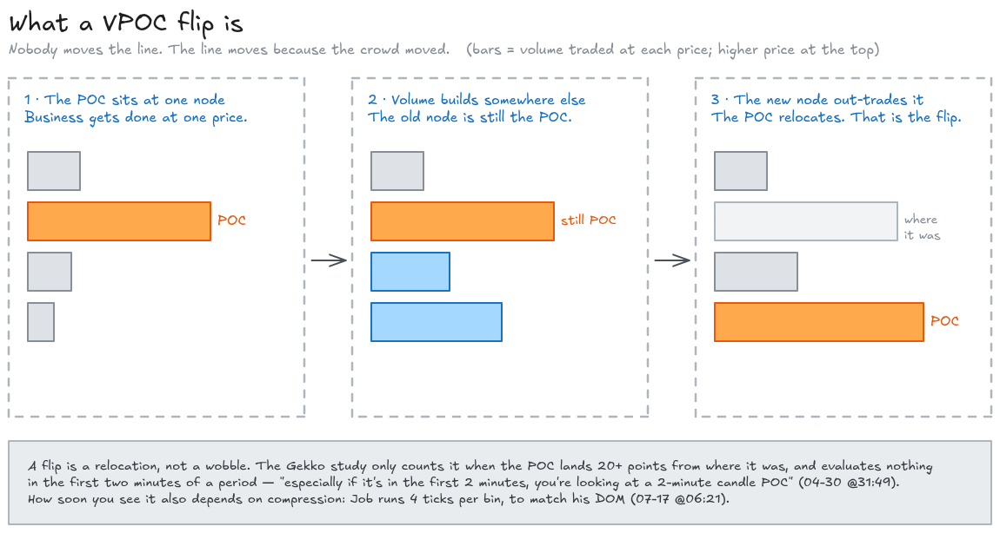
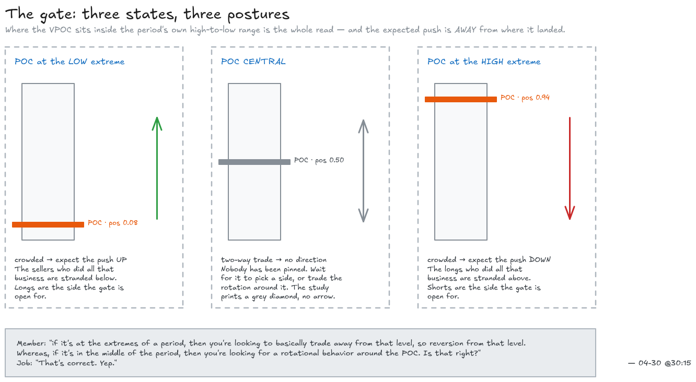
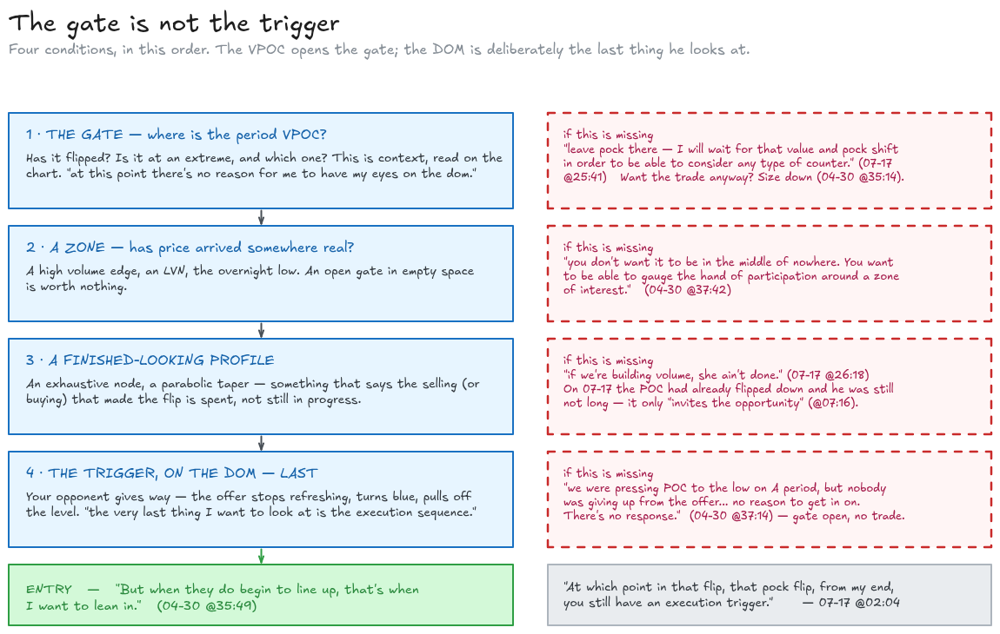
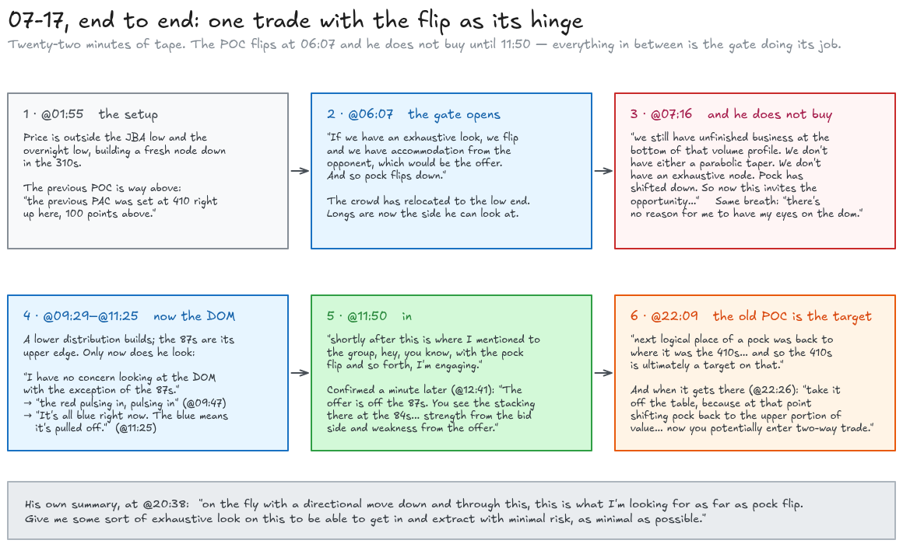

# The VPOC flip as an entry gate, in plain English — with the receipts

Written 2026-08-28 from the market-replay transcripts in [`docs/jba-research/replays/`](./replays/).
Two of the nine replays carry essentially all of the VPOC material: **04-30** (51 mentions — the
long Q&A at the end is the single best statement of the rule Job has given on tape) and **07-17**
(the whole video is one VPOC-flip trade, start to finish). Every timestamp below is a real link
into a real video — click it and watch the thing happen.

**Terminology note.** You say VPOC. Job says "POC", sometimes "V puck". The auto-captions hear
"pock" and occasionally "park" or "puck" — those are all the same word and the quotes are left
verbatim, disfluencies and mishearings included, because that is what you will actually hear.
Following the [refreshing explainer](./refreshing-explained.md), my own prose says buy/sell where
Job says bid/offer.

| Job says | Means |
| --- | --- |
| **POC** / **V puck** / *"pock"* (captions) | **VPOC** — the single price with the most volume traded at it, in whatever profile is being discussed |
| **VPO** | volume POC, as opposed to **TPO** = time POC. Two different objects; this document is only about the volume one |
| **period** | a 30-minute clock block of the session, lettered A, B, C… from the RTH open |
| **flip** / **shift** | in a POC sentence: the VPOC relocating to a different price. In a DOM sentence: the **pull-stack flip**, a completely different thing on the order book. Job uses one word for both — see §7 |
| **crowded** | POC jammed against one end of the period's range |
| **the high volume edge** | the shoulder of a fat volume node — a price with heavy trade right next to a price with little |
| **bid** / **offer** | resting **buy** orders below the market / resting **sell** orders above it |

---

## 1. What a VPOC is, from first principles

Every trade happens at a price. If you keep a tally sheet — one row per price, and you add the size
of each trade to the row it happened at — at the end of any window you have a histogram lying on
its side. Long bars where lots of contracts changed hands, short bars where few did.

**The VPOC is simply the longest bar: the one price where the most volume traded.**

That is all it is. It is not a level someone drew, not an average, not a prediction. It is a fact
about where the business got done.

Job puts one on a 30-minute bar and watches it move:

> *"On the left, what you'll see a 30-minute candle… Um there's a red line. That is the volume POC.
> And as the 30-minute builds out, you'll see the POC shift back and forth."*
> — [04-30 @00:10](https://youtu.be/5124WmFuurg?t=10)

The words "as the 30-minute builds out" are the important half. This is a **developing** VPOC. At
09:31 the B-period bar is one minute old and its VPOC is the busiest price of that one minute. At
09:59 it is the busiest price of twenty-nine minutes. The line moves during the period, and where
it moves is the signal.

---

## 2. What "the flip" is

**A flip is the VPOC relocating — the busiest price stops being one price and becomes a different
price, somewhere else in the bar.**

It happens because volume kept piling into a new area until that new area out-traded the old one.
Nobody moved the line. The line moved because the crowd moved.



*Every diagram in this document has its editable source alongside it in [`diagrams/`](./diagrams/)
as a `.excalidraw` file — drop one into [excalidraw.com](https://excalidraw.com) to change it.*

Job's own framing, from the last question of the 04-30 session, is a pendulum. A member offers the
analogy and Job takes it and draws it:

> *"I look at when the V puck shifts down on the 30-minute as being like — if something happens,
> whatever it is, someone gets offside, everyone's going to run for the door."*
> — [04-30 @41:34](https://youtu.be/5124WmFuurg?t=2494)
>
> *"I totally I'm on board with you. And as that pendulum swings, it moves back and forth. Actually,
> let me make a drawing for you. So, here's our pendulum, right? And we might shift to this side and
> then get a shift back to this side… and then rotate back to this side."*

And the thing that makes the pendulum a *trade* rather than a curiosity — the flip means the
inventory that was sitting at the old price is now stranded above or below the new one:

> *"when the POC shifts the bottom, then we typically get a crowded type of environment. We push up,
> and away we go to the next logical place to push POC. And if we shift it, then we get a rotation
> back and forth. You get this ping-pong."* — [04-30 @00:28](https://youtu.be/5124WmFuurg?t=28)

He is explicit about what the crowd at a POC *is*, when a member asks whether he is reading it as a
big player positioning:

> *"Yeah. Yeah, it's it's I view it essentially as absorption."*
> — [04-30 @39:46](https://youtu.be/5124WmFuurg?t=2386)
>
> *"You can simplify it as a liquidity zone… we're looking at absorption. We move away. Okay, that
> absorption is now flipped to the other participant and we're passing the ball back and forth."*

So a VPOC is a pile of absorbed inventory, and a flip is the pile moving. That is the whole
mechanism.

---

## 3. The gate: three states, three postures

This is the load-bearing section. A member on 04-30 asks Job to state the rule outright, gets it
right, and Job confirms it in two words. It is the cleanest statement of the entry gate anywhere in
the corpus:

> **Member:** *"how are you gauging um directional bias relative to the POC in a given period? Um is
> — if I think what I've taken away is that if it's at the extremes of a period, then you're looking
> to basically uh trade away from that level, um so reversion from that level. Whereas, if it's in
> the middle of the period, then you're looking for a rotational behavior around the POC. Is that
> right?"*
>
> **Job:** *"That's correct. Yep."*
> — [04-30 @30:15](https://youtu.be/5124WmFuurg?t=1815)

Three states, then. Where the VPOC sits inside the period's own high-to-low range is the entire
read:



| VPOC sits… | What it means | Posture |
| --- | --- | --- |
| **At the low extreme** of the period | Crowded at the bottom. The sellers who did all that business are stranded under the market | Expect the push **up**. Longs are the side the gate is open for |
| **At the high extreme** of the period | Crowded at the top. Stranded longs above | Expect the push **down**. Shorts are the side the gate is open for |
| **Central** | Two-way trade. Nobody has been pinned | No directional gate. Wait for it to pick a side, or trade the rotation around it |

Note which way the arrow points. **The expected push is *away* from where the VPOC landed** — not
toward it. Job narrating exactly this in real time, watching a POC land in the middle and refusing
to call a direction:

> *"Okay, now we've shifted POC. It's not at the extreme, but we've shifted it. Did we come into uh
> the high volume edge? We haven't. And is POC at the bottom of this candle? No, it's not. So, it's
> pretty much central and this is where I'm looking at this going, 'All right, so two-way trade is
> potential here on B period.'"* — [04-30 @20:13](https://youtu.be/5124WmFuurg?t=1213)

> *"We have two-way trade um currently at this point in B period with the POC dead center in B
> period. And so, would like to see this shift to one and the other."*
> — [04-30 @23:22](https://youtu.be/5124WmFuurg?t=1402)

And the same idea used the other way — as a reason **not** to be short, because the POC being high
means the gate for shorts has not opened:

> *"And one thing we don't have currently is POC shifting down."*
> — [04-30 @18:21](https://youtu.be/5124WmFuurg?t=1101)
>
> *"POC on high. In order to shift it lower, we have to go lower. But if we don't shift it lower and
> we come up and create more volume into that POC on that period before that shift, we can see some
> overhead pressure."* — [04-30 @19:09](https://youtu.be/5124WmFuurg?t=1149)

### Where the flip is going — the target half

The gate also hands you a destination for free. If the VPOC just moved *from* somewhere, that
somewhere is the obvious place for it to go back to:

> *"we have the POC shift down. So, now we're looking back to where it was up here. And when that
> shifts back, that's sign. **Logical next place to put POC is where it was.**"*
> — [04-30 @04:00](https://youtu.be/5124WmFuurg?t=240)

Same rule stated on 07-17, where the old POC at the 410s is 100 points above the trade and becomes
the runner's target:

> *"next logical place of a pock was back to where it was the 410s… and so the 410s is ultimate is
> ultimately a target on that."* — [07-17 @22:09](https://youtu.be/glG8-dCLba0?t=1329)

---

## 4. The gate is a gate, not a signal

**A flip does not put you in a trade. It grants you permission to start looking for one.** This is
the single most important thing in the document and Job says it in one sentence, twelve seconds
into describing a flip:

> *"At which point in that flip, that pock flip, uh, from my end, **you still have an execution
> trigger.** And so you still want to be able to see is the volume profile finished."*
> — [07-17 @02:04](https://youtu.be/glG8-dCLba0?t=124)

The verb he uses for what a flip does is *invites*:

> *"we still have unfinished business at the bottom of that volume profile. We don't have either a
> parabolic taper. We don't have an exhaustive node. Pock has shifted down. **So now this invites the
> opportunity** to be able to see some sort of exhaustive look and parabolic taper off."*
> — [07-17 @07:16](https://youtu.be/glG8-dCLba0?t=436)

Read that carefully. The POC has already flipped down. He is still not long. He is waiting for the
profile to look *finished* — the exhaustive node, the parabolic taper — and then for his opponent
on the DOM to give way. The flip bought him the right to be interested in longs at all.

The word he uses on 04-30 for the same job is **filter**:

> *"and look at your POC on B period right here, still at the highs. Still going. **Use this as
> filter.** Keep an eye on that."* — [04-30 @16:39](https://youtu.be/5124WmFuurg?t=999)

### The order things happen in

Across both videos the sequence is consistent, and the DOM is always last:



1. **The gate** — where is the period VPOC, and has it flipped? This is context, checked away from
   the DOM. *"at this point there's no reason for me to have my eyes on the dom"*
   ([07-17 @07:16](https://youtu.be/glG8-dCLba0?t=436), continuing).
2. **A zone of interest** — price has to come to something. A high volume edge, an LVN, an overnight
   low. The gate being open in the middle of nowhere is worth nothing:

   > *"this is context based upon where you're at. And so, when that's occurring, you don't want it
   > to be in the middle of nowhere. You want to be able to gauge the hand of participation around a
   > zone of interest."* — [04-30 @37:42](https://youtu.be/5124WmFuurg?t=2262)

3. **A finished-looking profile** — on 07-17 that is the exhaustive node / parabolic taper. Without
   it, a flip down is just more selling in progress: *"if we're building volume, she ain't done"*
   ([07-17 @26:18](https://youtu.be/glG8-dCLba0?t=1578)).
4. **The trigger, on the DOM, last** —

   > *"Last — the very last thing I want to look at is the execution sequence of [pull] stack flip.
   > I don't care what happens up in here or anything like that. I want to see it on this zone."*
   > — [04-30 @23:00](https://youtu.be/5124WmFuurg?t=1380)

And when all four line up he stops sizing down and leans:

> *"But when they do begin to line up, that's when I want to lean in."*
> — [04-30 @35:49](https://youtu.be/5124WmFuurg?t=2149)

---

## 5. What the gate does when it is shut

Two different behaviours, and they are not the same thing.

### Shut and directional: wait, full stop

If price is just going, node after node, and the POC is riding along at the extreme without ever
relocating, there is no counter-trade to consider. This is the gate at its most literal:

> *"if we just go to zero and we don't come up come back in and above those 87s and we just keep
> going straight down builder node push down builder node push down leave pock there — **I will wait
> for that value and pock shift in order to be able to consider any type of counter on this** —
> instead of just continually taking breakout trades on it."*
> — [07-17 @25:41](https://youtu.be/glG8-dCLba0?t=1541)

The morning of 04-30 is the same story told as a confession. A-period POC pinned at the low, price
grinding, and he sat on his hands and said nothing on voice for a full period:

> *"you know how quiet I was today on voice this morning? Very quiet. You know, **I had no reason to
> get in.** We were pressing POC to the low on A period, but nobody was giving up from the
> from the offer. You know, we're just push, build, push, build, push, build. There was nothing… we
> slammed POC to the low, the act the exact low. And we just pressed, and we swept, and we pressed, because there was **no
> reason to get in on. There's no response.**"*
> — [04-30 @37:14](https://youtu.be/5124WmFuurg?t=2234)

Note what that passage actually shows: the POC was at an extreme — state 1, the "gate open" state —
and he still did nothing, because nothing at step 2 through 4 ever showed up. The gate is necessary,
not sufficient.

### Shut and you want the trade anyway: size down

This is the nuance that keeps the gate from being a rule you will break and then distrust. Asked
point-blank whether he ever trades against the 30-minute POC:

> **Member:** *"how important… would you say that alignment with the 30-minute POC is? Like for
> example, do you sometimes trade against it, or are you are sort of generally thinking I really want
> to be aligned with that POC narrative pretty much every trade I take?"*
>
> **Job:** *"**If I'm trading against it, I will size down.** If I'm trading against it and I have
> something like a Delta map flip, I got a pinch, I got a dominant, I got all these things lining up,
> I'll — I'll size down against the piece of energy… understanding that yeah, we can get a 20
> 30-point burst out of here and that's kind of pitch and catch, but also you don't have — I don't
> have that other piece in my favor. And so I don't necessarily look at this and say, 'Okay, now we're going to drive
> to all-time highs.'"* — [04-30 @35:14](https://youtu.be/5124WmFuurg?t=2114)

**Against the gate is a size decision and a target decision, not a ban.** Half size, and stop
expecting the big traverse.

He also breaks it in the other direction on the very trade he is reviewing. His short on 04-30 went
on *before* the POC flipped, and he flags it as preemptive rather than pretending otherwise:

> *"And right about here is where I jumped in preemptively, but it was at the 94s. So, right in that
> shift right there… **We hadn't shifted POC yet**, but looking at this going, all right, we got a
> response there. This is where I want to see a response."*
> — [04-30 @04:52](https://youtu.be/5124WmFuurg?t=292)

and then, a minute of tape later, the flip arrives and does its real job — it makes him comfortable
in a position he already had:

> *"and now we shift POC back up. **This is where now yeah, feel a little bit more comfortable on the
> trade.**"* — [04-30 @06:14](https://youtu.be/5124WmFuurg?t=374)

---

## 6. It gates the exit too

The gate is symmetric, and he says so directly:

> *"And so, **not only does that help me filter um the potential for position for entry, but it also
> helps me protect positioning.**"* — [04-30 @29:05](https://youtu.be/5124WmFuurg?t=1745)

Three ways it shows up on the management side.

**The POC returning to where it came from is a take-profit, because the edge is gone.** Once the
crowd has moved back, you are no longer trading a pinned market — you are trading a balanced one:

> *"especially when that puck shifts um take it — take it off the table, because at that point
> shifting pock back to the upper portion of value. Yeah. **Now you potentially enter two-way trade**
> before we escape a zone and we find direction again."*
> — [07-17 @22:26](https://youtu.be/glG8-dCLba0?t=1346)

**A flip against you is the thesis coming off.** On 04-30, watching the C-period POC go to the highs
while he is short: *"Uh, trade thesis from my end is no longer valid. For continuation on this. …So,
we shifted up. Now, it's at the highs."* — [04-30 @28:29](https://youtu.be/5124WmFuurg?t=1709).

**And it gates re-entry.** Flat, watching, and refusing to re-engage until the gate reopens:

> *"if you're going to rebid this or have anything on at this point, which shows flat, um **not
> looking to put anything on unless we come down and settle a little bit and we shift it back to the
> bottom.**"* — [04-30 @29:19](https://youtu.be/5124WmFuurg?t=1759)

---

## 7. Two different things both called "the flip"

This trips people up in the transcripts, because Job says "flip" for both and the auto-captions
mangle one of them into "bull stack flip".

| | **VPOC flip** | **Pull-stack flip** |
| --- | --- | --- |
| Lives on | the chart — the volume profile of the period | the DOM — resting order sizes on the ladder |
| Timescale | minutes | seconds |
| Says | the crowd has relocated | your opponent just gave way at *this* price |
| Role | the **gate** (§4, step 1) | the **trigger** (§4, step 4) |
| Job on it | *"you still have an execution trigger"* — [07-17 @02:04](https://youtu.be/glG8-dCLba0?t=124) | *"with that flip that occurred there, that in my end would trigger an entry"* — [06-30 @13:19](https://youtu.be/FrSP2kDoJvs?t=799) |

On 04-30 both appear inside 90 seconds of narration and they are doing opposite jobs — the pull
stack flip put him in (*"that pull stack flip initially in this zone, that's that was my early entry"*,
[@05:48](https://youtu.be/5124WmFuurg?t=348)) and the VPOC flip afterwards told him he was right
([@06:14](https://youtu.be/5124WmFuurg?t=374)).

The companion mechanic on the DOM — refreshing, and what it means when the offer stops coming back —
has its own document: [`refreshing-explained.md`](./refreshing-explained.md).

---

## 8. A worked example: 07-17, end to end

The 07-17 replay is one trade and the VPOC flip is the hinge of it. Twenty-five minutes, and the
whole gate-then-trigger sequence is visible.



1. **The setup.** Price is below the JBA low, building a new node down at the 310s. The old POC sits
   at the 410s, a hundred points above: *"the previous PAC was set at 410 right up here, 100 points
   above."* — [07-17 @01:55](https://youtu.be/glG8-dCLba0?t=115)
2. **The gate opens.** *"If we have an exhaustive look, we flip and we have accommodation from the
   opponent, which would be the offer. And so pock flips down."*
   — [07-17 @06:07](https://youtu.be/glG8-dCLba0?t=367)
3. **He does not buy.** *"we still have unfinished business at the bottom of that volume profile. We
   don't have either a parabolic taper. We don't have an exhaustive node. Pock has shifted down. So
   now this invites the opportunity…"* — [07-17 @07:16](https://youtu.be/glG8-dCLba0?t=436). Note
   the same passage continues: *"at this point there's no reason for me to have my eyes on the dom."*
4. **The zone, then the trigger.** Price builds a lower distribution; the 87s become the edge of it.
   Now, and only now, the DOM: *"I have no concern looking at the DOM with the exception of the 87s. Watch your 87s"* →
   [@09:29](https://youtu.be/glG8-dCLba0?t=569) → *"the red pulsing in, pulsing in"* →
   [@09:47](https://youtu.be/glG8-dCLba0?t=587) → *"It's all blue right now. The blue means it's
   pulled off"* → [@11:25](https://youtu.be/glG8-dCLba0?t=685) → *"The offer is off the 87s. You see
   the stacking there at the 84s… this is showing me strength from the bid side and weakness from the
   offer."* — [@12:41](https://youtu.be/glG8-dCLba0?t=761)
5. **In, with the gate named as the reason.** *"shortly after this is where I mentioned to the group,
   hey, you know, **with the pock flip and so forth, I'm engaging.**"*
   — [07-17 @11:50](https://youtu.be/glG8-dCLba0?t=710)
6. **The target is the old POC.** *"next logical place of a pock was back to where it was the 410s…
   and so the 410s is ultimate is ultimately a target."* — [07-17 @22:09](https://youtu.be/glG8-dCLba0?t=1329)

His own summary of the whole thing, at the end:

> *"on the fly with a directional move down and through this, **this is what I'm looking for as far as
> pock flip. Give me some sort of exhaustive look on this to be able to get in and extract with
> minimal risk**, as minimal as possible."* — [07-17 @20:38](https://youtu.be/glG8-dCLba0?t=1238)

---

## 9. Reading it live — the four traps

### Trap 1: the first two minutes are noise

A one-minute-old period has a one-minute VPOC. It will sit at an extreme for trivial reasons and
flip on a handful of contracts.

> *"within a period… you're going to see that shift back and forth, especially if it's in the first
> 2 minutes, you're looking at a 2-minute candle POC, right? If it's 15 minutes in, now you're
> looking at a 15-minute candle POC."* — [04-30 @31:49](https://youtu.be/5124WmFuurg?t=1909)
>
> *"so within the beginning of a period, I don't place as much emphasis on that um, as far as entering
> within the first couple minutes… POCs at the low in the period — well, POCs at the low in the
> period, but we're 15 seconds in. You know, naturally we're going to have some inventory
> fluctuation."* — [04-30 @32:45](https://youtu.be/5124WmFuurg?t=1965)

He says it a third time, about the trade he is actually in:

> *"And even if we very early on um in the first few minutes of B period, have this POC shifting back
> and forth, not too concerned about that."* — [04-30 @01:34](https://youtu.be/5124WmFuurg?t=94)

### Trap 2: your flip and his flip happen at different times

This one caught a member live on 07-17, and the answer is a chart setting, not a disagreement:

> *"We had a question from Brian early on in the chat and said, 'Okay, my pock flipped down now.
> Yours did not yet.' And um that's based upon **compression**. And so if you have a single tick
> compression, may not get that immediately. If you have multiple tick — **this is set on a four tick
> compression in order to match the DOM.** It has four tick compression on the pull stack activity."*
> — [07-17 @06:21](https://youtu.be/glG8-dCLba0?t=381)

Compression is how many ticks get bucketed into one row of the profile. On one-tick compression the
VPOC hops between adjacent ticks constantly; on four-tick it only moves when a genuinely different
area out-trades the old one. Job runs 4 on NQ *specifically so the chart and the DOM agree*. Set
yours to match your DOM or you will be looking at a different signal from the person next to you.

### Trap 3: one period is one timeframe among several

The same rule runs on every profile he keeps, and it is the *stack* that carries weight:

> *"within a period… you can zoom out or zoom in on this. And so I was also referencing the RTH POC,
> which is a higher time frame because that's my conglomerate of your each period… And then I've also
> spoken about the 4-hour rolling and the 5-day rolling and the 4-week rolling. The same concept
> applies across the board for me. It's just different time frames mean different things. You can have
> quite a bit more wiggle room on a 5-day rolling and a 4-week rolling or even an RTH than you will
> have on a 30-minute."* — [04-30 @30:35](https://youtu.be/5124WmFuurg?t=1835)
>
> *"When we do stack them at the highs and things like that, I look at that as kind of being stuck.
> It's like getting into the mud, not able to really get the wheels going."*
> — [04-30 @31:14](https://youtu.be/5124WmFuurg?t=1874)

Stacked at one end across timeframes = stuck. And stacking that develops over consecutive periods is
itself the setup:

> *"once you begin to build up lower POCs on periods and they begin to stack up like that at the
> close of the period, then I look at that and say, 'All right, we should probably uh, press up and
> out of this,' because that'll also be reflected on your 4-hour and your higher, your RTH profile."*
> — [04-30 @32:25](https://youtu.be/5124WmFuurg?t=1945)

Live on 04-30 he uses two at once as a probability stack: *"One is B period POC has moved to the
highs. Our [R]TH POC has moved back to where it began"* —
[@07:04](https://youtu.be/5124WmFuurg?t=424).

### Trap 4: it is not foolproof, and he says so unprompted

> *"Um now, is that foolproof? 100% every — No, because we can burst above that and build volume.
> There might be other influences um available at that particular time that drive inventory."*
> — [04-30 @31:28](https://youtu.be/5124WmFuurg?t=1888)

And the specific way it fails, in the pendulum language — the swing does not always swing back:

> *"let's say you shift over here and **you detach the edge of the pendulum and we just go.**"*
> — [04-30 @42:24](https://youtu.be/5124WmFuurg?t=2544)

That is a trend day. The gate opens, you take the reversion, and the market never comes back. It is
the reason step 4 exists: the DOM trigger is what keeps the loss small when the pendulum head comes
off.

### A reading aid he mentions in passing

Volume bars, not time bars, make the flip easier to anticipate — because a cluster of volume bars in
one place *is* the volume that will move the POC:

> *"With volume base bars, as we're sitting and settling, that helps you kind of see where we can
> shift that POC, because if we're spending a lot of time, we're spending a lot of volume. And so, I
> use that instead of time time base candles… to be able to see how this can shift back and forth and I'm
> looking at these clusters."* — [04-30 @15:02](https://youtu.be/5124WmFuurg?t=902)

---

## 10. How to see it on your own screen

Job runs a study for this and names it on tape:

> *"you can have your TPO, your time POC, um, you can have your VPO, your volume POC. Uh, I like to
> action along board with the VPO flips and so forth. **And that's one of the reasons why we have the
> VPO VPO flip study.**"* — [04-30 @34:11](https://youtu.be/5124WmFuurg?t=2051)

The Gekko equivalent is `GekkoPeriodVpocFlip.cpp` in `D:\SierraChart\ACS_Source`, spec'd in
[`v1-vpoc-flip-and-refresh-marks.md`](./v1-vpoc-flip-and-refresh-marks.md). What each input means in
terms of everything above:

| Input | Default | Which paragraph of this document it implements |
| --- | --- | --- |
| *Compression (ticks per bin)* | **4** | Trap 2 — match your DOM. `i_Compression`, `GekkoPeriodVpocFlip.cpp:270` |
| *Period Anchor Time* | 08:30 Chicago | the A/B/C period grid, anchored to the RTH open |
| *Settling Minutes* | **2** | Trap 1 — nothing is evaluated in the first two minutes. `GekkoPeriodVpocFlip.cpp:281` |
| *Min POC Relocation* | **20 pts** | §2 — how far the POC must move to count as a relocation rather than a wobble. `GekkoPeriodVpocFlip.cpp:285` |
| *Extreme Low / High Threshold* | 0.2 / 0.8 | §3 — the boundary between "at the extreme" and "central". `GekkoPeriodVpocFlip.cpp:289` |

The badge on the last bar reads, left to right, exactly the things §3 asks you to check:

```
B · POC 29586.38 · HIGH · crowded · pos 0.94 · vol 32k · FLIP DOWN 09:19:41 (POC up 29516->29586)
│    │              │      │         │                   │
│    │              │      │         │                   └ the gate event: arrow = expected push,
│    │              │      │         │                     parenthesis = which way the POC moved
│    │              │      │         └ position in the period range, 0 = low, 1 = high
│    │              │      └ crowded (extreme) vs two-way (central)
│    │              └ which end
│    └ the developing VPOC price
└ which 30-minute period
```

**The arrow is the trade direction, not the POC direction.** `FLIP DOWN … (POC up …)` means the POC
relocated *upward into the high extreme*, so the expected push is *down*. That is §3's "trade away
from it" rendered as one glyph, and it is the single easiest thing on the badge to misread.

During the settling window the last field reads `settling 1:12/2:00` and no arrow can print. A
central landing prints `SHIFT hh:mm:ss central (POC …)` and a grey diamond rather than an arrow —
because a central POC has no direction to give you ([04-30 @20:13](https://youtu.be/5124WmFuurg?t=1213)).

---

## 11. What the corpus does not tell us

Four honest gaps, so nothing above reads as more settled than it is.

1. **Job never states a numeric relocation threshold.** The 20 points is a Gekko choice, ratified by
   the operator on 2026-08-27 after a midpoint-crossing rule was tried and rejected. Job's own
   language is qualitative throughout — *"shift"*, *"relocate"*, *"where it was"*. If 20 is wrong for
   a given regime, nothing in the transcripts contradicts changing it.
2. **The 0.2 / 0.8 extreme bands are also a Gekko choice.** Job says *"at the extremes"*, *"dead
   center"*, and once *"it's not at the extreme, but we've shifted it"* — which is a judgement call
   about a specific bar, not a number.
3. **How hard a gate the higher-timeframe POCs are, we do not know.** He clearly *uses* the RTH,
   4-hour, 5-day and 4-week POCs ([@30:35](https://youtu.be/5124WmFuurg?t=1835)) and says stacking
   across them means stuck — but there is no statement on tape about whether a 5-day POC alone can
   veto a 30-minute setup, or only tilts size.
4. **He breaks the gate himself and does not fully explain when that is allowed.** The 04-30 short
   went on before the flip ([@04:52](https://youtu.be/5124WmFuurg?t=292)) and he calls it
   *preemptive*; the only stated rule for trading against the gate is *"I will size down"*
   ([@35:14](https://youtu.be/5124WmFuurg?t=2114)). What distinguishes an acceptable preemptive entry
   from an undisciplined one is not on tape.

---

## 12. Where to see it

### The source videos

| Date | Title | Length | Link |
| --- | --- | --- | --- |
| 2026-04-30 | Market Replay — Reoffer to ONL then Rebid from VAL and HVE | 45:18 | [5124WmFuurg](https://youtu.be/5124WmFuurg) |
| 2026-07-17 | Market Replay — Exhaustive Node at Edge of Range | 27:22 | [glG8-dCLba0](https://youtu.be/glG8-dCLba0) |
| 2026-06-30 | Market Replay | 30:43 | [FrSP2kDoJvs](https://youtu.be/FrSP2kDoJvs) |
| 2026-06-26 | Market Replay | 50:43 | [l4xvVNTE_H8](https://youtu.be/l4xvVNTE_H8) |
| 2026-04-08 | Market Replay | 36:28 | [u-S6Rvj7hIY](https://youtu.be/u-S6Rvj7hIY) |

### Start here — the six clearest clips

| Clip | Why this one |
| --- | --- |
| [04-30 @30:15](https://youtu.be/5124WmFuurg?t=1815) | **The rule, stated and confirmed.** Extremes → trade away; middle → rotation. Ninety seconds |
| [07-17 @02:04](https://youtu.be/glG8-dCLba0?t=124) | **The gate is not the trigger.** *"you still have an execution trigger"* |
| [04-30 @00:19](https://youtu.be/5124WmFuurg?t=19) | **The phrase itself** — *"opening the gates for entry… waiting for the shift"* |
| [04-30 @35:14](https://youtu.be/5124WmFuurg?t=2114) | **Against the gate = size down**, not "don't" |
| [07-17 @25:41](https://youtu.be/glG8-dCLba0?t=1541) | **No shift, no counter-trade.** The gate shut, in his own words |
| [04-30 @41:34](https://youtu.be/5124WmFuurg?t=2494) | **The pendulum**, and the failure mode where its head comes off |

### Full index — 2026-04-30 (the rule)

| Time | What is said |
| --- | --- |
| [@00:10](https://youtu.be/5124WmFuurg?t=10) | Sets up the screen: a plain 30-minute bar with a red volume-POC line that shifts as it builds |
| [@00:19](https://youtu.be/5124WmFuurg?t=19) | *"opening the gates for entry and… waiting for the shift"* — the framing this document is named after |
| [@00:28](https://youtu.be/5124WmFuurg?t=28) | POC to the bottom = crowded, push up; shift it and you get the ping-pong rotation |
| [@01:34](https://youtu.be/5124WmFuurg?t=94) | Early-period shifting back and forth — *"not too concerned about that"* |
| [@02:03](https://youtu.be/5124WmFuurg?t=123) | Reading a POC as neither centre nor extreme, live |
| [@04:00](https://youtu.be/5124WmFuurg?t=240) | RTH POC shifts down; *"when that shifts back, that's sign"*; **logical next place is where it was** |
| [@04:52](https://youtu.be/5124WmFuurg?t=292) | Admits the entry was **preemptive** — *"we hadn't shifted POC yet"* |
| [@05:48](https://youtu.be/5124WmFuurg?t=348) | The actual entry trigger was the **pull stack flip**, not the POC |
| [@06:14](https://youtu.be/5124WmFuurg?t=374) | POC flips back up → *"feel a little bit more comfortable on the trade"* |
| [@07:04](https://youtu.be/5124WmFuurg?t=424) | Stacking two timeframes as a probability read (B-period POC + RTH POC) |
| [@15:02](https://youtu.be/5124WmFuurg?t=902) | Why he uses volume bars: clusters show where the POC can shift to |
| [@16:39](https://youtu.be/5124WmFuurg?t=999) | *"Use this as filter"* — the word, applied to the B-period POC |
| [@18:21](https://youtu.be/5124WmFuurg?t=1101) | *"one thing we don't have currently is POC shifting down"* — the gate as a missing condition |
| [@19:09](https://youtu.be/5124WmFuurg?t=1149) | *"In order to shift it lower, we have to go lower"*; building into an unshifted POC = overhead pressure |
| [@20:13](https://youtu.be/5124WmFuurg?t=1213) | The three-way check done out loud: extreme? high volume edge? bottom of candle? → central → two-way |
| [@20:41](https://youtu.be/5124WmFuurg?t=1241) | Wanting a *second* shift before getting in at the high volume edge; *"you don't want to be in when everybody gets in"* |
| [@23:00](https://youtu.be/5124WmFuurg?t=1380) | **The DOM is last.** *"the very last thing I want to look at is the execution sequence of [pull] stack flip"* |
| [@23:22](https://youtu.be/5124WmFuurg?t=1402) | POC dead centre = two-way trade; wants it to pick a side |
| [@28:29](https://youtu.be/5124WmFuurg?t=1709) | POC shifts to the highs against him → *"trade thesis from my end is no longer valid"* |
| [@29:05](https://youtu.be/5124WmFuurg?t=1745) | *"not only does that help me filter… for entry, but it also helps me protect positioning"* |
| [@29:19](https://youtu.be/5124WmFuurg?t=1759) | Flat, and won't re-enter *"unless… we shift it back to the bottom"* |
| [@30:15](https://youtu.be/5124WmFuurg?t=1815) | **The rule, put to him as a question and confirmed** |
| [@30:35](https://youtu.be/5124WmFuurg?t=1835) | Same concept on RTH, 4-hour rolling, 5-day rolling, 4-week rolling — different wiggle room each |
| [@31:14](https://youtu.be/5124WmFuurg?t=1874) | POCs stacked at the highs = *"stuck… like getting into the mud"* |
| [@31:28](https://youtu.be/5124WmFuurg?t=1888) | *"is that foolproof? 100% every — No"* |
| [@31:49](https://youtu.be/5124WmFuurg?t=1909) | First 2 minutes = a 2-minute-candle POC |
| [@32:07](https://youtu.be/5124WmFuurg?t=1927) | Trampoline / ping-pong: the oscillation of a period POC |
| [@32:25](https://youtu.be/5124WmFuurg?t=1945) | Consecutive lower period POCs stacking at the close → expect a press up and out |
| [@32:45](https://youtu.be/5124WmFuurg?t=1965) | Doesn't weight the POC much for entries in the first couple of minutes |
| [@33:53](https://youtu.be/5124WmFuurg?t=2033) | *"we want to make that volume profile actionable"* — the project statement |
| [@34:11](https://youtu.be/5124WmFuurg?t=2051) | TPO vs VPO; *"that's one of the reasons why we have the VPO VPO flip study"* |
| [@34:40](https://youtu.be/5124WmFuurg?t=2080) | Read dynamically it *"can keep you safe… and it can also qualify a position"* |
| [@35:14](https://youtu.be/5124WmFuurg?t=2114) | **Trading against it = size down** |
| [@35:49](https://youtu.be/5124WmFuurg?t=2149) | *"when they do begin to line up, that's when I want to lean in"* |
| [@37:14](https://youtu.be/5124WmFuurg?t=2234) | The quiet A period: POC at the low, no response, no trade |
| [@37:30](https://youtu.be/5124WmFuurg?t=2250) | *"we slammed POC to the low, the act the exact low… no reason to get in on. There's no response."* |
| [@37:42](https://youtu.be/5124WmFuurg?t=2262) | The gate needs a zone — *"you don't want it to be in the middle of nowhere"* |
| [@39:46](https://youtu.be/5124WmFuurg?t=2386) | *"I view it essentially as absorption"* — what a POC is made of |
| [@41:34](https://youtu.be/5124WmFuurg?t=2494) | The pendulum analogy; *"everyone's going to run for the door"* |
| [@42:24](https://youtu.be/5124WmFuurg?t=2544) | The failure mode: *"you detach the edge of the pendulum and we just go"* |

### Full index — 2026-07-17 (the trade)

| Time | What is said |
| --- | --- |
| [@01:55](https://youtu.be/glG8-dCLba0?t=115) | The prior POC set at 410, a hundred points above where the trade will happen |
| [@02:04](https://youtu.be/glG8-dCLba0?t=124) | **After the flip, *"you still have an execution trigger"*** |
| [@03:47](https://youtu.be/glG8-dCLba0?t=227) | What he watches for at the edge of a range: *"a shift of that pock or even shift of value"* + an exhaustive look |
| [@06:07](https://youtu.be/glG8-dCLba0?t=367) | *"we flip and we have accommodation from the opponent… and so pock flips down"* |
| [@06:21](https://youtu.be/glG8-dCLba0?t=381) | **Brian's flip fired before Job's — compression.** Four ticks, to match the DOM |
| [@07:16](https://youtu.be/glG8-dCLba0?t=436) | POC has shifted down and it is still not enough: *"this invites the opportunity"*; no reason to look at the DOM yet |
| [@09:29](https://youtu.be/glG8-dCLba0?t=569) | Now the DOM: *"I have no concern looking at the DOM with the exception of the 87s. Watch your 87s"*; the red pulsing in follows at [@09:47](https://youtu.be/glG8-dCLba0?t=587) |
| [@11:25](https://youtu.be/glG8-dCLba0?t=685) | *"It's all blue right now. The blue means it's pulled off"* |
| [@11:50](https://youtu.be/glG8-dCLba0?t=710) | **The entry, with the gate named as the reason: *"with the pock flip and so forth, I'm engaging"*** |
| [@12:41](https://youtu.be/glG8-dCLba0?t=761) | *"The offer is off the 87s… strength from the bid side and weakness from the offer"* |
| [@14:14](https://youtu.be/glG8-dCLba0?t=854) | *"value shifted down to the bottom"* — the anatomy of the exhausted node |
| [@20:38](https://youtu.be/glG8-dCLba0?t=1238) | **The summary: *"this is what I'm looking for as far as pock flip. Give me some sort of exhaustive look… to be able to get in and extract with minimal risk"*** |
| [@22:09](https://youtu.be/glG8-dCLba0?t=1329) | The old POC at 410 is *"ultimate is ultimately a target"* |
| [@22:26](https://youtu.be/glG8-dCLba0?t=1346) | POC shifting back = **take it off the table**; two-way trade returns |
| [@25:41](https://youtu.be/glG8-dCLba0?t=1541) | **Gate shut: *"leave pock there — I will wait for that value and pock shift"*** before considering any counter |
| [@26:18](https://youtu.be/glG8-dCLba0?t=1578) | *"we built volume, we shifted pock down here, I'm expecting a rotation"* |

### Elsewhere

| Time | What is said |
| --- | --- |
| [06-30 @13:19](https://youtu.be/FrSP2kDoJvs?t=799) | *"with that flip that occurred there, that in my end would trigger an entry"* — the **pull-stack** flip, for contrast with the VPOC one |
| [06-26 @20:47](https://youtu.be/l4xvVNTE_H8?t=1247) | The refreshing definition the step-4 trigger rests on |
| [04-08 @19:25](https://youtu.be/u-S6Rvj7hIY?t=1165) | Session POC used as an overhead reference while flattening |

---

## In one paragraph

The VPOC is just the price where the most volume traded, and on a 30-minute bar it moves as the bar
builds. Job reads *where it sits inside that bar's range* as a filter on whether he is allowed to
look for a trade at all: pinned at one extreme means the crowd is stranded there and he expects the
push away from it; sitting in the middle means two-way trade and no directional edge. A **flip** —
the POC relocating from one node to another — is the crowd moving, and it opens the gate. But
opening the gate is all it does: *"in that flip, that pock flip, uh, from my end, you still have an
execution trigger."* Price still has to arrive at a real zone, the profile still has to look
finished, and the DOM still has to show his opponent giving way — the DOM is deliberately the last
thing he looks at. If the POC never shifts, he waits and takes no counter-trade; if he wants a trade
against the gate anyway, he takes it at reduced size and stops expecting a big traverse. The same
line manages the exit: the POC returning to where it came from is a take-profit, because at that
point the market is balanced again and the edge that justified the position is gone.
